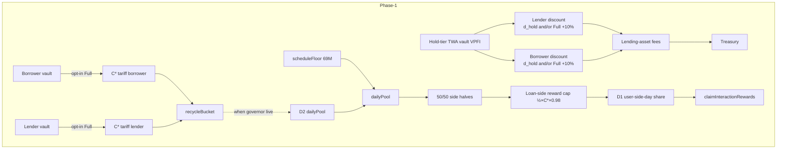
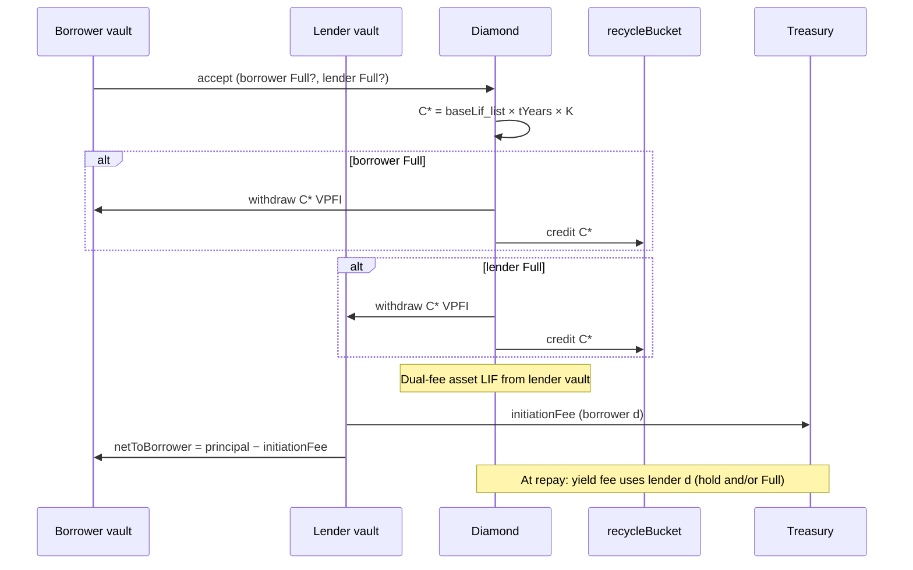

# VPFI Absorption & Distribution Formula Redesign (Near-Zero Legal Surface)

| Field | Value |
| --- | --- |
| **Title** | VPFI Absorption & Distribution Formula Redesign |
| **Author** | Vaipakam Developer Team |
| **Date** | 2026-07-16 |
| **Status** | **Draft — design proposal (rev 14)** — Codex r1–r6 freezes (post-#1294 r6 P2s folded); pending **owner ratification** for implementation |
| **Related** | `#687-A/B`, `#694`, `#1002` / Card-C rewards hardening, `#1008` / S13 day cap, `#1203` (E-1), `#1217` / `#1222` (recycling governor), TokenomicsTechSpec §§4–9 |
| **Prior art (binding substrate)** | [`VpfiRecyclingBalanceGovernorDesign.md`](VpfiRecyclingBalanceGovernorDesign.md) (RATIFIED 2026-07-15), [`VpfiLenderDiscountPegDecouplingDesign.md`](VpfiLenderDiscountPegDecouplingDesign.md) (E-1), [`VPFITokenomicsRedesignResearch.md`](VPFITokenomicsRedesignResearch.md) §9 |

> **Provenance:** promoted from session design scratch `.grok/design-scratch/vpfi-abs-dist/` (rev 8 freezes). This file is the canonical design home; implement only after owner ratification following Codex design-doc review.

> ⚠️ **Not legal advice.** Near-zero legal *expenditure* is a design goal (minimize mandatory counsel / registration paths). Residual risk for a transferable ERC-20 under admin control remains. Any activation of a published VPFI↔fee-value conversion path is counsel-gated (see §Legal Surface Checklist). Design goal ≠ clearance (`VPFITokenomicsRedesignResearch.md` §9).

---

## Overview

Vaipakam still carries formula families that publish (or imply) admin-set VPFI↔ETH unit relationships:

1. **Absorption / fee quoting** — `LibVPFIDiscount._feeAssetWeiToVpfi` converts LIF and yield-fee *values* into VPFI via `s.vpfiDiscountWeiPerVpfi` (historically `1 VPFI = 0.001 ETH`). While that peg is unset (documented Phase-1 posture), borrower LIF-in-VPFI and lender VPFI-payment discounts are inert; only E-1 **direct-reduction** stays live for lenders.
2. **Distribution / interaction rewards** — per-user daily cap `0.5 VPFI per 0.001 ETH` of eligible interest (`INTERACTION_CAP_DEFAULT_VPFI_PER_ETH = 500`), snapshotted as entry-independent `dayCapThreshold18` (#1008 / S13).
3. **Notification fee** — still embeds compile-time `VPFI_PER_ETH_FIXED_PHASE1 = 1e15` until re-denominated (PR-N).
4. **Tariff (this design, rev 8)** — fee-native schedule **`C* = baseLif_list × tYears × K`** (VPFI per list-LIF·year), **not** ETH·day volume and **not** fee-value conversion. Residual: admin chooses **K**.

This document redesigns absorption and distribution so that:

- Phase-1 retail launches **without fee-value conversion** (`feeUSD / vpfiPrice`) and without reintroducing the removed fixed-rate sale or passive yield;
- the platform always collects **real lending-asset fees** on HoldOnly **and** Full (tier-discounted, never waived by tariff), and **also absorbs VPFI** when Full attaches;
- absorption and distribution **can** balance via the ratified recycling governor once that stack lands — tariff may ship against bucket-credit-only first;
- formulas are **implementable** (frozen package matrix, mesh-safe D1 cap, exact matcher rule, storage layout) and compatible with Diamond + Base-canonical tier mesh.

**Recommended path (Phase-1):** **Hybrid fee collection (A1) + consumptive LIF·year tariff (A3) + hold-tier direct-reduction (A0/E-1)**, with distribution **D2 (governor) + D1 (absolute share-of-pool) + loan-side reward cap (replaces #1008 ETH ratio)**. Market-TWAP (A2) and peg-based custody LIF (legacy A4) are deferred / retired for **new** loans.

### Frozen product package (rev 8 — fee freeze + double absorption)

**Owner product decisions (2026-07-16):**

1. Full does **not** waive LIF / yield fee (rev 7 dual-fee).  
2. **List fees:** LIF **0.2%** of principal; yield fee **2%** of interest (was 0.1% / 1%).  
3. **Discount:** `d = min(d_hold + d_tariff, CAP)` with hold tiers **10/15/20/24%**, Full bonus **`d_tariff = 10%`**, **`CAP = 50%`**.  
4. **Tariff formula:** `C* = baseLif_list × tYears × K` with default **`K = 5`** (list LIF, not post-discount).  
5. **Double absorption:** Full is **per-party**. Each of borrower and lender who selects Full pays **one** `C*` from **their own** vault → recycle bucket. Both Full ⇒ **`2 × C*`** absorbed.  
6. **Reward cap (replaces #1008 `I_eth × 500`):** per **loan**, per **side**  
   `loanSideRewardCap = ½ × C* × (1 − m_reward)` with default **`m_reward = 200 bps (2%)`**. Notional `C*` is defined for every loan even if neither party takes Full. Keep **D1** share-of-pool and **50/50** half-pools.

| Party mode | Who pays tariff | That party’s asset-fee discount | VPFI movement |
| --- | --- | --- | --- |
| **None** | — | 0 | None |
| **HoldOnly** | — | `d_hold` only (tier) | None |
| **Full (dual-fee)** | **That party** pays `C*` from **their** vault | `min(d_hold + 10%, 50%)` on **their** fee line only | `C*` → recycle bucket (non-refundable) |

**Fee lines (who benefits):**

| Fee | Who’s discount applies | Full +10% requires |
| --- | --- | --- |
| LIF (lender haircut in lending asset) | **Borrower** hold / Full | **Borrower** Full (borrower paid `C*`) |
| Yield fee (from interest) | **Lender** hold / Full | **Lender** Full (lender paid `C*`) |

**What Full buys (honest UX):** deeper **own-side** asset-fee discount (tier + 10%, ≤50%) **plus** consumptive VPFI sink. Full is **not** “waive fees with VPFI” and **not** free-ride the counterparty’s discount. Marketing: dual-fee utility + optional absorb, never “buy LIF waiver.”

**`ENTITLEMENT_ZERO_YIELD_FEE` / LIF waive:** both **absent** Phase-1.

#### Worked list (10k principal, 10% APR, 30d, K=5)

```text
baseLif_list = 10_000 × 0.2% = 20 USDC
I_30d        ≈ 82.19 USDC
tYears       = 30/365
C*           = 20 × (30/365) × 5 ≈ 8.22 VPFI   // per Full party
loanSideRewardCap ≈ ½ × 8.22 × 0.98 ≈ 4.03 VPFI per side (loan life)
```

| Path | LIF (USDC) | Yield fee (USDC) | VPFI absorbed |
| --- | ---: | ---: | ---: |
| None / None | 20.00 | ~1.64 | 0 |
| HoldOnly T4 / HoldOnly T4 | 15.20 | ~1.25 | 0 |
| Full T4 / Full T4 | **13.20** (−34%) | **~1.08** (−34%) | **~16.44** (2×C*) |
| Full T4 borrower only | 13.20 | ~1.25 (lender HoldOnly T4) | **~8.22** (1×C*) |

---

## Background & Motivation

### Current state (code + specs)

| Surface | Mechanism today | Phase-1 launch reality |
| --- | --- | --- |
| Lender yield fee (1% of interest) | Prefer `tryApplyYieldFee` (VPFI at peg); else `directReductionYieldFee` (E-1) | Peg unset → **direct-reduction only**; no VPFI absorbed |
| Borrower LIF (0.1%) | `tryApplyBorrowerLif` → Diamond `vpfiHeld` → rebate/forfeit at terminal | Peg unset → **lending-asset LIF** haircut from **lender** vault (`OfferAcceptFacet`); custody path inert |
| Conversion helper | `_feeAssetWeiToVpfi` | `(false,0)` when peg or ETH ref unset |
| Interaction rewards | Proportional half-pool; `min(raw, interestEth×500)`; `dayCapThreshold18` factors remittance | Live; **500 VPFI/ETH** |
| Recycling | Constants + ConfigFacet setters exist; **no** `recycleBucket` / governor in `contracts/src` | Knobs only; closed loop unbuilt |
| Notification fee | `LibNotificationFee` + `VPFI_PER_ETH_FIXED_PHASE1 = 1e15` | Live conversion residual |

### Pain points

1. **Utility without absorption** — E-1 forgoes asset fees without recycling VPFI.
2. **Borrower consumptive path blocked** without peg.
3. **Multiple VPFI↔ETH unit stories** (discount peg, notification 1e15, reward 500).
4. **Absorption ≠ distribution** until governor + absorption classes exist.
5. **Fee-value conversion** adjacent to excised sale optics if peg is set “for convenience.”

### What is already decided (do not reopen without owner)

- No issuer sale; no passive staking APR; buyback dormant Phase-1.
- E-1 direct-reduction when peg unset.
- Recycling governor (2026-07-15): margin **500 bps**, additive floor, **W = 7**; Layer-2 tariff principle adopted.
- **This rev supersedes** E-1’s narrative that “absorption resumes when peg is set” as the Phase-1 absorption plan: **A3 tariff is the Phase-1 absorption path**; peg conversion stays market-era / counsel-gated only.

### Spec supersession map (Issue 5)

| Source | Replaced for new loans | Grandfather / keep |
| --- | --- | --- |
| TokenomicsTechSpec §6 / §6b borrower: full LIF in VPFI at peg → custody → rebate | **Yes** — HoldOnly hybrid asset LIF + Full tariff | Open loans with `vpfiHeld > 0` still `settleBorrowerLifProper` / `forfeitBorrowerLif` |
| TokenomicsTechSpec §6 lender VPFI-payment mode | **Dormant Phase-1** — E-1 only | Code path may remain behind peg≠0 |
| E-1 “peg later absorbs” | **Superseded** by A3 tariff absorption | E-1 dual-mode predicate still correct if peg ever set |
| CLAUDE.md Phase 5 custody bullets | Intent rewritten in FunctionalSpecs PR-1 | Terminal call sites keep settle/forfeit for legacy |
| TokenomicsTechSpec §4 `500 VPFI/ETH` (#1008) | **Rev 8:** **loan-side cap** `½×C*×(1−m_reward)` **+ D1** share-of-pool (not D1 alone) | Migration window dual-read optional |
| Recycling design §4.2 “deeper discount” | **Rev 8:** dual-fee Full + **per-party** +10% when that party pays tariff; **not** LIF waive | Hold still parks supply |
| Prior “borrower-only tariff” (rev ≤7) | **Rev 8:** **double absorption** — each Full party pays `C*` | — |

**Invariant (new loans):** `borrowerLifRebate[loanId].vpfiHeld == 0` for every loan originated under this design (Full, HoldOnly, None). Tests must enforce.

---

## Goals & Non-Goals

### Goals

1. Near-zero legal *expenditure* Phase-1 — no fee-value conversion; no sale; no passive yield; consumptive framing.
2. Platform benefit — real lending-asset fees; VPFI absorption when Full attaches; governor margin when D2 live.
3. Absorption ↔ distribution **eventual** balance via governor; accept temporary scheduleFloor-only distribution if tariff lands first.
4. Formulas work **without VPFI market feed** (loan-asset oracles only).
5. Keep anti-gaming (TWA, min-history, min-tier clamp, consent).
6. Mesh-safe reward caps (D1 remittance proof).
7. Implementable math + frozen package + storage plan.

### Non-Goals

- Reintroducing sale, staking APR, Phase-1 buyback.
- Solving VPFI **retail acquisition** via protocol sale (forbidden). Acquisition is external (see §Phase-1 VPFI acquisition).
- veToken revenue share; SAFT as prerequisite.
- Changing list fees outside the rev‑8 freeze (LIF **0.2%** / yield **2%**) except via governance knobs after launch.
- Industrial KYC/country-pair on retail.

---

## Proposed Design

### Architecture



### Design principles

| # | Principle | Implication |
| --- | --- | --- |
| P1 | **Tariff ≠ fee-value conversion** | Never `feeUSD / vpfiPrice`. Tariff is **`baseLif_list × tYears × K`** (fee-native). Residual: admin **K**. |
| P2 | **Always collect real lending-asset fees** | None / HoldOnly / **Full** all charge LIF in the lending asset (tier/Full-discounted). Full **adds** VPFI; it never replaces the asset fee. |
| P3 | **Hold parks; consume sinks; no free-ride** | Each party’s discount uses **only that party’s** hold + own Full. Borrower Full never sets lender `d`; lender Full never sets borrower `d`. |
| P3b | **Double absorption** | Each Full party pays **own** `C*` from own vault. Both Full ⇒ `2×C*` to bucket. |
| P4 | **Governor closes loop when built** | Tariff may credit bucket before D2; temporary imbalance accepted. |
| P5 | **D1 share-of-pool + loan-side tariff-linked cap** | D1: durable `(user,side,day)` remaining-budget. **Loan-side:** `loanSideRewardCap = ½×C*×(1−m_reward)` replaces #1008 ETH ratio. 50/50 half-pools unchanged. |
| P6 | **Peg retired at launch** | `vpfiDiscountWeiPerVpfi` stays 0 on retail. |

### Dual rails (coexist)

| Rail | User action | Effect |
| --- | --- | --- |
| **Hold-tier** | Deposit VPFI, min-history, consent | Own-side discount `d_hold` on that party’s fee line. |
| **Full dual-fee tariff** | **That party** opt-in at accept/match, pay `C*` VPFI | Own-side `d = min(d_hold+10%, 50%)` **and** absorb `C*` from **that party’s** vault. |

### Loan-bound entitlement (per-party — rev 9)

At `acceptOffer` / `matchOffers` / signed-offer fill:

1. Resolve **borrower** and **lender** effective tiers independently.
2. Quote **one shared notional** `C* = baseLifListNumeraire18 × tYears × K / 1e18` for the loan (see F4 unit freeze).
3. **Per-party Full authorization (frozen):** Full is **not** a single `useFeeEntitlement` bool.
   - **Borrower Full** requires explicit borrower authorization on the accept/match path the borrower signs or initiates (calldata flag `borrowerFull`, or borrower-signed permit/intent field).
   - **Lender Full** requires **prior** lender authorization that the non-lender caller cannot forge: e.g. fields on the **lender’s offer** / standing intent / signed offer EIP-712. A bare accept calldata flag set by the borrower/matcher **MUST NOT** pull `C*` from the lender vault.
   - Matcher/keeper fills may apply lender Full **only** if the offer/intent already stamped lender Full auth.
   - **Tariff ceiling bound (rev 14):** **every** Full authorization — standing offer, EIP-712 intent, **and same-tx borrower calldata** — **MUST** include a mandatory absolute **`maxCStar`** (VPFI 1e18) in the signed/calldata payload. Optional extras: `tariffKVersion` / `maxK` for early UX rejection — **not** a substitute for `maxCStar`.  
     At fill: if quoted `C* > auth.maxCStar` → **revert** `FeeEntitlementTariffAboveAuth` (or downgrade only if `allowFullDowngrade`).  
     Rationale: K-only bounds and “live quote without max” both miss oracle/numeraire or K moves between UI quote and execution. **No exception for same-tx borrower Full.**
4. **Kill switch first (rev 14):** if any party presents Full auth and `cfgFeeEntitlementEnabled == false` → treat as **failed Full opt-in** (`FeeEntitlementDisabled`) unless that party set `allowFullDowngrade=true` (then HoldOnly/None per rules below). **Forbidden:** silently ignore Full and continue as HoldOnly when the flag is off without explicit downgrade permission.
5. For each party with authorized Full and flag enabled: if vault VPFI ≥ `C*` and `C* ≤ auth.maxCStar`, pull `C*` from **that party’s** vault → recycle bucket; stamp mode = Full; `tariffPaid[party] = C*`.
6. **Failed Full opt-in (frozen):** if a party is authorized Full but cannot complete (flag off, balance, pause, transfer fail, or `C* > maxCStar`), the whole accept/match **reverts** unless `allowFullDowngrade=true`. HoldOnly/None only when Full was **never** authorized or downgrade was explicit.
7. Else if that party consent + tier ≥ 1 (and Full not authorized): mode = HoldOnly.
8. Else: None.
9. Apply LIF using **borrower** mode/discount; yield fee later using **lender** mode/discount (including Full +10% when `lenderMode == Full`). Position NFT carries **both** stamps; **no tariff refund** on sale/transfer/preclose.



---

## LIF incidence (Issue 12) — who pays

**Current non-VPFI path (code of record, `OfferAcceptFacet`):**

- Debt principal the borrower owes = full `effectivePrincipal` (LIF is not added to debt).
- **Transfer path:** lender vault funds principal; protocol pulls `initiationFee` from the **lender** vault to treasury/matcher, then delivers `netToBorrower = principal − initiationFee` to the borrower vault.
- **Economic incidence (frozen wording):** LIF is a **borrower cash haircut at origination** — the borrower receives less spendable principal while still owing full principal. The fee is **sourced** from the lender vault’s principal transfer (not a separate borrower wallet pull), but the discount control (`d_borrower`) is **borrower-selected** and benefits the **borrower** (higher `d` → higher cash received). Do **not** describe LIF as a “lender principal haircut” in product/UI copy; that mis-assigns who the discount is for.
- Lender still ends the open with less principal outlaid net of fee routing; accounting remains “fee from funded principal,” not “lender pays fee from unrelated balances.”

**HoldOnly hybrid (this design):** same transfer path and borrower-cash incidence; only the fee amount changes:

```
initiationFee = principal * LIF_BPS * (BPS - d_borrower) / BPS²
netToBorrower = principal - initiationFee
// pulls from lender vault: treasuryCut + matcherCut = initiationFee
// borrower debt principal unchanged = principal
```

**Full (dual-fee — rev 8):** **same lending-asset LIF incidence as HoldOnly** (with borrower’s `d`), **plus** per-party VPFI tariff(s):

```
// Lending-asset LIF — borrower discount only
d_b = discountBps(borrowerMode, borrowerHoldBps)  // min(hold+1000, 5000) if Full else hold
initiationFee = principal * LIF_BPS * (BPS - d_b) / BPS²
netToBorrower = principal - initiationFee
// pulls from lender vault: treasuryCut + matcherCut = initiationFee  (matcher in lending asset)

// VPFI tariff — separate; each Full party pays C* from own vault
// if borrower Full: pull C* from borrower vault → recycle bucket
// if lender Full:   pull C* from lender vault   → recycle bucket
// does NOT change initiationFee, debt principal, or netToBorrower
```

**Sale-vehicle accepts:** unchanged — skip all LIF/tariff (position already paid LIF at origination).

**Example restated (rev 8 list 0.2%):** list LIF **20** USDC on 10k. Borrower T4 Full (−34%) → haircut **13.20** USDC; cash **9,986.80**; debt still **10,000**. Borrower Full also pays **~8.22 VPFI**; if lender Full too, lender also pays **~8.22 VPFI**.

---

## Formulas

BPS = 10_000; VPFI/ETH in 1e18.

### F1 — Hold-tier effective discount (unchanged)

```
(effTier, effBps) = effectiveTierAndBps(user)  // TWA + min-history + min-tier clamp
if !vpfiDiscountConsent[user]: effBps = 0
// defaults T1–T4: 10% / 15% / 20% / 24%
```

### F2 — Lender yield fee (frozen — rev 8)

At every lender-yield settlement (`interestAmount` in principal-asset wei):

```
baseFeeAsset = interestAmount * effectiveTreasuryFeeBps(loan) / BPS
// list default rev 8: treasury fee = 2% of interest (200 bps)

d_hold = 0
if vpfiDiscountConsent[loan.lender]:
    d_hold = lenderTimeWeightedDiscountBps(loan)  // TWA hold tier

d_tariff = (loan.lenderMode == Full) ? 1000 : 0   // +10% only if lender paid C*
d = min(d_hold + d_tariff, 5000)                  // CAP 50%

// Phase-1 delivery: always direct-reduction (peg unset)
feeAsset = baseFeeAsset * (BPS - d) / BPS
// tryApplyYieldFee remains dormant while peg unset
```

**Accept tests:** lender None ⇒ full 2% yield fee; lender HoldOnly T2 ⇒ 15% off; lender Full T2 ⇒ 25% off; lender Full T4 ⇒ 34% off; **borrower** mode never appears in lender `d`.

### F3 — Borrower LIF (frozen — rev 8 dual-fee)

```
baseLifAsset = principal * cfgLoanInitiationFeeBps() / BPS
// list default rev 8: LIF = 0.2% of principal (20 bps)

d_hold = borrower hold bps at accept (0 if None / no consent)
d_tariff = (borrowerMode == Full) ? 1000 : 0
d_borrower = min(d_hold + d_tariff, 5000)

if borrowerMode == Full || borrowerMode == HoldOnly:
    lifAsset = baseLifAsset * (BPS - d_borrower) / BPS
else:
    lifAsset = baseLifAsset

// Incidence: haircut from lender vault; debt principal unchanged
// If borrower Full: ALSO pull C* from borrower vault (F4)
// If lender Full:   ALSO pull C* from lender vault (F4) — independent of lifAsset
```

**Accept tests:** borrower Full T2 ⇒ lifAsset = base × 0.75 (15%+10%); borrower Full T4 ⇒ base × 0.66 (24%+10%); HoldOnly T4 ⇒ base × 0.76; Full always has that party’s `tariffPaid == C*`; never zeros LIF.

### F3b — Matcher (frozen — rev 7 dual-fee)

Because Full always has `lifAsset > 0` (when LIF BPS > 0), the **primary** matcher share stays on the lending-asset LIF path for **all** modes:

| Path | Matcher payment |
| --- | --- |
| `lifAsset > 0` (None / HoldOnly / **Full**) | **Unchanged:** `matcherCut = matcherShareOf(lifAsset)` in **lending asset** from lender vault (`LibOfferMatch.matcherShareOf`, default 1% of LIF) |
| Full tariff (VPFI) | **Default rev 7:** entire `tariffPaid` → recycle bucket (`matcherCutVpfi = 0`). Optional later: `matcherCutVpfi = tariffPaid * cfgLifMatcherFeeBps() / BPS` if product wants dual-currency matcher — **off by default** so Full does not double-pay matcher. |

No separate `notionalLifVpfiSchedule`. No fee-value conversion.

### F4 — Consumptive tariff (A3) — rev 9 LIF·year, double absorption

```
// Fee-native — NO ethVolume, NO feeUSD/vpfiPrice.
// baseLif is LIST LIF (pre-discount) so high tiers do not shrink absorption.

// ── Unit freeze (rev 9 — implementable, asset-decimal-safe) ──────────────
// K is "VPFI (1e18) per 1 whole unit of list-LIF numeraire (1e18) per year".
// List LIF is ALWAYS converted to protocol numeraire 1e18 (same family as
// interest numeraire / LTV USD-like unit — NOT raw token wei, NOT ETH).
//
//   baseLifTokenWei = principal * cfgLoanInitiationFeeBps() / BPS
//   baseLifListNumeraire18 = OracleFacet asset→numeraire conversion of
//                           baseLifTokenWei (same helper family as
//                           LibInteractionRewards interest numeraire)
//   durationDays = feeEntitlementDurationDays(offer)   // ≥ 1
//   tYearsRay = durationDays * 1e18 / 365              // 1e18 fixed-point years
//   K = cfgTariffKPerLifYear()                         // default 5e18
//        meaning: 5 VPFI per 1.0 numeraire-unit of list LIF per year
//
//   C_star = baseLifListNumeraire18 * tYearsRay / 1e18 * K / 1e18
//          = VPFI wei (1e18)
//
// Worked example: 20 USDC list LIF → baseLifListNumeraire18 ≈ 20e18
//   tYears = 30/365, K = 5e18 → C* ≈ 8.22e18 VPFI wei.
// USDC-6, DAI-18, WETH all normalize through numeraire first → same economics
// for same $ list LIF. Feed failure: see Illiquid/oracle (rev 12) — reward-eligible
// originations need numeraire for cStar; not "HoldOnly/None always OK".

// Each Full party pays the SAME C* from their own vault (double absorption):
//   if borrowerMode == Full: pull C_star from borrower vault → bucket
//   if lenderMode   == Full: pull C_star from lender vault   → bucket
// canPay(party) iff trackedVaultVpfi[party] >= C_star && consent && feeEntitlementEnabled
// HoldOnly/None: no pull.
// Tier mult table on raw tariff: **retired** for v1 (K is single knob) —
// do NOT add tariffTierMultBps storage.
```

**Illiquid / oracle (rev 12):** A successful **numeraire** quote for list LIF is required for **any reward-eligible origination** (Full **and** HoldOnly/None that will create interaction-reward entries), not only Full — because F6b stamps notional `cStar` for loan-side caps.  
- Feed failure / zero principal: **either** (a) origination reverts if the product path is reward-eligible, **or** (b) loan is stamped **reward-ineligible** (`cStar=0`, no reward entries / no claim) while still allowing HoldOnly/None fee paths.  
- **Forbidden:** reward-eligible loan without `cStar` (blocks cutover or forces zero/infinite cap ambiguity).

#### Duration rules (frozen — Issue 9)

| Offer / loan shape | `durationDays` |
| --- | --- |
| Fixed term | `max(1, ceil(termSeconds / 1 days))` |
| Open-ended / max-term | `max(1, ceil(offer.maxDurationSeconds / 1 days))` |
| Range / partial fill | Use **filled** `effectivePrincipal` and the **loan’s** term (not unfilled remainder) |
| Preclose / early repay | **No refund** of tariff; UX must warn “tariff priced on full term at open” |
| Refinance | **New loan** with **fresh reward entries** → **hard rule (rev 10):** new loan gets its own `cStar` / `loanSideRewardCap` **only if** it pays the **new-loan list LIF** (and Full tariff if Full) under the same incidence as a fresh origination. If product policy skips LIF on a refinance path, then **either** (a) new loan **inherits** remaining `loanSideRewardPaid` / cap budget from the closed parent (no cap reset), **or** (b) new loan is **reward-ineligible** (`cStar=0` ⇒ loan-side cap 0). **Forbidden:** free cap reset via refinance without LIF/tariff (rollover farming). |
| Term extend (if any) | If product adds extend later: either block Full loans from free extend or require top-up tariff for added days — **v1: no free extend that increases duration without new tariff** |
| Sale-vehicle accept | **No tariff** (not a fresh origination) |

### F5 — Partial consume

**Not in v1.** Binary Full vs HoldOnly/None only.

### F6 — Absorption accounting

```
// Rev 11/12 — use INTERACTION day id when emissions are launched; never
// call a reverting currentDay() when launch is unset/future.
//
// if interactionLaunchTimestamp == 0 || block.timestamp < launch:
//   // Tariff may still ship before rewards enablement (rollout debt).
//   // Bucket credit MUST NOT depend on currentDay() in this window.
//   recycleBucket += netAbsorb
//   recycledCreditedByDayPreLaunch += netAbsorb   // or single cumulative
//   // Optional: do NOT write recycledCreditedByDay[dayId] until launch;
//   // backfill into day-0 / first live day when launch arms, OR keep
//   // pre-launch absorbs only in recycleBucket total (governor Ā reads
//   // cumulative until day map is live).
//   emit VpfiRecycled(..., dayId=type(uint64).max or 0 sentinel)
// else:
//   dayId = interactionDayId()   // same as LibInteractionRewards.currentDay()
//   recycleBucket += netAbsorb
//   recycledCreditedByDay[dayId] += netAbsorb
//   emit VpfiRecycled(..., dayId)
//
// Product gate: feeEntitlementEnabled may be true before launch ONLY if
// the pre-launch absorb path above is implemented. Otherwise Full enable
// requires interaction launch armed (same as rewards enablement checklist).

// matcherCutVpfi = 0 default
// tariffPaidTotal = sum of per-party C* pulls
netAbsorb = tariffPaidTotal
// ... apply branch above ...
// Margin NOT skimmed at absorb-time
```

### F6b — Loan-side interaction reward cap (rev 8/11 — replaces #1008 ETH ratio)

```
// Defined for EVERY loan (notional C*), even if neither party took Full.
C_star_open = baseLifList × tYears_open × K     // stamped at open (full term)
m_reward = cfgRewardHaircutBps()                // default 200 (2%)

// Lifetime side cap at open (upper bound):
loanSideRewardCapOpen = C_star_open * (BPS - m_reward) / BPS / 2

// Rev 11/12 — EARLY-CLOSE PRORATION + POSITION-SALE ENTRY SPLITS:
// Cap is per (loanId, side), SHARED across all reward entries for that side
// (including after LibInteractionRewards.transferLenderEntry splits).
//
// Let openDays = durationDays stamped at open.
// Let cumulativeRewardedDays(loanId, side) = |union of reward-eligible days
//   covered by ANY entry for that loanId+side, from open through the claim
//   moment| (not a single entry window). Entry split after sale must not
//   recompute cap from the new entry’s remaining window alone.
//
//   loanSideRewardCapEff = loanSideRewardCapOpen
//                          * cumulativeRewardedDays / openDays
//   (floor; openDays==0 → 1)
//
// At claim: loanSideRewardPaidVpfi[loanId][side] ≤ loanSideRewardCapEff
// Preclose after 1 rewarded day on a 365d stamp → ~1/365 of open cap.
// Sale split: old entry 10d + new entry 20d of same 30d loan → cumulative 30
// (union), not 20 on the new entry with shared paid already counting 10.
//
// HoldOnly/None stamp cStar_open (notional) whenever reward-eligible.

// Accrual remains daily + proportional to eligible interest (F9).
// At claim for reward entries of this loan on side S:
//   paid_to_side_on_loan ≤ loanSideRewardCapEff
// Then ALSO apply D1: userSideDayPaid[user][side][day] ≤ C_day share cap
// final slice = min(rawShare, loanSideRemaining, d1Remaining, poolRemaining)

// 50/50 half-pools UNCHANGED — loanSideRewardCap is the per-side half of the
// tariff-linked ceiling; it is NOT a second split of the global pool.
```

**Identity:** rewards are **per loan** (cap domain includes `loanId`) **and per side** (50/50 → each side owns `½×C*×(1−m)` proration of open notional). Daily pool share still runs first; caps only **ceiling** payouts.

### F7 — Distribution budget D2 (ratified governor)

```
Ā[D] = sum_{d in (D−W .. D]} credited[d] / W     // W=7, zero-pad
// scheduleFull[D] = 2 * halfPoolForDay(D)   // full day pool before governor
// IMPORTANT: halfPoolForDay already returns ONE SIDE's schedule half.
// Once governor is live, NEVER use bare halfPoolForDay as the claim half
// without adding the recycled half.

scheduleFloorFull[D] = min(scheduleFull[D], freshAvailable[D])
recycledBudgetFull[D] = scheduleFull[D] == 0 ? 0
    : min(fundable[D], Ā[D] * (BPS - marginBps) / BPS)
dailyPool[D] = scheduleFloorFull[D] + recycledBudgetFull[D]

// Per side (lender / borrower):
sideHalf[D] = dailyPool[D] / 2
// Broadcast SEPARATE fields: scheduleFloorHalf[D], recycledHalf[D]
// so mirrors do not re-derive schedule-only pools (recycling design).
```

**Implementer rule:** after governor live, claim/remittance read `sideHalf = scheduleFloorHalf + recycledHalf` from finalized day record — not `halfPoolForDay` alone.

### F8 — Per-user reward + D1 absolute share-of-pool cap (rev 6 — preview worklist = claim; re-entrant sweep; fail-closed mode)

#### Why D1 is not a drop-in for `dayCapThreshold18` / O(1) `cumMin`

**Live claim math today** (`LibInteractionRewards._processEntry`, #1008 / S13):

```
// Entry-independent Δ_d (RPN units) = halfPool[d] * 1e18 / globalTotal[d]
// T_d = dayCapThreshold18[d]   // ETH-ratio threshold in RPN units
// cumMin[d] = Σ_{k≤d} min(Δ_k, T_k)
//
// reward(entry) = perDayNumeraire18 * (cumMin[end-1] − cumMin[start-1]) / 1e18
//               = Σ_{d ∈ [start,end)} perDay * min(Δ_d, T_d) / 1e18
```

This product form is O(1) **only because** the ETH cap factors:

```
final_d = interest_d * min(Δ_d, T_d) / 1e18
        = min( interest_d * Δ_d / 1e18, interest_d * T_d / 1e18 )
```

and `T_d` is **entry-independent**, so every entry multiplies the same `min(Δ,T)` sequence. Live code also processes **one entry at a time** (`claimForUserEntries` → `_processEntry` per id) and only after `_entryClaimable` (closed / terminal — #1002). The old ETH-ratio cap still summed correctly across sequential claims because each entry’s cap scaled with **that entry’s** interest.

**D1 absolute share cap** (intent):

```
sideHalf[D]     = dailyPool[D] / 2                    // schedule-only today; + recycled later
C[D]            = sideHalf[D] * cfgUserSideShareCapBps() / BPS   // absolute VPFI wei
raw_u,s,D       = Σ_{entries e of user u on side s covering D}
                    e.perDayNumeraire18 * Δ_D / 1e18
                = sideHalf[D] * userInterest_u,s,D / globalInterest_s,D   // identity
final_u,s,D     = min(raw_u,s,D, C[D])                // absolute — not entry-scaled
```

When the cap binds, `final = C` is **independent of `perDay`**, so

```
Σ_d min(raw_d, C)  ≠  perDay * (something entry-independent cumulative)
```

for multi-day windows. Therefore **claims MUST NOT** keep using `perDay × ΔcumMin` with a single `T` under D1. Treat D1 as a **new cap family** with an explicit claim algorithm (below).

**Rejected as primary:** conservative closed form `min(Σ raw_d, N×C)` for an N-day entry — it is always ≥ `Σ min(raw_d,C)` and **over-pays** when only some days bind. Documented only as a non-spec upper bound, not the payout rule.

**Rejected for v1:** per-user-day full accrual ledger written at finalize for every user (largest lift; optional later optimization). D1 v1 still needs a **paid budget** map (below) — that is claim-time remaining accounting, not finalize-time accrual for all users.

#### Cap domain (frozen — absolute `(user, side, day)`)

| Domain | Verdict |
| --- | --- |
| `(entry, day)` cap at `C` | **Forbidden** — N loans ⇒ up to `N×C` for one user |
| Claimable-set-only `min(Σ raw_claimable, C)` **without** durable paid state | **Forbidden** — staggered loan closes double-pay (Loan A claims 4%, then Loan B claims 4% ⇒ 8% > C) |
| **`(user, side, day)` with remaining-budget** | **Required** — one absolute ceiling; durable `userSideDayPaidVpfi` |

Tokenomics intent (“each user’s daily interaction reward is capped”) maps to **`(user, side, day)`**, not per `RewardEntry` and not “claimable-set at this tx.” Entries remain the storage / forfeit / routing unit; **all payout paths** (user claim + forfeit sweep) share one remaining-budget primitive.

**Security invariant (must-hold across sequential claims and sweeps):**

```
∀ user u, side s, day d with dayCapMode[d] == ShareOfPool:
  userSideDayPaidVpfi[u][s][d] ≤ C[d] = dayUserSideCapVpfi18[d]
```

where `userSideDayPaidVpfi` counts **all** VPFI already routed for that triple — to the user **or** to treasury (forfeit slices). Forfeit does not create a second budget.

**Staggered-close acceptance:** exact simultaneous pro-rata among loans that become claimable at different times is **not** guaranteed. First-claimable entries may consume more of `C` than a joint claim would have allotted them. **Σ paid ≤ C always holds.** Test 3 is this invariant across sequential claims — not “4%+4% in one call only.”

#### Finalize snapshot (Base)

```
// After sideHalf[D] known (halfPoolForDay today; governor dailyPool/2 later):
shareBps = cfgUserSideShareCapBps()   // stored 0 ⇒ USER_SIDE_SHARE_CAP_DEFAULT_BPS
s.dayCapMode[D] = CapMode.ShareOfPool // explicit mode — NEVER infer from C≠0
s.dayUserSideCapVpfi18[D] = sideHalf[D] * shareBps / BPS
// C MAY be 0 on dust / zero-emission days — still ShareOfPool mode

// Disable legacy ETH-ratio tightening for this day on every chain:
s.dayCapThreshold18[D] = type(uint256).max
// so any residual cumMin advance treats min(Δ,T)=Δ (uncapped RPN path)

// Stamp shareBpsAtFinalize[D] for audit immutability (optional uint16)
```

**Do not** use `dayUserSideCapVpfi18[D] != 0` as the D1/legacy switch (dust days have `C=0` under ShareOfPool).

**Fail-closed (rev 6):** for every finalized day with `D ≥ D*`, the write of `dayCapMode[D] = ShareOfPool` is **load-bearing**. Omitting it while setting `dayCapThreshold18 = max` would have been a Legacy-uncapped hole; claim/sweep now **revert** instead. Finalize tests (5/10/18) must assert mode is written atomically with C and max-T.

#### Cross-chain broadcast (frozen — messenger v2 wire format)

Live `VaipakamRewardMessenger` pins:

| Constant | Value | Payload |
| --- | --- | --- |
| `MSG_TYPE_REPORT` | 1 | report |
| `MSG_TYPE_BROADCAST` | 2 | v1 day broadcast |
| `MSG_TYPE_TIER_UPDATED` | 3 | tier |
| `MSG_TYPE_VERSION_BUMPED` | 4 | tier-table version |
| `BROADCAST_PAYLOAD_SIZE` | `5 * 32` | `abi.encode(uint8 kind, uint256 dayId, uint256 lender, uint256 borrower, uint256 capThreshold18)` |

D1’s `C` is **VPFI wei**, not RPN — reusing kind `2`’s last word without a mode is an ABI/semantic landmine.

**Chosen: new message kind (not silent same-slot reinterpretation).**

| Field | Value |
| --- | --- |
| **Kind** | `MSG_TYPE_BROADCAST_V2 = 5` (next free after 4) |
| **Size** | `BROADCAST_V2_PAYLOAD_SIZE = 6 * 32` |
| **Encode (rev 11 — D2-ready)** | Prefer **v2 extended** or **v3** before multi-chain governor: include side-half budgets so mirrors do not re-derive `halfPoolForDay` only. Minimum for D1-only cutover: `abi.encode(uint8(5), dayId, lenderGlobal, borrowerGlobal, capMode, capPayload)`. **Before enabling D2 on mirrors:** add `lenderSideHalf`, `borrowerSideHalf` (scheduleFloor half + recycled half as finalized on Base) — either widen v2 payload with a version nibble or ship **`MSG_TYPE_BROADCAST_V3 = 6`**. |
| **`capMode`** | `0 = LegacyEthRatio` → `capPayload = T_d` (RPN, today’s `dayCapThreshold18` meaning) |
| | `1 = ShareOfPool` → `capPayload = C` (`dayUserSideCapVpfi18`, VPFI 1e18) |
| **On ShareOfPool receive** | write `dayCapMode[d]=ShareOfPool`, `dayUserSideCapVpfi18[d]=capPayload`, **and** `dayCapThreshold18[d]=type(uint256).max`; if side-half fields present, store finalized halves for claim Δ |
| **On LegacyEthRatio via v2** | write `dayCapMode[d]=LegacyEthRatio`, `dayCapThreshold18[d]=capPayload` (escape hatch; post-cutover Base should only send ShareOfPool) |
| **Reject** | wrong length for kind; unknown `msgType`; `capMode ∉ {0,1}` |
| **v1 kind 2** | **Forever decodable** for historical / in-flight packets → always means `LegacyEthRatio` + `capThreshold18`. Base **stops sending** kind 2 after cutover day `D*` (deploy gate: only v2+). |
| **Quote** | Add `quoteBroadcastGlobalV2` (or V3) so fee quotes match real sends. |
| **Interface** | Prefer **new function** so old ABI callers cannot accidentally omit mode / halves. |
| **D2 gate** | **Forbidden** to enable governor dual-RPN claims on mirrors until side-half budgets are in the broadcast (or equivalent finalize path). Base-only D2 may land first. |

| Compatibility | Rule |
| --- | --- |
| Days finalized **before** cutover | v1 kind 2 / `LegacyEthRatio`; claims use `cumMin` product for those days |
| Days finalized **after** cutover | Always v2 kind 5 `ShareOfPool`; mirrors upgraded before cutover |
| Base local | Writes `dayCapMode` + maps directly; no messenger hop |

Mirrors **never** recompute `C` from local half-pool — only Base’s finalized `capPayload`.

#### Dual claim pipe freeze (live facet)

Live `InteractionRewardsFacet.claimInteractionRewards` does:

```
entryReward  = claimForUserEntries(...)   // RewardEntry / RPN path
windowReward = claimForUserWindow(...)    // legacy per-day counters + ETH-ratio cap
pending      = entryReward + windowReward
```

**Frozen PR-2 rule — one economic pipe after D1 cutover:**

| Day / mode | Entry path | Window path (`claimForUserWindow`) |
| --- | --- | --- |
| `dayCapMode[d] == LegacyEthRatio` (pre-`D*`) | `_processEntry` product / cumMin (unchanged) | May still pay **only if** residual `userLenderInterestNumeraire18[d][user]` (or borrower) counters are non-zero — product must prove no double-count with entry registration for the same interest. If production has zero residual window balances, delete/no-op window path in the same PR. |
| `dayCapMode[d] == ShareOfPool` | **Only** D1 remaining-budget day loop | **Must return 0 / skip that day** — no ETH-ratio cap, no second payout |
| Facet post-cutover | `claimInteractionRewards` may call `claimForUserWindow` only for a **legacy day range clamp** `< D*`; for any day ≥ `D*` window contribution is identically 0 | |

**Preferred implementation:** gate inside `claimForUserWindow` — if `dayCapMode[d] == CapMode.ShareOfPool` **or** `postCutover(d)` (armed cutover; fail-closed: do not pay Legacy product), skip / return 0 for that day. Facet-level test: post-cutover claim with fabricated non-zero window counters still pays **0** from window path.

**Preview dual-pipe freeze:** `previewInteractionRewards` / `previewForUserWindow` use the same skip — window path contributes **0** for ShareOfPool days. Entry preview is **not** “dual-pipe freeze alone”; it must implement the full view SM in **§ F8 Entry preview SM** below (joint day + remaining-budget). A naïve per-entry `min(raw_e, C)` or live-style O(1) product **overstates** multi-entry / partial-paid days and is **forbidden** on ShareOfPool days.

#### Shared day primitive (claim + sweep)

Both `claimForUserEntries` and `sweepForfeitedByLoanId` **must** call the same internal:

```
processUserSideDay(user, side, d, payableEntryIds[]) -> (toUser, toTreasury)
```

`sweepForfeitedByLoanId` **must not** call standalone `_processEntry` for ShareOfPool days (live path today). It may still use `_processEntry` only for pure-LegacyEthRatio days. For ShareOfPool:

1. Collect **all** of `user`’s entries on `side` that cover `d` and are currently **payable for budget consumption** under the aggregation set rules (below) — not only the loan’s forfeited entry.
2. Run `processUserSideDay` once.
3. Route each entry’s slice: forfeited → treasury; clean claimable → user (sweep still only **invokes** for loans with a forfeited entry, but the joint day computation includes sibling clean entries so remaining budget is correct; clean siblings are **not** marked paid unless this call is also a user claim — see below).

**Sweep + clean sibling rule (frozen):**

- `processUserSideDay` always computes slices for the full **payable set** (all claimable-or-forfeited-unpaid entries covering `d` for that user/side).
- **Mutation / transfer scope** depends on caller:
  - **User claim:** pay + advance `claimNextDay` for every entry in the payable set; credit `userSideDayPaid` by Σ slices.
  - **Sweep:** pay + advance **only** entries that are forfeited (and in the sweep’s loan set); still **charge `userSideDayPaid` only for slices actually transferred this call**. Clean claimable siblings are included in **rawPay** for apportionment math **only if** we adopt reserve-for-siblings; **v1 simpler rule (frozen):**

**v1 sweep aggregation (simpler, still Σ≤C):**

- Payable set for budget = entries that are **ready to transfer now** for this call:
  - User claim: all `_entryClaimable` && !processed && claimNextDay ≤ d (clean or forfeited — forfeited on user claim still routes treasury, same as today if user triggers claim on mixed set).
  - Sweep: only forfeited && !processed && claimNextDay ≤ d for that loan’s entry ids (and orphans), **but** remaining budget = `C − userSideDayPaid` already reduced by prior user claims.
- So: if user claims clean A first (pays up to C), later sweep of forfeited B sees `remaining = C − paid` and can only route `≤ remaining` to treasury.  
- If sweep runs first on B alone, B consumes up to min(contrib_B, C); later user claim on A sees remaining. **Σ (user+treasury) ≤ C** regardless of order.
- **Do not** transfer clean entries inside sweep (preserve #1061: sweep never marks clean entries processed without paying the user).

This freezes Test 8’s order-independence on **total routed ≤ C**, without requiring sweep to pay clean siblings.

#### Remaining-budget day math (core)

```
// Storage (append-only):
// mapping(address => mapping(uint8 side => mapping(uint256 dayId => uint256)))
//   userSideDayPaidVpfi;  // VPFI 1e18 already paid (user + treasury) for (u,s,d)

// mapping(uint256 entryId => uint64) rewardEntryClaimNextDay;
//   0 means "not started" → treat as e.startDay
//   advances to d+1 after day d is paid for that entry
//   when claimNextDay >= e.endDay → mark e.processed = true

function nextDay(e):
  nd = rewardEntryClaimNextDay[e.id]
  return nd == 0 ? e.startDay : nd

// PRECONDITION for contrib / processUserSideDay on ShareOfPool day d:
//   cumCursor[side] >= d   (RPN row for d is materialized)
// Outer SM enforces this gate before calling processUserSideDay.
// Never compute Δ when cumCursor < d (unset slot: underflow risk or false 0).

function rpnReady(side, d) -> bool:
  return cumCursor[side] >= d

function contrib(e, side, d):
  // Caller MUST ensure rpnReady(side, d). Under that gate:
  Δ = uncappedΔ(side, d)           // cumRpn[d]-cumRpn[d-1], never cumMin under D1 intent
  if globalInterest[side][d] == 0: return 0
  return e.perDayNumeraire18 * Δ / 1e18

function processUserSideDay(user, side, d, transferSet) -> (toUser, toTreasury):
  // transferSet ⊆ entries of user/side covering d with nextDay(e) == d
  //   and ready to transfer under caller rules (claimable clean / forfeited)
  require dayCapMode[d] == ShareOfPool
  require rpnReady(side, d)        // hard: outer SM must not call without this

  C = dayUserSideCapVpfi18[d]      // may be 0
  paid = userSideDayPaidVpfi[user][side][d]
  if paid >= C:                    // nothing left (also handles C==0)
    // 0-slice advance ALLOWED — budget exhausted is permanent for this (u,s,d).
    for e in transferSet:
      if nextDay(e) == d: rewardEntryClaimNextDay[e.id] = d + 1
      if nextDay(e) >= e.endDay: e.processed = true
    return (0, 0)

  remaining = C - paid
  rawPay = 0
  for e in transferSet:
    c[e] = contrib(e, side, d)
    // Rev 9 — loan-side remaining budget (F6b) is an INPUT weight clamp:
    // each entry's payable weight cannot exceed that loan's remaining side cap.
    // loanSideCap[e] = loanSideRewardCap(e.loanId)  // ½×C*×(1−m_reward), 0 if unset pre-5c
    // loanSidePaid[e] = loanSideRewardPaidVpfi[e.loanId][side]
    // loanSideRem[e] = loanSideCap[e]==0 && !loanSideCapsLive ? +inf : loanSideCap[e]-loanSidePaid[e]
    // cEff[e] = min(c[e], max(loanSideRem[e], 0))
    cEff[e] = min(c[e], loanSideRemaining(e.loanId, side))
    rawPay += cEff[e]

  if rawPay == 0:
    // Legitimate zero weights only — advance (day permanently empty for these entries).
    for e in transferSet where nextDay(e) == d:
      rewardEntryClaimNextDay[e.id] = d + 1
      if nextDay(e) >= e.endDay: e.processed = true
    return (0, 0)

  budget = min(rawPay, remaining)   // D1 day remainder

  // poolRemaining: outer mutable. If 0, OUTER must not call this helper
  // (see claim SM). If budget would be 0 only because poolRemaining==0 while
  // rawPay>0 and D1 remaining>0 → do NOT advance cursors; return (0,0) and
  // outer BREAKS (retryable when pool refills / next claim). 
  if poolRemaining == 0:
    return (0, 0)   // NO cursor advance — retryable pool exhaustion
  budget = min(budget, poolRemaining)

  // Pro-rata floor on cEff; capacity-bounded dust; Σ may be < budget.
  // ALL paid-map charges happen ONLY for the actual transfer amounts below.
  // Forbidden: charge paid maps then scale down post-hoc at facet layer.
  slices = proRataFloorWithCapacityBoundedDust(budget, cEff, transferSet)
  sumSlices = Σ slices[e]

  // If pool clamp left nothing payable but day still has raw/D1 headroom:
  if sumSlices == 0 && rawPay > 0 && remaining > 0:
    return (0, 0)   // NO cursor advance — retryable

  for e in transferSet:
    rewardEntryClaimNextDay[e.id] = d + 1
    if nextDay(e) >= e.endDay: e.processed = true
    if e.forfeited || _entryTerminalForfeit(e):
      toTreasury += slices[e]
    else:
      toUser += slices[e]
    if slices[e] > 0:
      loanSideRewardPaidVpfi[e.loanId][side] += slices[e]

  userSideDayPaidVpfi[user][side][d] = paid + sumSlices
  // Caller: poolRemaining -= (toUser + toTreasury)  — only path that mutates pool
  return (toUser, toTreasury)
```

**Invariant (rev 9–14):** for every `(loanId, side)`,  
`loanSideRewardPaidVpfi[loanId][side] ≤ loanSideRewardCapEff(loanId)`.  
Outer multi-day loop **debits** `poolRemaining` after each day. Dust respects `cEff`.  
**Forbidden:** facet post-hoc scale of `userTotal` after paid maps / cursors already advanced (burns budget permanently). Share **one** mutable `poolRemaining` across ShareOfPool, legacy-day, and any residual window paths **before** mutations.

**0-slice advance policy (frozen — when may `claimNextDay` move with 0 pay):**

| Condition | Advance `claimNextDay` with 0 slice? |
| --- | --- |
| `paid >= C` (D1 day budget exhausted, incl. `C==0`) | **Yes** — day permanently consumed for those entries |
| `rpnReady` and legitimate `rawPay==0` (zero global / zero half / zero weights / all loan-side exhausted) | **Yes** — nothing ever payable for that day |
| **`poolRemaining == 0`** (or clamp zeros a still-payable day) | **No** — return without advance; **outer BREAK**; retry later |
| `!knownGlobalSet[d]` | **No** — break outer loop; do not call `processUserSideDay` |
| `knownGlobalSet[d]` but `cumCursor[side] < d` | **No** — **break** outer loop; retry after further `advanceCum*Through` |
| Unset / garbage `cumRpn[d]` read without gate | **Forbidden** |

This matches live `_processEntry` spirit: if `cum*Cursor < need` after `advanceCum*Through`, return `(0,0)` **without** setting `processed` (retryable).

**Uncapped Δ:**

```
// Only after rpnReady(side, d):
Δ_d = cumRpn[d] − cumRpn[d−1]     // d≥1; day 0 excluded
// Under D1 finalize, dayCapThreshold18=max so cumMin==cumRpn; still read cumRpn explicitly.
// d==1 with cumRpn[0] unset: day 0 excluded from rewards; startDay≥1 or treat cumRpn[0]=0 by convention.
```

#### D1 claim state machine (chunked multi-call — freeze)

**Forbidden:** accumulate `reward[e]` only in memory across txs and pay once at end (double-pay / stuck gas).

**Required:** each claim transaction **pays** the days it walks, **persists** `rewardEntryClaimNextDay` + `userSideDayPaidVpfi`, and transfers in that tx.

```
function claimForUserEntries(user) -> (userTotal, treasuryTotal):
  // Build per-side worklists from userRewardEntryIds (live index).
  // Include entry e iff !e.processed && (claimable clean OR forfeited-with-routing)
  // using existing _entryClaimable / _isForfeited gates.

  daysBudget = MAX_INTERACTION_CLAIM_DAYS   // REUSE existing constant (=30); do NOT add MAX_D1_CLAIM_DAYS

  for side in {Lender, Borrower}:
    E = worklist for side
    if E empty: continue

    // Ensure RPN cursor covers the farthest day we might touch this call
    target = min(
      max over e in E of (nextDay(e) + daysBudget - 1),
      max over e in E of (e.endDay - 1)
    )
    advanceCum*Through(target)              // existing MAX_CUM_ADVANCE_DAYS may require multi-call
    // cumCursor may still be < some d; outer loop MUST break on !rpnReady — never fake Δ=0

    daysUsed = 0
    // poolRemaining: ONE mutable budget for this claim call (rev 14).
    // Initialized once from available interaction-pool VPFI BEFORE the loop.
    // Shared by legacy-day path AND ShareOfPool path. Never post-hoc scale totals.
    while daysUsed < daysBudget:
      if poolRemaining == 0:
        break   // stop day walk; remaining days retryable on next claim
      d = min { nextDay(e) | e in E, nextDay(e) < e.endDay, !e.processed }
      if no such d: break
      if !knownGlobalSet[d]: break

      if !rpnReady(side, d):
        break

      mode = dayCapMode[d]
      if postCutover(d):
        if mode != CapMode.ShareOfPool:
          revert DayCapModeUnsetPostCutover(d)
      else if mode == CapMode.ShareOfPool:
        ;
      else:
        // Legacy day — MUST return routed amounts and debit pool (rev 14)
        (u, t) = applyLegacyDay(user, side, d, E, poolRemaining)
        // applyLegacyDay: pays min(legacy slices, poolRemaining); advances
        // only days it actually settled; if pool-clamped to 0 with remaining
        // legacy entitlement → do not advance; outer will break on pool==0.
        userTotal += u
        treasuryTotal += t
        poolRemaining -= (u + t)
        daysUsed += 1
        continue

      transferSet = [ e in E | nextDay(e) == d && e.startDay <= d < e.endDay
                      && readyToTransfer(e) ]
      (u, t) = processUserSideDay(user, side, d, transferSet, poolRemaining)
      // If helper returned 0,0 without advancing (pool exhaustion), break
      if u + t == 0 && poolRemaining == 0:
        break
      if u + t == 0:
        // Helper may have advanced (legit empty day) or not (retryable).
        // processUserSideDay documents which; if no advance and day still
        // needs pay, break to retry. If advanced, continue.
        ;
      userTotal += u
      treasuryTotal += t
      poolRemaining -= (u + t)
      daysUsed += 1

  // Transfer EXACTLY userTotal / treasuryTotal — no post-mutation scale.
  // poolRemaining already enforced every day; facet must not re-truncate.
  return (userTotal, treasuryTotal)
```

**Chunk properties:**

| Property | Rule |
| --- | --- |
| Pay timing | Every **successfully processed** day pays in **this** tx |
| Persistence | `rewardEntryClaimNextDay`, `userSideDayPaidVpfi`, `processed` written before return for days that entered `processUserSideDay` / `applyLegacyDay` |
| Double-pay | Impossible: day `d` only paid when `nextDay(e)==d`; then advances to `d+1` |
| Stuck / retry | Budget exhaust / legit zero-Δ advance with 0 slice; **unready RPN does not advance** — next call re-tries after more `advanceCum` |
| Multi-entry joint day | All ready entries with `nextDay==d` share one `processUserSideDay` |
| Long window | `end−start > MAX_INTERACTION_CLAIM_DAYS` ⇒ ≥2 claims; second call starts at persisted `claimNextDay` |
| `processed` | Set only when `claimNextDay >= endDay` (full window walked), not when memory sum completes |
| Cum-ready | Outer SM: `if cumCursor[side] < d: break` before any day apply |
| Post-cutover mode | `d ≥ D*` requires `dayCapMode == ShareOfPool` or **revert** (fail-closed) |

#### Entry preview SM (view-only twin — rev 6 freeze: worklist = claim)

Live today: `previewForUserEntries` sums per-entry `_previewEntryReward` (O(1) `cumMin` product). That works for entry-scaled ETH caps. Under D1 it **overstates** if ported as `min(raw_e, C)` per entry or uncapped product when multiple entries share a day or `userSideDayPaidVpfi` already > 0.

**Frozen (rev 6):** entry preview is a **view-only twin** of `claimForUserEntries` day SM — **same worklist E (clean + forfeit)**, same day ordering, same `simNext` advancement, same joint `transferSet`, same remaining-budget — **without** storage writes or transfers.

**Only** difference vs claim’s user-facing sum:

```
userTotal += slice  iff  !(e.forfeited || terminalForfeit(e))
```

Forfeited entries **must** participate in outer day walk and `simNext` advancement (including 0-slice days). Excluding them from `E` desyncs day order vs claim: a forfeit with `nextDay = 5` charges `userSideDayPaid` before a clean entry with `nextDay = 10`; a clean-only `E` jumps to `d = 10`, builds `transferSet` without the still-cursor-5 forfeit, reads `paid ≈ 0`, and **overstates** the clean user total (violates preview ≤ claim / Test 11).

Treasury forfeit is **not** part of the public `previewInteractionRewards` headline (optional separate treasury preview remains out of scope).

```
function previewForUserEntries(user) -> userTotal:
  // Worklist E = SAME as claimForUserEntries:
  //   !e.processed && (claimable clean OR forfeited-with-routing)
  //   using existing _entryClaimable / _isForfeited gates.
  // Forfeit entries are IN E for day ordering + simNext + joint weights.
  // They are OMITTED only when accumulating userTotal (below).

  daysBudget = MAX_INTERACTION_CLAIM_DAYS   // same bound as claim — see below

  for side in {Lender, Borrower}:
    E = claim worklist for side   // clean + forfeit; NOT clean-only
    if E empty: continue

    // VIEW: do NOT call advanceCum*Through (cannot mutate). Read live cumCursor.
    // If cursor short, break — under-report (never over-report), same as live
    // _previewEntryReward when cum*Cursor < need (Codex #1147 r8 L3).

    daysUsed = 0
    // Initialize simNext for ALL e in E (including forfeit)
    for e in E:
      simNext[e] = nextDay(e)   // rewardEntryClaimNextDay / startDay; read-only
    // simPoolRemaining: same initial pool as claim would use (rev 14)
    simPoolRemaining = availableInteractionPool()
    // simLoanPaid[loanId][side] seeds from durable loanSideRewardPaidVpfi

    while daysUsed < daysBudget:
      // Day order = claim: min simNext over full E (forfeit prefixes included)
      d = min { simNext[e] | e in E, simNext[e] < e.endDay, !e.processed }
      if no such d: break
      if !knownGlobalSet[d]: break
      if !rpnReady(side, d): break       // cumCursor < d — stop; retry later

      mode = dayCapMode[d]
      if postCutover(d) && mode != CapMode.ShareOfPool:
        // Fail-closed parity with claim: unstamped post-cutover day is not
        // previewable as Legacy/uncapped — break (under-report) rather than
        // invent Legacy product with T=max. Mutating claim would revert.
        break
      if simPoolRemaining == 0:
        break   // match claim: stop; do not invent uncapped later days
      if !postCutover(d) && (mode == CapMode.LegacyEthRatio || mode == 0):
        // View twin of applyLegacyDay — also pool-clamped
        dayUser = 0
        for e in E with simNext[e]==d:
          if !(e.forfeited || terminalForfeit(e)):
            dayUser += legacyDaySliceView(e, d)
        dayUser = min(dayUser, simPoolRemaining)
        userTotal += dayUser
        simPoolRemaining -= dayUser
        for e in E with simNext[e]==d:
          simNext[e] = d + 1
      else:
        transferSet = [ e in E | simNext[e]==d && covers(e,d) && readyToTransfer(e) ]
        C = dayUserSideCapVpfi18[d]
        paid = userSideDayPaidVpfi[user][side][d]
        if paid >= C:
          for e in transferSet: simNext[e] = d + 1
        else:
          // simLoanPaid keyed by (loanId, side) — NOT loanId alone (rev 14)
          rawPay = 0
          for e in transferSet:
            rem = loanSideRemainingSaturated(
              e.loanId, side, simLoanPaid[e.loanId][side])
            cEff[e] = min(contrib(e,side,d), rem)
            rawPay += cEff[e]
          if rawPay == 0:
            for e in transferSet: simNext[e] = d + 1
          else:
            budget = min(rawPay, C - paid, simPoolRemaining)
            slices = proRataFloorWithCapacityBoundedDust(budget, cEff, transferSet)
            for e in transferSet:
              if !(e.forfeited || terminalForfeit(e)):
                userTotal += slices[e]
              simLoanPaid[e.loanId][side] += slices[e]
              simNext[e] = d + 1
            simPoolRemaining -= Σ slices[e]
      daysUsed += 1

  return userTotal
```

**Preview/claim parity (rev 10/14):** after PR-5c, preview **must** use the same `cEff` / capacity-bounded dust / simulated `loanSidePaid[(loanId,side)]` / **`simPoolRemaining`** walk as claim. Violating this breaks `preview ≤ claim` when loan-side ≪ D1 or pool is tight.

**Preview properties (frozen):**

| Property | Rule |
| --- | --- |
| Worklist | **Identical to claim** — clean + forfeit + claimable gates; forfeit drives day order |
| Dual-pipe | Window preview skips ShareOfPool days (same as claim) |
| Joint day | Multi-entry same `d` uses one remaining-budget, not per-entry `min(raw_e,C)` |
| Partial paid | Reads live `userSideDayPaidVpfi` — prior claim/sweep reduces preview |
| Forfeit sum | Not added to user-facing preview total; **still in E, simNext, transferSet weights** |
| simNext | Initialized and advanced for **every** entry in E (including forfeit 0-slice) |
| Cum-ready | `cumCursor < d` ⇒ **break** (under-report); never invent Δ from unset RPN |
| Post-cutover mode | `d ≥ D*` && `mode != ShareOfPool` ⇒ **break** (under-report; claim reverts) |
| Mutation | No writes; `simNext` is memory-only |
| Overstate | **Forbidden** — preview ≤ what a subsequent claim would pay for the same walked prefix (modulo concurrent state changes) |
| Chunk bound | On-chain preview walks at most **`MAX_INTERACTION_CLAIM_DAYS` unpaid days per side** (same as one claim call). UI/off-chain may loop with “more pending” semantics already used for multi-call claim. Preview is therefore a **lower bound for the first chunk**, not always the full multi-chunk lifetime total — **document in NatSpec + Claim Center** (matches live multi-call claim UX). |

**Forbidden preview implementations on ShareOfPool days:**

- Clean-only worklist `E` (forfeit excluded from day walk / `simNext`).  
- Sum over entries of `_previewEntryReward`-style `perDay × ΔcumMin` product for the whole window.  
- Sum over entries of `min(entryRaw_d, C)` independently.  
- Ignore `userSideDayPaidVpfi`.  
- Advance or assume RPN when `cumCursor < d`.  
- Include forfeit only in `transferSet` when `simNext==d` without also walking forfeit-only prefix days.

**Staggered forfeit-before-clean (canonical overstate case — Test 11):**

- Entry B forfeited, window days 5–14, `claimNextDay = 5`  
- Entry A clean, window days 10–14, `claimNextDay = 10`  
- `C` binds when both raw shares are large  

**Claim** processes B on 5… then joint A+B on overlap; `userSideDayPaid` rises before A is paid.  
**Preview** must walk `d = 5` first (B in `E`), advance `simNext[B]`, charge remaining budget in the joint math when A starts, and only then sum A’s clean slices — never jump to `d = 10` from an A-only worklist.

#### Sweep state machine (re-entrant multi-call — rev 6 freeze)

Live today: `sweepForfeitedByLoanId` pays an entire forfeited entry in one call via the O(1) `cumMin` product. D1 day-walk reuses `MAX_INTERACTION_CLAIM_DAYS` (30). A forfeit window longer than 30 unpaid days therefore needs **≥2** `sweepForfeitedByLoanId` invocations under the same chunk SM as claim.

**Observable contract (frozen):**

- Sweep is **chunked and re-entrant** — not a single-call full-window settle under D1.  
- After one call: `rewardEntryClaimNextDay` and `userSideDayPaidVpfi` **persist**; entry may remain `!processed` if unpaid days remain.  
- Keepers / UI / bots **must re-call** until the entry is `processed` (or treasury delta / return value shows no further progress and `claimNextDay >= endDay`).  
- Second (and later) calls **must not double-pay** days already advanced (same double-pay rule as claim: only pay when `nextDay(e)==d`).  
- Prefer return `(treasuryPaidThisCall, moreRemaining)` or emit `ForfeitSweepProgress(loanId, entryId, nextDay, processed)` so partial progress is obvious — PR-2 NatSpec **must** state multi-call requirement.

```
function sweepForfeitedByLoanId(loanId) -> (treasuryTotal, moreRemaining):
  // Gather forfeited entry ids (active lender/borrower + loanForfeitedLenderEntryIds)
  // Group by (user, side) — user is e.user after re-anchor
  for each (user, side) group G:
    // Walk days needed by G with same MAX_INTERACTION_CLAIM_DAYS budget
    // Same cum-ready gate + dayCapMode fail-closed as claim
    // Day-branch MUST match claim (rev 13) — do NOT call whole-entry _processEntry
    // on mixed windows (start < D* ≤ end): that would settle the entire remainder
    // under legacy cumMin and skip ShareOfPool + loan-side/user-day paid maps.
    // For each day d in chunk:
    //   if postCutover(d): processUserSideDay(..., forfeit-only transferSet)
    //   else if entry wholly pre-cutover OR d not postCutover: applyLegacyDay
    //     (per-day legacy product only — never jump entire entry across D*)
    // Persist claimNextDay / paid map every walked day (same as claim)
  // Never transfer clean non-forfeited entries
  // moreRemaining = any forfeited entry in set still !processed after this call
```

**NatSpec one-liner (PR-2):**  
`/// @dev D1: chunked re-entrant sweep — may need multiple calls when unpaid window > MAX_INTERACTION_CLAIM_DAYS; state persists between calls; no double-pay.`

#### Cutover strategy (single mandate — Issue 5)

**PR-2 mandatory strategy: (3) day-branch inside the claim loop** (as in the SM above).

- Every day `d` selects Legacy vs ShareOfPool from `dayCapMode[d]` (authoritative).  
- **Armed cutover predicate (rev 11 — everywhere):**  
  `postCutover(d) := (shareOfPoolCutoverDay != 0) && (d >= shareOfPoolCutoverDay)`.  
  **Never** write `d >= D*` alone — default `D*==0` would make every day “post-cutover.”  
- **Post-cutover fail-closed (rev 6/11):** for `postCutover(d)`, claim / finalize / sweep **require** `dayCapMode[d] == ShareOfPool`. Unset (`0`) or wrong mode → **`DayCapModeUnsetPostCutover(d)`**. Preview **breaks** on the same condition.  
- When **not** `postCutover(d)`: unset (`0`) still means Legacy product (migration window / unarmed).  
- Entries **may** span cutover (`startDay < D* ≤ endDay`); no force-split tooling required for PR-2.  
- **Mixed-window rule (rev 13):** claim **and** forfeit sweep must day-slice across `D*` — **forbidden** for sweep to call whole-entry legacy `_processEntry` when any unpaid day is `postCutover`.  
- Quiet period / force-split are **optional ops hygiene**, not alternative specs.

Deploy checklist still requires: all mirrors decode v2; Base sends only kind 5+ for `postCutover` days; **Base local finalize always writes `dayCapMode=ShareOfPool` for postCutover days** (Test 5/10); fail-closed is the backstop if that write is forgotten. Tests must cover **`shareOfPoolCutoverDay == 0`** (no fail-closed) vs armed.

#### Pro-rata dust policy (Issue 7 — rev 11)

```
// Within processUserSideDay for budget B and contrib weights cEff[e]:
//   floor_e = B * cEff[e] / rawPay
//   Σ floor_e ≤ B
// Dust = B - Σ floor_e
// Assign dust largest-first ONLY into residual capacity (cEff[e] - floor_e).
// If residual capacity is exhausted: leave dust UNALLOCATED.
```

**Frozen (rev 11):**  
- Prefer capacity-bounded dust-to-largest (tie: lowest entryId).  
- **`Σ slices ≤ B` is required; `Σ slices == B` is NOT required** when capacity is exhausted.  
- Dust is **not** redistributed to other users or later days.  
- Global unused remainder when `rawPay < C` or dust unplaceable stays unassigned — same spirit as today’s “unused remainder stays in the pool.”

Fuzz / unit tests (rev 12): `Σ entry slices ≤ budget ≤ remaining` (**not** `== budget` when capacity exhausted); `∀e slices[e] ≤ cEff[e]`; `userSideDayPaid ≤ C`; loan-side paid ≤ capEff; multi-day claim with low `poolRemaining` never charges paid maps above actual transfer.

#### Dual fresh/recycled RPN (when PR-3c lands)

Compute combined raw first; `budget = min(rawPay, remaining)`; apportion trim pro-rata across fresh/recycled sources (recycling design). D1 does not require dual RPN to ship.

#### Gas

Worst case O(|E| × `MAX_INTERACTION_CLAIM_DAYS`) per claim call. Not O(1) like `cumMin` — **accepted trade** for absolute `C`. NatSpec: long windows / many entries may need multiple `claimInteractionRewards` calls (already true for cum cursor catch-up).

#### Single-day identity (remittance)

For a single day `D` and user `u` on side `s`, if all of u’s covering interest is eventually paid under remaining-budget:

```
totalPaid_u,s,D ≤ min( raw_u,s,D_full, C[D] )
```

where `raw_full` sums all entries’ contrib for that day (including those paid across multiple txs). Remittance proof uses uncapped chain slice (safe upper bound):

```
Σ_u min(raw_u,s,D, C[D]) ≤ Σ_u raw_u,s,D
  = sideHalf[D] * chainInterest_s[c][D] / globalInterest_s[D]
  =: uncappedChainSlice_s[c][D]
```

**v1 remittance rule for ShareOfPool days** (`chainRewardBudgetForDay`):

```
// Preserve zero-denominator guard (live code invariant — do not drop):
if globalInterest_s[D] == 0:
    chainBudget_s = 0
else:
    uncappedSlice = ceilDiv(half * chainInterest_s[c][D], globalInterest_s[D])
    // Rev 11/12 — lifetime headroom must NOT be re-offered every day, AND
    // remittance must not under-fund a claim that can pull remaining cap on
    // the first closed claim day.
    //
    // Frozen claim-side rule (align remittance with claim):
    //   processUserSideDay cEff uses TOTAL remaining capEff (no daily claim quota).
    //   A closed loan may claim up to full remaining lifetime on the first
    //   walked days (subject to D1 / pool).
    //
    // Therefore remittance headroom for loan L on day D is NOT flat
    // cap/openDays alone. Use:
    //   remainingCap_L = saturatingSub(capEff_L, max(paid_L, remitted_L))
    //   // Front-load enough for claimable path: remaining lifetime, not daily slice
    //   // Optional soft daily ceiling for thin remits: max(dailyQuota, remainingCap)
    //   // Phase-1 freeze: loanDayHeadroom_L = remainingCap_L
    //   // (full remaining lifetime may be remitted on first post-close day —
    //   //  matches claim; prevents mirror underfund. Do NOT use flat daily
    //   //  only, which underfunds first claim day.)
    //
    // loanSideHeadroom_c,s,D = Σ loanDayHeadroom_L for loans covering D on chain c
    // chainBudget_s = min(uncappedSlice, loanSideHeadroom_c,s,D)
    // After remit: remitted_L += attributed share
    //
    // Before joint D*+5c: keep uncappedSlice / legacy min(Δ,T) only.
    chainBudget_s = min(uncappedSlice, loanSideHeadroom_c_s_D)
```

Legacy days keep today’s `min(Δ,T)` remittance tightener. A finalized day with nonzero side half but **zero** global interest on that side must remit **0**, never revert.

**Why (rev 10–12):** prevent (a) remitting full halfPool, (b) re-sending lifetime every day via flat remaining without remitted counter, (c) underfunding claim by flat dailyQuota when claim can take full remaining on first walk.

**How Base learns per-chain loan headroom (rev 12 — freeze to live architecture):**

Live path is **Base-orchestrated**: `RewardRemittanceFacet.remitRewardBudget` on Base computes `chainRewardBudgetForDay` then pushes VPFI to mirrors. **Option A (mirror-initiated pull) is REJECTED** for Phase-1 — no authenticated debit of Base’s pool from mirrors without a new protocol surface.

| Option | Status | Rule |
| --- | --- | --- |
| **B (required)** | **Adopt** | Mirror→Base report carries **per-loan (or per-entry) headroom commitments** for day D on each side — not only aggregates. Base `chainRewardBudgetForDay` uses `min(uncappedSlice, Σ commitments)`. After remit, Base **and mirror** increment **`loanSideRewardRemitted[loanId][side]`** by the **attributed** amount. |
| **B-attribution** | **Required with B** | If day budget is truncated, attribute pro-rata by commitment weight (or deterministic loanId order). **Forbidden:** aggregate-only headroom with no attribution rule. |
| **Mirror enforcement (rev 14)** | **Required** | Remitted VPFI is **not** a free shared pot for any claim. Mirror claim path enforces `paid_L ≤ remitted_L` (or holds attributed remits in per-loan escrow until claim). Prevents loan A draining loan B’s attributed budget while Base blocks B’s future remits. |
| **A** | **Rejected** Phase-1 | Mirror pull of Base pool without new message + Base debit handler. |
| **Forbidden** | — | Invent headroom from numeraire-only v1 reports; aggregate headroom without remitted_L attribution; shared mirror balance without per-loan remitted caps. |

PR-2/PR-5c must ship report extension **B + attribution + mirror remitted enforcement** before joint cutover uses loan-side remittance bounds on mirrors.

#### Migration from ETH cap / dual pipe / storage

| Phase | Behavior |
| --- | --- |
| Pre-D1 | Unchanged entry path + optional residual window path |
| D1 cutover `D*` | Finalize writes `dayCapMode=ShareOfPool`, `dayUserSideCapVpfi18`, `dayCapThreshold18=max`; broadcast **v2 kind 5** |
| Claims | Day-branch on `dayCapMode[d]`; ShareOfPool uses remaining-budget SM; **window path skips ShareOfPool days** |
| Config | `setUserSideShareCapBps`; `setInteractionCapVpfiPerEth` no effect on ShareOfPool days; deprecate after one release |
| Mesh | All mirrors: decode kind 5 + size quote helper **before** `D*` |

#### Launch defaults for share cap (thin-book)

Absolute share caps are **hostile on thin books**: with 1–5 participants, everyone can exceed 5% of side interest and forfeit most of `scheduleFloor` to the unallocated remainder.

| Environment | Recommended `userSideShareCapBps` |
| --- | --- |
| **Compile-time default** | **2000 (20% of side half)** — not 500 |
| Testnet | 2000 |
| Mainnet launch | **2000**, tighten toward 500–1000 only when concentration is low |
| Bounds | min 50; **max 5000 (50%)** |

#### Tests (security-critical — PR-2 must include)

1. **Multi-day entry, bind every day:** each day `raw > C` → payout `= Σ C` over days (not one-shot `min(N×raw,C)`).  
2. **Multi-day, partial bind:** payout `= Σ min(raw_d,C)` with remaining-budget per day.  
3. **Multi-entry sequential claim (staggered close):** Loan A then Loan B each 4% raw, `C = 5%×half` → first claim pays ≤4%, second pays ≤ remaining, **Σ ≤ C** (not 8%). Same-call joint claim also Σ ≤ C with pro-rata.  
4. **Multi-entry under cap:** 1%+1% → final = sum raw.  
5. **Cutover day-branch:** entry with `start < D* ≤ end`; legacy days use ETH product; ShareOfPool days use remaining-budget; no double pay; no ETH cap on ShareOfPool days.  
6. **Dust day `C=0`:** ShareOfPool; rewards 0; `claimNextDay` still advances; no legacy fallback.  
7. **Remittance:** uncapped slice; all capped users claim; mirror never bricks.  
8. **Forfeit + clean order:** clean claim then sweep forfeit (and reverse) → **user+treasury ≤ C** for that (user,side,day); sweep never destroys clean rewards (#1061).  
9. **Chunked long window:** `end−start > MAX_INTERACTION_CLAIM_DAYS` needs ≥2 claims; second call does not re-pay first chunk; `userSideDayPaid` monotonic.  
10. Cap snapshot immutability after finalize; zero global interest → raw 0.  
11. **Dual pipe + preview parity (incl. staggered forfeit):** post-cutover, non-zero legacy window counters do not add window payout on ShareOfPool days. Entry **preview** equals claim **user** total for the same first-chunk window: multi-entry joint day (combined raw > C), partial `userSideDayPaidVpfi` already consumed, **and** forfeit-before-clean staggered cursors (forfeit `nextDay=5`, clean `nextDay=10`, `C` binds) — preview worklist must include forfeit so day walk matches claim; forfeit slices omitted only from `userTotal` (must not overstate).  
12. **Messenger:** kind 5 size 6 words accepted; kind 2 still decodes as legacy; wrong size reverts; ShareOfPool sets `dayCapThreshold18=max`.  
13. **Pro-rata dust (rev 12/13):** `Σ slices ≤ budget` and `∀e slices[e] ≤ cEff[e]`; capacity-bounded dust may leave unallocated remainder; fuzz `paid ≤ C`.  
14. **Budget exhaustion progress:** after `paid == C`, further entries covering that day advance `claimNextDay` with 0 slice and eventually `processed`.  
15. **Cum-ready gate:** day `d` finalized (`knownGlobalSet[d]`) but `cumCursor < d` (e.g. cursor artificially held back / mid-`MAX_CUM_ADVANCE` catch-up) → claim pays 0 for that day, **`claimNextDay` unchanged**, entry not `processed`; after `advanceCum*Through` catches up, day is still fully claimable (no permanent skip, no underflow).  
16. **Preview chunk bound:** on-chain `previewForUserEntries` walks ≤ `MAX_INTERACTION_CLAIM_DAYS` unpaid days/side; UI may show “more pending” when unpaid window is longer (same as multi-call claim).  
17. **Re-entrant forfeit sweep:** forfeit window `end−start > MAX_INTERACTION_CLAIM_DAYS` needs ≥2 `sweepForfeitedByLoanId` calls; after first call entry may remain `!processed` with advanced `claimNextDay`; second call does not double-pay; `userSideDayPaid` monotonic; treasury total across calls = full forfeit entitlement under remaining-budget.  
18. **Post-cutover dayCapMode fail-closed:** for `d ≥ D*`, finalize that writes `dayCapThreshold18=max` but omits `dayCapMode=ShareOfPool` → claim/sweep **revert** `DayCapModeUnsetPostCutover` (not Legacy uncapped); preview under-reports (break). Correct finalize always stamps mode (Test 5/10).

### F9 — Conceptual emission (unchanged intent)

Proportional to eligible interest; day 0 excluded; claim after close; borrower forfeit on bad terminal. Governor changes pool **size**, not character. D1/D2 do **not** by themselves improve securities posture beyond removing ETH-unit **reward cap** optics (research residual remains — see Legal).

### F10 — Closed-loop mint / drawdown

```
fresh drawdown ≤ 69M − paidOutFresh − reservations − outstanding commits
recycled term never counts against 69M
after 69M exhaust: dailyPool = recycledBudget only (if governor live)
```

---

## Full package matrix (single source of truth — rev 8)

On a **10,000** principal / **30d** / **10% APR** / list LIF **0.2%** (= **20**) / list yield fee **2%** of **I≈82.19** (= **~1.64**) / **K=5** → **C\*≈8.22 VPFI**:

| Borrower mode | Lender mode | LIF asset | Yield fee | VPFI absorbed |
| --- | --- | ---: | ---: | ---: |
| None | None | 20.00 | 1.64 | 0 |
| HoldOnly T2 | HoldOnly T2 | 17.00 (−15%) | 1.40 (−15%) | 0 |
| HoldOnly T4 | HoldOnly T4 | 15.20 (−24%) | 1.25 (−24%) | 0 |
| **Full T2** | HoldOnly T2 | **15.00** (−25%) | 1.40 | **8.22** (borrower) |
| HoldOnly T2 | **Full T2** | 17.00 | **1.23** (−25%) | **8.22** (lender) |
| **Full T4** | **Full T4** | **13.20** (−34%) | **1.08** (−34%) | **16.44** (2×C*) |
| Full, no VPFI balance | any | unavailable for that party | — | — |

**Identity (rev 8):**  
`d_party = min(d_hold + (Full? 10%: 0), 50%)`  
`lifAsset` uses **borrower** `d` only; `yieldFee` uses **lender** `d` only.  
`tariffPaid[party] = C*` iff that party Full, else 0.  
`loanSideRewardCap = ½ × C* × 0.98` for **both** sides (notional; independent of who paid tariff).

---

## Parameter Table (complete — Issue 11)

| Parameter | Default | Bounds | Storage / API | Zero-sentinel |
| --- | --- | --- | --- | --- |
| `RECYCLE_MARGIN_DEFAULT_BPS` | 500 | 1–2500 | `LibVaipakam`; `ConfigFacet.setRecycleMarginBps(uint16)`; `cfgRecycleMarginBps()` | 0 ⇒ default |
| `TARIFF_K_PER_LIF_YEAR_DEFAULT` | **5e18** (5 VPFI per 1 numeraire-unit list LIF per year) | e.g. 1e17–1e20 | **New** `ConfigFacet.setTariffKPerLifYear(uint256)` / `cfgTariffKPerLifYear()` — **do not** reuse ETH·day setter | 0 ⇒ default |
| `USER_SIDE_SHARE_CAP_DEFAULT_BPS` | **2000 (20% of side half)** | 50–**5000** | `ConfigFacet.setUserSideShareCapBps` | 0 ⇒ default |
| `REWARD_HAIRCUT_DEFAULT_BPS` | **200 (2%)** | 0–2000 | **New** `cfgRewardHaircutBps` — `m_reward` in loan-side cap | 0 ⇒ default 200 |
| `DISCOUNT_CAP_BPS` | **5000 (50%)** | ≤ 5000 | hard constant or config | — |
| `FULL_TARIFF_BONUS_BPS` | **1000 (10%)** | 0–2000 | constant or config | — |
| `cfgFeeEntitlementEnabled` | **false until PR-5c (or rewards-dark)**; then **true** for mainnet Full (C1) | bool | `setFeeEntitlementEnabled` | **Rev 14:** compile/default **false**; flip true only when loan-side cap live or rewards disabled |
| `cfgLifMatcherFeeBps` | 100 | ≤ 5000 | existing | existing |
| Hold-tier thresholds / discounts | 10/15/20/24% | existing | ConfigFacet | existing |
| LIF BPS / yield fee BPS | **20 / 200** (0.2% / 2%) | existing knobs | **Must change compiled zero-sentinel defaults** from 10/100 → 20/200 (see fee-default migration) | rev 8/9 freeze |
| Min-history | 3 days | existing | existing | existing |
| `ENTITLEMENT_ZERO_YIELD_FEE` | **absent v1** | — | — | — |
| `INTERACTION_CAP_DEFAULT_VPFI_PER_ETH` | 500 | legacy | keep active until **joint** D1+loan-side cutover (PR-2 + PR-5c) | dual-read optional |
| `RECYCLE_TARIFF_K` ETH·day | legacy | — | **Do not use for new Full.** Keep only if old paths need it; new code calls `cfgTariffKPerLifYear` only | superseded |

### Storage layout (append-only preferred)

```solidity
// Parallel mapping — do NOT pack into dense Loan struct mid-fields
struct FeeEntitlementState {
    uint8 borrowerMode;       // 0 None, 1 HoldOnly, 2 Full
    uint8 lenderMode;         // 0 None, 1 HoldOnly, 2 Full
    uint128 tariffPaidBorrower; // 0 or C*
    uint128 tariffPaidLender;   // 0 or C*
    uint128 cStar;              // notional C* at open (VPFI 1e18)
    uint32 openDays;            // durationDays stamped at open (rev 14 — cap proration)
    uint128 loanSideRewardCapOpen; // optional cache of ½×cStar×(1−m); or recompute from cStar
}
mapping(uint256 => FeeEntitlementState) feeEntitlementByLoanId;

// Loan-side reward remaining budget (replaces #1008 per-entry ETH cap on new loans)
// side: 0 = lender, 1 = borrower
mapping(uint256 => mapping(uint8 => uint256)) loanSideRewardPaidVpfi; // loanId => side => paid
// Base + each mirror: attributed remitted budget (rev 12/14)
mapping(uint256 => mapping(uint8 => uint256)) loanSideRewardRemitted; // loanId => side => remitted

// D1 — append-only at LibVaipakam.Storage tail
enum CapMode { LegacyEthRatio, ShareOfPool } // uint8: 0 / 1
uint64 shareOfPoolCutoverDay;              // canonical D*; 0 = not armed (rev 10)
mapping(uint256 => uint8) dayCapMode;              // per dayId — authoritative switch
mapping(uint256 => uint256) dayUserSideCapVpfi18;   // C[D] VPFI 1e18; 0 is valid under ShareOfPool
// dayCapThreshold18 remains for Legacy days + set to type(uint256).max on ShareOfPool days

// Remaining-budget accounting (required for absolute C across staggered claims)
// side: 0 = lender, 1 = borrower (match RewardEntry side encoding)
mapping(address => mapping(uint8 => mapping(uint256 => uint256))) userSideDayPaidVpfi;

// Per-entry unpaid-day cursor (parallel map — do not repack RewardEntry mid-struct)
// 0 = treat as startDay; advances to d+1 after day d paid; >= endDay ⇒ processed
mapping(uint256 => uint64) rewardEntryClaimNextDay; // entryId => next unpaid day

// Recycling (from governor design — separate PRs)
// recycleBucket, recycledCreditedByDay, dual RPN fields, commits...
bool feeEntitlementEnabled;
uint16 userSideShareCapBps;
uint16 rewardHaircutBps;           // m_reward; 0 ⇒ default 200
uint256 tariffKPerLifYear;         // 0 ⇒ default 5e18; NEW unit — not ETH·day
// REV 9: do NOT add tariffTierMultBps / tariffMultTableVersion — F4 single-K only.
// Day chunk bound: REUSE LibVaipakam.MAX_INTERACTION_CLAIM_DAYS (=30).
// Do NOT introduce a second MAX_D1_CLAIM_DAYS constant.
```

### Fee-default migration (rev 9/10 — list LIF/yield)

Current code zero-sentinels compile to **10 bps LIF / 100 bps yield**. Rev 8 freezes **20 / 200** for the **new package**.

**Critical (rev 10):** loans with `treasuryFeeBpsAtInit == 0` today resolve settlement yield fee through the **live** default. Blindly changing the zero-sentinel from 100→200 would reprice **already open** loans from 1% → 2% at repay. Same risk class for LIF if any path re-reads zero as “current default” post-open.

Implementation **must**:

1. **Active-loan cutoff / legacy resolver:** settlement yield fee uses  
   `effectiveTreasuryFeeBps(loan) = loan.treasuryFeeBpsAtInit != 0 ? loan.treasuryFeeBpsAtInit : LEGACY_DEFAULT_100`  
   for loans originated **before** fee-package activation timestamp / loan-id watermark, **or** backfill every open loan’s snapshot to explicit 100 before flipping the sentinel.  
2. **New loans** after activation: stamp **200** (or explicit non-zero) at init; compiled default / zero-sentinel for **new** originations becomes **20 / 200**.  
3. Deploy/configure step + tests for both fresh Anvil (20/200) and grandfather path (open loan still 1% yield fee).  
4. Deploy-sanity assert in PR-9 family for post-activation defaults **and** a regression that an open loan with snapshot 0 or 100 is not charged 200 after upgrade.

---

## Phase-1 VPFI acquisition & absorption expectations (Issue 8)

Formulas do **not** need a secondary market feed. Users still need VPFI **balances** to use Full:

| Channel | Phase-1 status |
| --- | --- |
| Protocol fixed-rate sale | **Removed** (#687-A) |
| Staking yield mint | **Removed** (#687-B) |
| Interaction rewards | Live (scheduleFloor-heavy early); claim after close |
| No-consideration airdrop | Separate research ADOPT; optional, not required for this design |
| Team/tester unlocks / external transfer | Possible |
| Organic secondary market | Not required for formula correctness; may appear later |

**Product honesty:**

- Full is **optional** and expected **rare at cold start** until rewards/airdrop/transfers seed balances.
- Platform benefit at launch is primarily: (1) HoldOnly hybrid still collects majority of LIF in asset; (2) E-1 still forgoes some yield fee without absorption; (3) tariff absorption ramps with attach rate.
- **Success metrics:** tariff attach rate (% of liquid originations), absorption VPFI/day, net lending-asset fee revenue vs pure-E-1 baseline, recycle self-funding ratio once governor live.
- Do **not** model Phase-1 treasury as if Full attach is high.

---

## Worked examples (rev 8)

Assumptions: 10,000 USDC, 10% APR, **30d**; interest ≈ **82.19** USDC; list LIF **0.2%** = **20**; list yield fee **2%**; **K=5**; **m_reward=2%**; sideHalf launch ≈ 10,082 VPFI; D1 share cap 20%.

### Example 1 — HoldOnly T4 / HoldOnly T4 (no tariff)

| Item | Result |
| --- | --- |
| LIF haircut | `20 × 0.76 = 15.20` USDC |
| Cash to borrower | 9,984.80 USDC |
| Debt principal | **10,000** |
| Yield fee | `1.64 × 0.76 ≈ 1.25` USDC |
| VPFI absorbed | 0 |
| loanSideRewardCap | **~4.03 VPFI** each side (notional C*) |

### Example 2 — Full T4 / Full T4 (double absorption)

```
C* = 20 × (30/365) × 5 ≈ 8.22 VPFI
borrower pays 8.22; lender pays 8.22; bucket += 16.44
d = min(24%+10%, 50%) = 34%
lifAsset = 20 × 0.66 = 13.20 USDC
yieldFee ≈ 1.64 × 0.66 ≈ 1.08 USDC
loanSideRewardCap ≈ 4.03 VPFI / side
```

| Item | Result |
| --- | --- |
| LIF asset | **13.20 USDC** |
| Yield fee | **~1.08 USDC** |
| VPFI absorbed | **~16.44** (2×C*) |
| Max reward / side (loan-side cap) | **~4.03** (before D1/raw) |
| Matcher | ~1% of lifAsset in USDC |

**Wash pair both Full:** absorb **16.44**, max claim both sides **~8.05** ⇒ net VPFI **≈ −8.4** plus **~$14** asset fees — strong farm break at K=5.

### Example 3 — Interaction rewards (dual ceilings)

Sole $10k loan, one side, one day of interest (~$2.74):

| Ceiling | Binds when |
| --- | --- |
| Raw 50% pool share | sole user raw ≈ halfPool (~10k) — always huge |
| **Loan-side remaining** | lifetime ≤ **~4.03** VPFI for this loan/side — **binds hard** |
| **D1 user-side-day** | ≤ 20% of halfPool (~2,016) — rarely binds after loan-side |

Legacy #1008 would pay ~0.46 VPFI/day × 30 ≈ **13.7**/side — **retired** for new loans under rev 8.

### Example 4 — Borrower Full only

Borrower T4 Full, lender HoldOnly T4: LIF **13.20**, yield fee **~1.25**, absorb **8.22** (borrower only). Lender does **not** get +10% on yield fee.

### Example 5 — Wash economics (rev 8)

1. **Recycle-loop:** still `recycledBudget ≤ (1−m)×Ā`.  
2. **Loan-side cap** ties max extractable interaction reward on a loan to **½×C*×0.98 per side**, independent of scheduleFloor size.  
3. **Double Full wash:** pay **2×C*** absorb vs **≤ C*×0.98** both sides combined → **structurally VPFI-negative** on the tariff-vs-cap identity at m_reward=2%, plus asset fees.  
4. **None/None wash:** no tariff; still pay list asset fees; still capped at **~4.03/side** — farm only if VPFI market value of ~8 VPFI > fees+gas+capital.

---

## Alternatives Considered

| ID | Approach | Verdict |
| --- | --- | --- |
| A0 | Direct-reduction only | Keep as hold rail |
| A1 | Hybrid asset fees | Adopt |
| A2 | Market TWAP conversion | Market-era only |
| A3 (legacy ETH·day) | VPFI utility schedule `k × ETH·day` | **Retired for new Full (rev 8+)** — do not wire `setRecycleTariffKPer1e18EthDay` for Phase-1 absorption |
| A3 (rev 8 freeze) | **LIF·year tariff** `C* = baseLifListNumeraire × tYears × K` | **Adopt primary absorption** |
| A3′ | Other numeraire-band variants | Superseded by LIF·year K for v1 |
| A4 | Custody+rebate new loans | Retire Phase-1 new loans |
| A1+A3 (LIF·year) | Hybrid + LIF·year tariff | **Recommended** |
| **A1-only launch slice** | Hold hybrid LIF + E-1; **no Full tariff** | **Rejected as launch plan** (owner C3, 2026-07-16) — ship Full package with HoldOnly (PR-4→PR-5). Weaker absorption if used; not Phase-1.0 |
| D0 | 500 VPFI/ETH cap | Replace |
| D0′ | Keep ETH cap but set disabled | Worse legally; reject |
| D1 | Absolute share-of-pool | **Adopt** with remittance proof |
| D2 | Governor absorption coupling | Adopt (multi-PR) |
| D3 | Ad-hoc daily budget | Reject as primary |

---

## API / Interface Changes

### Exact identifiers (Issue 15)

| Item | Identifier |
| --- | --- |
| Margin setter | `ConfigFacet.setRecycleMarginBps(uint16 newMarginBps)` |
| Margin read | `LibVaipakam.cfgRecycleMarginBps()` |
| **Tariff K (rev 9 — LIF·year)** | **New** `ConfigFacet.setTariffKPerLifYear(uint256)` / `LibVaipakam.cfgTariffKPerLifYear()` — default **5e18**; unit = VPFI per numeraire-unit list LIF per year |
| Legacy ETH·day K | `setRecycleTariffKPer1e18EthDay` / `cfgRecycleTariffKPer1e18EthDay` — **must not** be used by new Full path; leave dormant or delete in a follow-up once no caller remains |
| Legacy reward cap | `InteractionRewardsFacet.setInteractionCapVpfiPerEth(uint256)` — remains until joint cutover |
| Legacy threshold | `snapshotDayCapThreshold` / `dayCapThreshold18` / `chainRewardBudgetForDay` (with **zero-denominator guard**) |
| New share cap + loan-side | `setUserSideShareCapBps`; `dayCapMode`; `dayUserSideCapVpfi18`; `userSideDayPaidVpfi`; `rewardEntryClaimNextDay`; `loanSideRewardPaidVpfi`; `processUserSideDay` (clamps **both** D1 and loan-side) |
| Messenger v2 | `MSG_TYPE_BROADCAST_V2 = 5`; `BROADCAST_V2_PAYLOAD_SIZE = 6*32`; `broadcastGlobalV2(...)`; `quoteBroadcastGlobalV2` |
| Dual-pipe freeze | `claimForUserWindow` skips `dayCapMode==ShareOfPool` |
| Cum-ready + entry preview | Outer SM `cumCursor ≥ d` or break; preview worklist = claim; re-entrant sweep; fail-closed mode post-`D*` |
| Entitlement enable | `ConfigFacet.setFeeEntitlementEnabled(bool)` |
| Quote | `quoteFeeEntitlementTariff(asset, principal, durationDays)` → returns `C*` (party-independent notional) |
| **Per-party Full auth** | Offer/intent: `lenderFull` + **`maxCStar`** (lender-signed). Accept/match: `borrowerFull` + **`maxCStar`** (even same-tx) + optional `allowFullDowngrade` (default false). Kill switch off → failed Full. |

### Facet / library touch list + grep checklist (Issue 17)

**Tariff pull / LIF write (PR-5):**

- `OfferAcceptFacet` (primary LIF / `tryApplyBorrowerLif` site)
- Match paths: `matchOffers` / `LibOfferMatch` / any `acceptOfferInternal` signed-offer fill
- Range-order match overrides sharing the same LIF block

**Yield fee read entitlement / DR (PR-6) — grep targets:**

- `tryApplyYieldFee`, `directReductionYieldFee` in:  
  `RepayFacet`, `PrecloseFacet`, `RefinanceFacet`, `AutoLifecycleFacet`, periodic interest paths, `LibSwapToRepayIntentSettlement` / `SwapToRepayFacet`, sale settlement libs

**Legacy custody (grandfather only):**

- `settleBorrowerLifProper`, `forfeitBorrowerLif` in:  
  `RepayFacet`, `PrecloseFacet`, `RefinanceFacet`, `DefaultedFacet`, `RiskFacet`, `ClaimFacet`, `PrepayListingFacet`, `CollateralListingExecutor`, `LibSwapToRepayIntentSettlement`, etc.

**LIF amount sites:** `cfgLoanInitiationFeeBps` haircuts in accept/match — must use F3 amounts.

**Rewards (PR-2):** `LibInteractionRewards`, `RewardAggregatorFacet`, `RewardReporterFacet` broadcast, `RewardRemittanceFacet`, `InteractionRewardsFacet`.

---

## Data Model Changes

See Parameter Table storage layout. Migration: existing loans `mode=None` or infer; `vpfiHeld>0` legacy until closed.

---

## Migration from peg-based quoting

| Artifact | Action |
| --- | --- |
| `s.vpfiDiscountWeiPerVpfi` | Leave **0** retail; remove set from launch runbook |
| `_feeAssetWeiToVpfi` | No new-loan success path |
| E-1 `directReductionYieldFee` | Primary lender path |
| `tryApplyBorrowerLif` for new loans | **Do not call** when this design enabled; use HoldOnly/Full instead |
| `settleBorrowerLifProper` / `forfeitBorrowerLif` | Legacy only |
| E-1 “peg enables absorption” story | **Superseded** by A3 |
| Notification 1e15 | PR-N flat VPFI tariff |
| `INTERACTION_CAP_*` / `dayCapThreshold18` | Migrate to D1 per F8 (`dayCapMode` + `dayUserSideCapVpfi18` + `userSideDayPaidVpfi`; v2 kind 5 broadcast) |
| Dual pipe `claimForUserWindow` | **Skip ShareOfPool days**; residual legacy-only if counters remain; no post-cutover double pay |
| TokenomicsTechSpec §5.2b / §6b | **Rewrite intent** in PR-1 (not annotate-only) |

---

## Security & Privacy

| Risk | Sev | Mitigation |
| --- | --- | --- |
| Borrower tariff free-rides lender discount | Crit | **Frozen:** yield fee = lender hold **and** lender Full only (own vault `C*`) |
| Cheap secondary VPFI → cheap dual-fee attach | Low | Full no longer waives LIF; cheap VPFI only increases absorption, does not erase asset fees; still monitor attach rate / raise `k` |
| Wash vs scheduleFloor | Med | Not claimed impossible; D1, forfeit rules, monitoring |
| D1 remittance under-fund | Crit | Uncapped chain slice proof |
| `k` too low/high | Med | Bounds + timelock |
| Oracle numeraire manipulation (list LIF) | High | Same feeds/probes as LTV; feed fail ⇒ Full unavailable |
| Sanctions | High | Tier-1 on accept, tariff, claim |
| Sale double LIF/tariff | Med | Sale-vehicle skip |
| Bucket insolvency | High | Commitment accounting when governor lands |

---

## Observability

`absorbed[D]`, `recycledBudget`, `scheduleFloor`, attach rate, `feeEntitlement` mix, share-cap hit rate, dual-fee attach (asset LIF + tariff VPFI), accidental peg-set alert, rewards enablement flag.

---

## Rollout Plan

**Reconciled order (Issue 7):**

| Stage | Work | Notes |
| --- | --- | --- |
| 0 | PR-1 specs / supersession map | Docs only; fee defaults 20/200 |
| 1a | PR-2 D1 share cap **code** (may merge dark) | **Must not cut over `D*` alone** — see joint gate below |
| 1b | PR-4 hybrid HoldOnly LIF + **fee-default 20/200 migration** | Independent of Full |
| 2 | PR-5a bucket ledger credit path | Absorb without D2 |
| 3 | PR-5b Full tariff + **per-party auth** + double absorption | Depends on 2 |
| 3b | **PR-5c loan-side reward cap** integrated into `processUserSideDay` | Needs `cStar` from 5b (or notional stamp on all new loans from 4+) |
| 3c | **Joint cutover** `D*`: enable ShareOfPool **only when** loan-side caps live for all reward-eligible loans in scope | Blocks wash-economics hole |
| 4 | PR-6 settlement sweep (**requires Full stamp** for lender +10%) | **Hard dep PR-5b** |
| 5 | PR-3a–3d governor Phase A′ stack | Parallel after 2; **not** one mega-PR |
| 6 | PR-N notification flat tariff | Anytime |
| 7 | PR-8 frontend | After 5b selectors |
| 8 | PR-9 deploy peg-unset + fee 20/200 assert | Before mainnet |
| 9 | PR-10 mesh B′ | After Base governor |

**Joint D1 + loan-side cutover (rev 9 — P1 freeze):**

- Shipping PR-2 ShareOfPool **without** PR-5c leaves sole-user / thin-book rewards at ~20% of halfPool (~2k VPFI) instead of ~`½×C*×0.98` (~4 VPFI on the worked example) and **invalidates** wash-economics freezes.
- **Allowed:** merge PR-2 implementation with `dayCapMode` still Legacy until cutover.
- **Forbidden:** set production `D*` / write `dayCapMode=ShareOfPool` until PR-5c is live and `loanSideRewardCap` is stamped for loans whose reward days are ShareOfPool.
- Until joint cutover, keep **#1008 ETH ratio** (or hold rewards dark) — do not run uncapped-vs-D1-only.

**Accepted launch debt:** tariff credits bucket while `dailyPool = scheduleFloor` only — absorption without distribution coupling until PR-3 stack. Document in release notes.

**Feature flags (rev 13):**

| Flag | Rule |
| --- | --- |
| `feeEntitlementEnabled` | Gates **Full** tariff path. **Default false** (rev 14) until PR-5c live or rewards dark; then C1 allows mainnet **true**. |
| **Full enablement gate** | **Forbidden** to ship `feeEntitlementEnabled=true` while rewards use legacy #1008 without loan-side `½×C*×0.98`. Parameter table default must match (not unconditional true). |
| HoldOnly hybrid | Always on when hybrid LIF ships (PR-4); independent of Full flag. |

Runtime disable remains a kill switch. **Package ship order (C3):** HoldOnly (PR-4) → PR-5c loan-side (or rewards-dark) → Full (PR-5b) with flag **true**.

---

## Legal Surface Checklist

| Item | Status | Notes |
| --- | --- | --- |
| Issuer fixed-rate **sale** | Avoided | #687-A |
| Passive **staking APR** | Avoided | #687-B |
| Fee-value conversion (`fee / vpfiPrice`) | Avoided at launch | Peg unset |
| Admin **K VPFI per list-LIF·year** tariff | **Used — residual** | Fee-native (rev 8); not fee-value conversion; still admin unit |
| Admin **`k` VPFI per ETH·day** (pre-rev-8) | **Retired for new Full** | Superseded by LIF·year K |
| Compile-time notification `1e15` peg | **Residual until PR-N** | Then flat VPFI tariff |
| Reward **VPFI/ETH** #1008 cap | **Removed by rev 8 loan-side cap** | + D1 share-of-pool (no ETH unit) |
| Hold-for-discount | Used | Quiet utility |
| Interaction rewards | Kept — residual | Research §4.2/§9 counsel-gated; D1/D2 do not clear Howey residual; copy: no APR/yield on holdings |
| Rewards launch dependency | **Required** | Claim-on-close verified (#1002); no APR marketing; optional disable-until-hardened; Card-C posture restated |
| Buyback | Dormant | Phase-2 |
| Platform margin as holder distribution | Avoided | Bucket retain |
| SAFT prerequisite | Not required by design | Bounded counsel still highest-ROI optional spend |
| Residual ERC-20 / admin control | Acknowledged | Design goal ≠ clearance |

---

## Key Decisions

1. Phase-1 absorption = **A3 LIF·year tariff + hybrid fees**, not peg conversion.  
2. Hold-tier and Full coexist; **no free-ride** — each party’s `d` from own hold + own Full only.  
3. **Full = dual-fee:** asset fees always charged; Full **adds** VPFI tariff and **+10%** own-side discount (CAP **50%**).  
4. **Double absorption (rev 8):** each Full party pays **`C*`** from own vault; both Full ⇒ **`2×C*`**.  
5. **List fees (rev 8):** LIF **0.2%**, yield fee **2%**.  
6. **Tariff:** `C* = baseLif_list × tYears × K`, default **K=5**; list LIF not post-discount.  
7. **Rewards:** still **50/50** lender/borrower halves; **per-loan per-side** cap `loanSideRewardCap = ½×C*×(1−m_reward)`, default **m_reward=2%**, enforced **inside** `processUserSideDay`; **D1** retained; **#1008 retired only at joint D*+5c cutover**.  
8. Yield fee Phase-1 delivery = **direct-reduction only** (peg unset).  
9. Matcher = **lending-asset share of lifAsset**; tariff → bucket (no VPFI matcher skim).  
10. D1 claim SM freezes (rev 4–6) unchanged: remaining-budget, chunk SM, cum-ready, preview=claim worklist, re-entrant sweep, fail-closed dayCapMode, messenger v2.  
11. Governor multi-PR; tariff may precede D2 coupling.  
12. New loans never set `vpfiHeld`; legacy settle/forfeit remain.  
13. Duration = max/fixed term at open; **no tariff refund** on preclose.  
14. **Owner calibration:** C1 Enabled default; C2 share cap 2000 bps; C3 Full package together; **C5 double absorption**; **C6** fee freeze + loan-side reward cap.

---

## Open Questions

### Blockers closed

| Former | Resolution |
| --- | --- |
| Q1 payer | **Rev 8/9: per-party double absorption + signed/offer-level Full auth** |
| Q2 matcher | LIF asset matcher; tariff VPFI matcher skim **off** |
| Q4 duration | **maxDuration / fixed term at open** |
| Q6 yield waive | **No** |
| Q7 LIF waive | **No** — dual-fee |
| Q8 reward ETH cap | **Rev 8: loan-side `½×C*×(1−m)` + D1** |

### Decided calibration (owner, 2026-07-16)

| ID | Decision |
| --- | --- |
| **C1** | Mainnet `feeEntitlementEnabled` **Enabled only after PR-5c (or rewards-dark)**; compile default **false** until then (rev 14). |
| **C2** | `USER_SIDE_SHARE_CAP` default **2000 bps (20%)**. |
| **C3** | Ship **Full package together** (PR-4 → PR-5). |
| **C5** | **Double absorption** — each Full party pays `C*`. |
| **C6** | LIF **0.2%**, yield **2%**, Full **+10%**, CAP **50%**, tariff **`baseLif×tYears×K` (K=5)**, reward **`½×C*×0.98` per side**, replace #1008. |

### Remaining (future)

| ID | Question | Severity |
| --- | --- | --- |
| C4 | A3′ numeraire-band tariff later? | Future |

---

## References

- TokenomicsTechSpec §§4–9  
- VpfiRecyclingBalanceGovernorDesign.md  
- VpfiLenderDiscountPegDecouplingDesign.md  
- VPFITokenomicsRedesignResearch.md §9  
- VPFISecuritiesFeatureExcision.md  
- Code: `LibVPFIDiscount.sol`, `LibInteractionRewards.sol` (`chainRewardBudgetForDay`, `dayCapThreshold18`), `LibVaipakam.sol`, `ConfigFacet.sol` (`setRecycleMarginBps`, `setRecycleTariffKPer1e18EthDay`), `OfferAcceptFacet.sol` (LIF incidence), `LibNotificationFee.sol`

---

## Recommendation summary

| Track | Phase-1 | Wait |
| --- | --- | --- |
| Hold E-1 + HoldOnly hybrid LIF | Yes | — |
| Full dual-fee (tiered LIF + VPFI tariff) | Yes — **default Enabled** (C1); PR-4→PR-5 with HoldOnly (C3) | — |
| LIF or yield waived by Full | **No** (rev 7) | — |
| Peg conversion / new custody LIF | No | Market-era + counsel |
| D1 share cap | Yes | — |
| D2 governor | Yes (multi-PR) | Mesh B′ later |
| Buyback/burn | No | Phase-2 |

---

## PR Plan

### PR-1 — Spec supersession (docs)

- **Title:** `docs: supersede peg LIF custody + ETH reward cap; freeze Full package matrix`  
- **Files:** TokenomicsTechSpec §§4/6/6b/9, this design promoted or linked, `_CodeVsDocsAudit`, release fragment, WebsiteReadme copy rules  
- **Deps:** none  
- **Must:** rewrite §6b intent; supersession map; Full matrix; LIF incidence; legal residual for `k`

### PR-2 — D1 share-of-pool cap (security-critical)

- **Title:** `feat(rewards): (user,side,day) remaining-budget share cap + joint day SM + broadcast v2`  
- **Files:**  
  - `LibInteractionRewards.sol` — `processUserSideDay` + remaining-budget SM; rewrite `claimForUserEntries` / **re-entrant** `sweepForfeitedByLoanId` for ShareOfPool; **cum-ready gate**; **`previewForUserEntries` worklist = claim worklist** (clean+forfeit; sum omits forfeit only); day-branch + **fail-closed** `dayCapMode` for `d ≥ D*`; dual-pipe skip; `chainRewardBudgetForDay` uncapped on D1 days; `snapshotDayCap` **always** writes mode+C+max T  
  - NatSpec: multi-call sweep + multi-call claim; preview first-chunk lower bound  
  - Tests **11** (staggered forfeit-before-clean preview), **17** (re-entrant sweep), **18** (fail-closed mode)  
  - `LibVaipakam.sol` — `dayCapMode`, `dayUserSideCapVpfi18`, `userSideDayPaidVpfi`, `userSideShareCapBps`, `rewardEntryClaimNextDay` (reuse `MAX_INTERACTION_CLAIM_DAYS`, no new day-chunk constant); **`shareOfPoolCutoverDay` (canonical `D*`)**  
  - `IRewardMessenger.sol` / `VaipakamRewardMessenger.sol` — **`MSG_TYPE_BROADCAST_V2 = 5`**, `BROADCAST_V2_PAYLOAD_SIZE = 6*32`, `broadcastGlobalV2` + quote helper; keep kind 2 decode forever  
  - `RewardAggregatorFacet`, `RewardReporterFacet` — finalize + receive v2  
  - `InteractionRewardsFacet` — dual-pipe freeze; preview parity  
  - `ConfigFacet.setUserSideShareCapBps`; **`ConfigFacet.setShareOfPoolCutoverDay(uint64 Dstar)`** (timelocked; 0 = not armed)  
  - Tests: F8 list 1–14 (sequential multi-entry ≤C, chunk pay/persist, sweep order, dual-pipe, messenger size, dust)  
- **Deps:** PR-1 preferred; **mesh v2 decoder on all reward chains before cutover**  
- **Blocked until:** F8 rev-4 freezes (remaining-budget, chunk SM, shared sweep, dual-pipe) — **unblocked by rev 4**  
- **Must:** `userSideDayPaid ≤ C` across claim/sweep order; pay-per-chunk persistence; window path 0 on ShareOfPool; remittance ≥ uncapped slice; day-branch cutover  

**`D*` source of truth (rev 10 — freeze):**

| Surface | Rule |
| --- | --- |
| Storage | `uint64 shareOfPoolCutoverDay` on Base (and each reward chain after mesh B′/config sync). **0 = cutover not armed** → all days use pre-cutover rules (Legacy / #1008 path). |
| Semantics | `postCutover(d) := shareOfPoolCutoverDay != 0 && d >= shareOfPoolCutoverDay`. **All** SM/tests use this predicate — never bare `d >= D*`. |
| Fail-closed | If `postCutover(d)` and `dayCapMode[d] != ShareOfPool` → claim/sweep revert; preview breaks. If **unarmed** (`D*==0`), fail-closed **never** applies. |
| Broadcast | v2/v3 payload carries `capMode` per day; cutover day itself is **config**, not inferred per-finalize. Mirrors must receive the same `D*` **before** Base arms cutover. |
| Forbidden | Inferring `D*` as “first day we saw ShareOfPool mode”; bare `d >= D*` with default 0. |

### PR-3 stack — Governor Phase A′ (split)

| PR | Scope |
| --- | --- |
| **PR-3a** | `recycleBucket` ledger + `VpfiRecycled` + separation invariant + day credits |
| **PR-3b** | `_finalizeAndWrite` budget formula + margin stamp + `fundable` / commits |
| **PR-3c** | Dual fresh/recycled RPN + claim consume |
| **PR-3d** | Metrics (#1218) + tests |

- **Deps:** 3a before 3b–3d; can parallel PR-2/4  
- **Not** a single mega-PR

### PR-4 — HoldOnly hybrid borrower LIF

- **Title:** `feat(fees): borrower LIF hold-tier direct-reduction (lender haircut incidence)`  
- **Files:** `OfferAcceptFacet`, match helpers, `LibVPFIDiscount`, tests  
- **Deps:** PR-1  
- **Note:** No tariff; no `vpfiHeld` on new path

### PR-5a — Minimal absorb credit path

- **Title:** `feat(vpfi): recycle day-credit + bucket (or cumulative) for tariff class`  
- **Deps:** PR-3a preferred; if 3a not ready, temporary `tariffAbsorbedByDay` mapping  
- **Allows PR-5b without full governor**

### PR-5b — Full tariff entitlement (double absorption)

- **Title:** `feat(vpfi): per-party fee-entitlement tariff (double absorption) at accept/match`  
- **Files:** `LibFeeEntitlement` / `LibVPFIDiscount`, `feeEntitlementByLoanId` (borrowerMode + lenderMode + cStar + per-party paid), `OfferAcceptFacet`, match/signed-offer fill, `ConfigFacet` K + enabled, events, tests (each Full party pays C*; both Full ⇒ 2×C*; own-side +10% only)  
- **Deps:** PR-4, PR-5a  
- **Does not require** PR-3b–3d

### PR-5c — Loan-side reward cap (replace #1008)

- **Title:** `feat(rewards): per-loan per-side cap ½×C*×(1−m_reward) inside processUserSideDay; joint D* gate`  
- **Files:** `LibInteractionRewards` (`processUserSideDay` clamp + `loanSideRewardPaidVpfi` + remitted maps + early-close proration), claim/sweep, ConfigFacet m_reward, tests (multi-loan day, forfeit charge, remaining-budget, preclose proration)  
- **Deps:** PR-5b (or earlier notional `cStar` stamp on every new loan); PR-2 code may land first but **cutover blocked** until 5c  
- **Must:** 50/50 unchanged; cap is ceiling not re-split; notional C* even if no Full; forfeit slices charge loan-side paid; **no ShareOfPool production cutover without 5c**  
- **Backfill / cutover gate (rev 11):** before arming `shareOfPoolCutoverDay`, **every** reward entry that can still claim on a post-cutover day must have `cStar` (or explicit `loanSideRewardCapOpen`) stamped. Options: (1) migration script backfills open loans from principal/term/K snapshot, (2) delay `D*` until all unstamped entries are closed, (3) unstamped entries stay on Legacy path forever (entry-level dual-read) — pick (1) or (2); **forbidden** to treat missing cStar as infinite cap or as silent zero without product call.

### PR-6 — Entitlement-aware settlement sweep

- **Title:** `feat(fees): yield-fee sites honor lender hold + Full +10% stamp; grep checklist green`  
- **Files:** all F2 call sites listed above  
- **Hard deps:** **PR-4** (hybrid LIF) **and PR-5b** (lender Full stamp / `lenderMode`) — F2 **does** read Full for `d_tariff = 1000` when `lenderMode == Full`  
- **Forbidden:** shipping PR-6 yield-fee math that ignores Full (would under-discount Full lenders until a later migration touches every settlement path)  
- Soft: analytics/events only after 5b (already required)

### PR-7 — Notification flat VPFI tariff

- **Title:** `feat(fees): remove notification VPFI_PER_ETH_FIXED_PHASE1 conversion`  
- **Files:** `LibNotificationFee.sol`, UI Push copy  
- **Deps:** none

### PR-8 — Frontend / e2e

- **Title:** `feat(app): Full tariff quote, incidence copy, no purchase-price language`  
- **Deps:** PR-5b ABIs; `e2e/COVERAGE.md`

### PR-9 — Deploy peg-unset assert

- **Title:** `chore(deploy): retail post-deploy assert vpfiDiscountWeiPerVpfi==0`  
- **Files:** deploy scripts, configure spells, sanity tests  

### PR-10 — Mesh B′

- Recycling design Phase B′; deps PR-3 stack + PR-5a credits on mirrors

### Rewards enablement gate (Issue 13)

PR plan assumes interaction rewards remain enabled only if: claim-on-close paths covered, no APR copy in UI, operator accepts research residual. Optional: config kill-switch already pattern-compatible — document in runbook; **not** claimed fixed by D1/D2.

---

## Risks

| Risk | Sev | Mitigation |
| --- | --- | --- |
| Low Full attach | Med | Honest metrics; hybrid still collects LIF |
| scheduleFloor wash | Med | Existing reward rules + monitoring |
| PR-3 scope creep | Med | Split 3a–3d |
| Accidental peg set | High | PR-9 |
| Low Full attach (tariff is extra cost) | Med | Honest UX; hybrid HoldOnly still collects discounted asset fees |

---

### Rev 14 changelog (Codex r6 — post-#1294 late P2s)

- **Pool exhaustion:** break claim loop when `poolRemaining==0`; do **not** advance cursors on pool-only zero (retryable).  
- **No post-hoc pool scale** after paid-map / cursor mutations; one shared `poolRemaining` across legacy + ShareOfPool.  
- **Legacy `applyLegacyDay` returns (u,t)** and debits pool.  
- **Preview:** `simPoolRemaining` + `simLoanPaid[loanId][side]`.  
- **`maxCStar` required for all Full**, including same-tx borrower.  
- **Kill switch off** = failed Full (unless allowFullDowngrade).  
- **`cfgFeeEntitlementEnabled` default false** until PR-5c / rewards-dark.  
- **Storage:** `openDays` (+ optional `loanSideRewardCapOpen`) with `cStar`.  
- **Mirror enforces per-loan remitted** budgets / escrow (not free shared pot).

### Rev 13 changelog (Codex r5 design-doc findings)

- **Canonical claim SM** debits `poolRemaining` after each `processUserSideDay`.  
- **Remittance B requires per-loan commitments + attribution** of `remitted_L`.  
- **Test 13 dust** asserts `Σ ≤ budget` (not `==`).  
- **Stale F4 feed-failure comment** aligned with rev-12 cStar rules.  
- **Alternatives A3 row:** ETH·day retired; LIF·year is adopted A3.  
- **Sweep mixed windows:** day-branch only — no whole-entry legacy `_processEntry` across `D*`.  
- **Full enablement gated on PR-5c** (or rewards-dark) before `feeEntitlementEnabled=true`.

### Rev 12 changelog (Codex r4 design-doc findings)

- **Outer multi-day loop debits `poolRemaining`** after each day.  
- **Cap proration uses cumulative/union rewarded days** per (loanId, side) — sale entry splits OK.  
- **Dust tests:** `Σ ≤ budget`, not `==`.  
- **Remittance headroom = Base-orchestrated report extension (B)**; reject mirror-pull A.  
- **Remittance headroom = remaining lifetime** (align with claim; not flat daily-only).  
- **cStar required for all reward-eligible originations** (or explicit reward-ineligible on feed fail).  
- **Pre-launch absorb path** when interaction day helper would revert.

### Rev 11 changelog (Codex r3 design-doc findings)

- **`postCutover(d)`** requires armed `D* != 0` everywhere (no bare `d >= 0`).  
- **`maxCStar` mandatory** on pre-authorized Full (K-only insufficient).  
- **Early-close cap proration** by rewardedDays/openDays.  
- **Remittance remitted counter** (no lifetime re-send each day).  
- **Absorption day id = interaction day**, not Unix epoch.  
- **Pool avail clamp before paid-map charges.**  
- **Preview saturated loan remaining** (no uint underflow).  
- **Dust policy:** `Σ slices ≤ B` allowed; aligned with capacity-bounded rule.  
- **Broadcast side-halves** required before multi-chain D2.  
- **cStar backfill gate** before joint cutover.

### Rev 10 changelog (Codex r2 design-doc findings)

- **Preview mirrors claim loan-side clamp** (`cEff` + sim `loanSidePaid` walk).  
- **Dust capacity-bounded** — never `slice > cEff`.  
- **Full auth binds `maxCStar` / K ceiling** on standing offers & EIP-712 intents.  
- **Canonical `shareOfPoolCutoverDay` (`D*`)** in PR-2 storage/API + mesh rule.  
- **Refinance cap-reset freeze:** new cap only with real LIF/tariff; else inherit or reward-ineligible.  
- **Remittance `min(uncappedSlice, loanSideHeadroom)`** after 5c.  
- **Fee-default migration:** grandfather open loans (legacy 100 bps yield) before zero-sentinel → 200.

### Rev 9 changelog (Codex r1 design-doc findings)

- **P1 joint cutover:** ShareOfPool `D*` forbidden until PR-5c loan-side caps live; keep #1008 until then.  
- **P1 per-party Full auth:** lender Full only via lender-signed offer/intent; no single counterparty-draining flag; failed Full **reverts** unless explicit `allowFullDowngrade`.  
- **P1 processUserSideDay:** clamp weights by `loanSideRemaining`; charge `loanSideRewardPaidVpfi` on every slice (incl. forfeit).  
- **P2 F4 unit freeze:** list LIF → **numeraire 1e18**, then `C* = num × tYears × K / scales`; K default **5e18**.  
- **P2 API:** new `setTariffKPerLifYear` / `cfgTariffKPerLifYear`; do **not** reuse ETH·day setter for Full.  
- **P2 storage:** remove `tariffTierMultBps` / version from layout.  
- **P2 LIF incidence wording:** borrower **cash** haircut; fee sourced from lender vault principal path.  
- **P2 PR-6 hard-deps PR-5b** (Full stamp required for +10% yield fee).  
- **P2 fee-default migration:** compiled + deploy path for **20/200** bps (not zero-sentinel 10/100).  
- **P2 remittance:** `globalInterest == 0 ⇒ chainBudget = 0` (no div-by-zero revert).

### Rev 8 changelog (fee freeze + double absorption + loan-side reward cap)

- **List fees:** LIF **0.2%**, yield fee **2%**.  
- **Discount:** `min(d_hold + 10% Full, 50% CAP)`; Full bonus is **per-party**.  
- **Tariff:** `C* = baseLif_list × tYears × K` (default **K=5**); **retires ETH·day** formula for new Full.  
- **Double absorption:** borrower Full and lender Full each pay **C*** from own vault; both ⇒ **2×C***.  
- **Rewards:** keep **50/50**; add **`loanSideRewardCap = ½×C*×(1−m_reward)`** (default m=2%); **retire #1008 `I_eth×500`** for new loans; keep D1 share cap.  
- Storage: per-party modes + `cStar` + `loanSideRewardPaidVpfi`.  
- Worked 30d $10k: C*≈8.22; both Full absorb ≈16.44; side reward cap ≈4.03.  
- Q1 reopened→closed as double absorption (C5); C6 fee/reward freeze.

### Rev 7 changelog (dual-fee Full — owner product)

- Full no longer sets `lifAsset = 0`. Full = HoldOnly lending-asset fee formulas **+** consumptive VPFI tariff.
- Worked example (pre-rev-8 list fees): T2 Full → **8.5 USDC** LIF + **~0.70** yield fee + tariff; superseded numbers in rev 8.
- Matcher primary path stays on lending-asset LIF for Full; VPFI matcher skim off by default.

### Rev 3 changelog (D1 architecture)

- F8 rewritten: multi-day claim algorithm (A), `(user,side,day)` aggregation, explicit `dayCapMode`, v2 broadcast, remittance/tests.  
- Share-cap default **2000 bps** (thin-book); max **5000**.  
- F4 oracle composition named without fictional `assetToEthWei`.  
- PR-2/PR-6 dependency wording corrected.

### Rev 4 changelog (D1 claim SM — review Issues 1–8)

- **Remaining-budget:** `userSideDayPaidVpfi[user][side][day]`; absolute `(user,side,day)` holds across staggered closes (no claimable-only hole).  
- **Chunk SM:** pay + persist `rewardEntryClaimNextDay` every tx; no memory-only accumulate; budget exhaustion still advances cursor.  
- **Shared primitive:** `processUserSideDay` used by user claim and `sweepForfeitedByLoanId`; order-independent `user+treasury ≤ C`.  
- **Dual pipe:** `claimForUserWindow` returns 0 on ShareOfPool days.  
- **Cutover:** mandatory **day-branch** only (no three-option soup).  
- **Messenger:** `MSG_TYPE_BROADCAST_V2 = 5`, 6-word payload, kind 2 kept forever for history.  
- **Dust:** floor + dust-to-largest so `Σ slices == budget`.  
- **Gas bound:** reuse `MAX_INTERACTION_CLAIM_DAYS` (no second constant).  
- Tests 1–14; PR-2 freezes remaining-budget family.

### Rev 5 changelog (cum-ready gate + entry preview SM — review Issues 1–2)

- **Cum-ready gate:** outer day loop requires `knownGlobalSet[d]` **and** `cumCursor[side] ≥ d` before ShareOfPool/Legacy day apply; if cursor short after `advanceCum*Through`, **break** without advancing `claimNextDay` (retryable; matches live `_processEntry`).  
- **0-slice advance restricted** to (a) `paid ≥ C` or (b) RPN ready + legitimate `rawPay==0`; never for unmaterialized RPN (prevents permanent skip + Δ underflow).  
- **`processUserSideDay`:** hard `require rpnReady(side, d)` before `contrib` / Δ.  
- **Entry preview SM (rev 5 draft):** view-only twin; later tightened in rev 6 for forfeit worklist.  
- **Forbidden:** per-entry `min(raw_e, C)` or O(1) product preview on ShareOfPool days.  
- **Preview chunk:** same `MAX_INTERACTION_CLAIM_DAYS` bound as claim; UI multi-call / lower-bound documented.  
- Tests **15–16** added; Test **11** extended for multi-entry + partial paid preview parity.

### Rev 6 changelog (preview worklist = claim; re-entrant sweep; fail-closed mode — review Issues 1–3)

- **Preview worklist = claim worklist:** `E` includes clean **and** forfeit; outer `d = min(simNext)` walks forfeit-only prefixes; `simNext` advanced for all entries; **only** `userTotal` omits forfeit slices. Fixes staggered forfeit-before-clean overstate.  
- **Forbidden:** clean-only preview `E`; forfeit only in `transferSet` without day-order participation.  
- **Sweep re-entrant:** D1 `sweepForfeitedByLoanId` is chunked (`MAX_INTERACTION_CLAIM_DAYS`); state persists; callers loop until `processed`; return/event surfaces partial progress; Test **17**.  
- **dayCapMode fail-closed:** for `d ≥ D*`, unset/`0` does **not** Legacy-fallback; claim/sweep revert `DayCapModeUnsetPostCutover`; preview breaks (under-report); Test **18**. Pre-`D*` unset still Legacy.  
- Test **11** extended with forfeit-before-clean case.

---

*End of design document (rev 14).*
