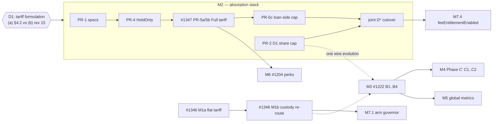

# VPFI Recycling — Completion Plan (programme of record)

| Field | Value |
| --- | --- |
| **Title** | VPFI Recycling — Completion Plan |
| **Author** | Vaipakam Developer Team |
| **Date** | 2026-07-18 |
| **Status** | **Draft — programme plan + Phase B′ implementation design** for owner review. Single document of record for *everything still required* to complete VPFI recycling, re-verified against `main` (through the RL-4 landing) and reconciled with the 2026-07-18 completeness-scout state (#1346, #1347, the #1222 parked B1–B4/C1–C2 plan + WIP branch) |
| **Cards** | Umbrella **#1349** · #1222 (Phase B′ mesh + Phase C′) · #1331 (folds into B2) · #1346 (Layer 0) · #1347 (Layer 2 — **D1 DECIDED (b)**, owner 2026-07-18; re-based to the formula doc) · #1218 (metric completion) · #1204 / #1219 (channels 3–4) · M2 card set (cut per §M2) |
| **Substrate (binding)** | [`VpfiRecyclingBalanceGovernorDesign.md`](VpfiRecyclingBalanceGovernorDesign.md) (RATIFIED governor), [`VpfiCrossChainRecyclingDesign.md`](VpfiCrossChainRecyclingDesign.md) (Option-B mesh), [`VpfiRecyclingLoopClosureDesign.md`](VpfiRecyclingLoopClosureDesign.md) (RATIFIED RL-1…6), [`VpfiAbsorptionDistributionFormulaRedesign.md`](VpfiAbsorptionDistributionFormulaRedesign.md) **at its CURRENT revision** (rev 15 at time of writing — adds ack-timed remitted accounting + reward-haircut snapshotting over the rev-8–14 freezes; M2 cards scope against the live file, never a pinned rev — see the §M2 divergence decision) |

---

## 0. Purpose

Four design documents govern VPFI recycling, written at different times
against different code states, plus a completeness scout (2026-07-18) that
filed cards and parked WIP. This plan consolidates all of it into one
verified programme: what is **done** on `main`, what **remains**, in what
**order**, which older checklist items are **superseded**, and the one
genuine **design divergence** that gated the biggest remaining block —
**resolved: D1 decided (b), owner 2026-07-18** (§M2/§7.1). It also carries the Phase B′
mesh implementation design (§M3), aligned to the #1222 parked
decomposition with two corrections.

**Definition of done** is §6: every governor-§4 absorption class live or
explicitly market-era deferred; distribution absorption-coupled on every
deployed chain; recycle-at-source with shortfall-only remittance; loop
health publicly observable; and the system **armed**, not just merged dark.

## 1. State of `main` — DONE (verified 2026-07-18)

| Piece | Landed via | Notes |
| --- | --- | --- |
| Recycle-bucket ledger, `LibVpfiRecycle.credit` chokepoint, `VpfiRecycled` day-bucketed feed, backing check, forfeited-reward re-route | #1217 PR-3a (#1312) | `RecycleSource` enum reserves every future class; only `ForfeitedReward` + `ExpiredReward` have credit sites today |
| Governor: absorption-coupled day-pool stamps, commitment accounting, margin knob, `armedFromDay` arming | #1217 PR-3b (#1313) | Ships **unarmed** — schedule-only until the ceremony (§M7) |
| Dual fresh/recycled accumulators, consume-at-claim, pool-composition + arming broadcast (8-word payload) | #1217 PR-3c (#1315) | Composition crosses the mesh already; custody stays Base-side |
| RL-1 claim-to-vault delivery (Diamond-funded credit primitive, `deliverTo`, wrapper carve-outs, broadcast-safe rollup) | #1301 (#1302) | |
| RL-2 retention ledger + `VaultVpfiDebited` + indexer `rewardLoopLedger` | #1303 (#1310) | Dashboard *surface* still pending (§M5) |
| RL-3 claim-horizon sweep (per-entry, grandfathered, split signals) | #1305 (#1317) | **Dark** until the horizon knob is set; mirror routing gap = #1331 |
| RL-4 allocation register (claims-first structural, forward reserve, dormant `[keeper 0, reserve 10000]`) | #1306 (#1344) | Base-only by design |
| RL-6 legal evidence pack + copy-rules release gate | #1304 (#1308) | |
| Read views (`getRecycleBucket`, `getRecycledCreditedByDay`, `getRecycleConfig`, `getRecycleRegisterState`) + EIP-170 lens refactor | #1344 / #1333 | |

**Verified NOT done:** notification-fee custody re-route + flat tariff
(`LibNotificationFee.bill` still pays user-vault → treasury, "No Diamond
custody", via the fixed conversion) — #1346; the Layer-2 tariff charger
(no `credit(FullTariff, …)` call site) — #1347; the #1294 D1/HoldOnly/
settlement-sweep stack (no `dayCapMode`/ShareOfPool/`feeEntitlement`
anywhere in `contracts/src`); all Phase B′ mesh fields (no
`chainRecycledVpfi18`, no `recycleConsume` — B1 WIP parked on
`feat/1222-b1-per-chain-recycled-ledger`, not for merge); Phase C′; the
arming ceremonies.

## 2. Is the cross-chain mesh (#1222) still required? — YES

Re-checked after #1299 and the A′ landings. The mesh substrate was kept
verbatim by every later design; the code state has made the need concrete:

1. **Mirror buckets accumulate with nothing consuming them.**
   `LibVpfiRecycle.credit` is chain-agnostic and the facets are identical
   everywhere, so a mirror's forfeited rewards (LIVE class) credit that
   mirror's local `recycleBucket` — but sizing, commitment reserve, and
   consume paths are all `onlyCanonical`. Mirror-absorbed VPFI is parked,
   invisible to `Ā`, funding nothing.
2. **Base over-remits while mirror buckets sit full** — #776 remittances
   don't know a mirror holds protocol-owned recycled VPFI locally;
   exactly the round-trip waste Option B exists to remove.
3. **Global `Ā` under-counts**: the coupled term sizes from Base-local
   credits only.
4. **A live, filed drift exists (#1331)**: mirror remitted-recycled
   shares hit a no-op `releaseCommitment` instead of crediting the local
   bucket — benign only *because* B′ is missing.
5. **RL-3's ratified mirror rules presuppose B′.**

Scope nuance (matches the owner's 2026-07-18 parking directive): B′ is
not needed while the reward program ships **dark / Base-only** — it is a
hard prerequisite of the **multi-chain reward rollout** being
economically correct. Parking is sequencing, not obsolescence.

## 3. The remaining programme — eight milestones

### M1 — Layer 0: notification tariff into the loop — card **#1346**

As filed (matches this plan): **M1a** flat-VPFI re-denomination (drop the
`VPFI_PER_ETH_FIXED_PHASE1` conversion — the class §14.2 forbids at
launch; default preserves today's ≈0.5 VPFI typical bill) + **M1b**
custody re-route into Diamond custody with
`credit(NotificationFee, …)`. No deps — the PR-3a chokepoint is live.
Reconcile with **#973 (L26)** in the same PR: the bill path moves vault
VPFI without the mandatory discount/tier restamp; the re-route must run
the standard tracked-balance/rollup tail. First live non-forfeit
absorption class; ships dark like everything else.

### M2 — The absorption formula stack — card **#1347** + the M2 card set

> **D1 DECIDED: (b)** — owner, 2026-07-18. The
> `VpfiAbsorptionDistributionFormulaRedesign.md` LIF·year dual-fee
> package at its current revision governs M2; option (a) is retired
> (the governor §4.2 formula gets its supersession note; the unwired
> `recycleTariffKPer1e18EthDay` knob is deleted once no caller remains).
> The divergence table is retained below for the record.

The launch-era absorption path is the tariff-priced discount entitlement
— on this everything agrees. What the tariff IS diverged between two
documents; the owner resolved it as recorded above (historical table):

| | **(a) Governor §4.2** (RATIFIED 2026-07-15; how #1347 is currently written) | **(b) #1294 rev 8–15** (merged doc, Draft status, but carrying later owner product decisions C1–C6 dated 2026-07-16) |
| --- | --- | --- |
| Formula | `k × loanVolumeETH × durationDays` (ETH·day) | `C* = baseLif_list × tYears × K` (LIF·year; K default 5e18) |
| Knob | `recycleTariffKPer1e18EthDay` (exists, unwired) | **New** `tariffKPerLifYear`; rev 14+ explicitly **forbids** wiring the ETH·day knob and retires it |
| Effect of paying | Buys that loan's LIF + yield-fee **discount entitlement** (applied at settlement) | **Dual-fee Full**: asset fees always charged; +10% own-side discount (CAP 50%); tariff absorbed at init, never a waiver/offset |
| Who pays | Party opting in | **Per-party double absorption** (each Full party pays own `C*`; both ⇒ 2×C*) |
| Coupling | Standalone charger | Drags the **loan-side reward cap** (`½×C*×(1−m_reward)` replaces #1008) + **D1 share cap** + joint `D*` cutover — `feeEntitlementEnabled=true` is forbidden until PR-5c is live |
| List fees | Unchanged (0.1% / 1%) | Frozen **0.2% LIF / 2% yield** with open-loan grandfathering |

**Recommendation: (b)** — it is the later owner decision set, it went
through five Codex design rounds, and its supersession map explicitly
retires (a)'s formula ("do not wire `setRecycleTariffKPer1e18EthDay` for
Phase-1 absorption"). But (b) is materially bigger (it re-prices list
fees and replaces the reward-cap regime), so the choice is the owner's,
made consciously — not defaulted. On (b), #1347's body is re-based to
the current revision (rev 15) and the card set below is cut; on (a), the
formula doc's fee/tariff sections get a supersession note instead. **The
formula doc's D1 + messenger content survives either way — with one
non-negotiable coupling under (a) too:** ShareOfPool must never cut over
without a per-loan fee-linked reward cap in force. Under (b) that is
PR-5c; under (a) the equivalent cap must be defined from (a)'s own
tariff (e.g. `½ × kEthDay-tariff × (1−m_reward)` per side) **or** the
D1 ShareOfPool cutover stays blocked (keep #1008) until one exists —
choosing (a) never licenses the documented D1-only thin-book
over-reward path.

Cards to cut on (b) (titles per the #1294 PR plan; PR-3a–3c landed —
**PR-3d, the metrics slice, is NOT landed and lives on as M5/#1218** —
PR-7 = #1346):

| Card | Scope | Hard deps |
| --- | --- | --- |
| PR-1 | Spec supersession (docs; fee defaults 20/200 + grandfather resolver) | D1 decided |
| PR-2 | D1 `(user,side,day)` share cap + joint day SM + broadcast evolution (coordinate with §M3 wire rule) | mirrors decode first |
| PR-4 | HoldOnly hybrid borrower LIF + fee-default migration | PR-1 |
| PR-5a/5b | Per-party Full tariff (LIF·year `C*`, `maxCStar` auth, no silent downgrade) + `credit(FullTariff, …)` at init | PR-4; #1347 re-based |
| PR-5c | Loan-side reward cap + `cStar` backfill gate | PR-5b |
| — | **Joint cutover `D*`** (arm ShareOfPool only when 5c live) | PR-2 + PR-5c |
| PR-6 | Settlement sweep honors lender hold + Full stamps | PR-4 + PR-5b |
| PR-8 | Frontend (tariff quote, incidence copy, no purchase-price language) | PR-5b ABIs |
| PR-9 | Deploy asserts (peg unset, fee 20/200, knob states) | before mainnet |

### M3 — Phase B′ mesh — card **#1222** (adopting its parked B1–B4 plan, with two corrections)

The #1222 parked decomposition (B1 ledger+report, B2 broadcast
consume/keeper + commitment-on-arrival absorbing #1331, B3 source-scoped
netted remittance, B4 e2e/invariants/watcher/specs) matches this plan and
is adopted as the implementation cut. Two corrections before B1 resumes:

1. **B1 must carry TWO report fields, not one.** The parked B1 adds only
   the cumulative `chainRecycledVpfi18` (payload 4→5). The ratified
   governor (§6, Codex r2) requires the mirror to report **both** the
   cumulative (availability accounting, self-healing) **and the
   day-bucketed credit total for the closing day** (`Ā`'s per-day
   attribution) — a cumulative delta spanning a missed day cannot be
   split between D and D+1, letting report *timing* rather than receipt
   timing shift budgets. Report payload goes 4→6 in one bump; the WIP
   branch's test updates cover both.
2. **Per-chain two-pass funding resolution** (governor §3.1, Codex
   r5/r6) belongs in B2/B3: global `Ā` sizes the *target*;
   `localFunded_c = min(target_c, availRecycled_c)`; Base tops up
   pro-rata (claims-first, keeper residual); each chain's broadcast
   carries its own funded `recycledHalf_c`. A chain whose slice is
   unfunded gets a smaller add-on — never a claim against tokens parked
   on another mirror.

Kept from the parked plan verbatim: commitment semantics (broadcast
*commits*; bucket debited pro-rata at claim/remit), whole-day idempotency
stamp covering every bucket-touching field, `consumed ≤ reported` per
chain, source-scoped netting with commitment-netted `availRecycled`,
per-destination arrays aligned to `broadcastDestinationChainIds`,
mirrors-decode-first messenger redeploy. **Wire-format rule, stated as a
field union — never an assumed word count:** standalone M3 widens the
kind-2 broadcast with the two new fields (`recycleConsume`,
`keeperAllocate`) and the report 4→6 — **and the broadcast build becomes
per-destination**: today's messenger builds ONE payload and loops over
`broadcastDestinationChainIds`, but under the §M3 two-pass funding
correction each chain must receive its OWN funded values —
`recycledHalf_c` (replacing the today-global `recycledHalf` slot),
`recycleConsume_c`, `keeperAllocate_c`. A single shared payload would
have every mirror accruing against the same recycled half even when a
chain's slice was funding-trimmed. So the B2 change is per-destination
payload assembly (or explicit per-destination array fields), not merely
"+2 words". If M2's PR-2 D1 evolution lands in the same window, the
combined shape is the **union of both field sets** — D1 replaces
`capThreshold18` with `capMode` + `capPayload` (net +1 word) *and* the
two recycle fields ride along (11 words, or a new kind with the explicit
field list) — one evolution, one mirrors-decode-first gate, with the
implementing PR pinning the exact layout. Naming a fixed word count
across both upgrades is exactly how a decoder silently drops `capMode`
or a recycle field; the layout is derived from the union at
implementation time. #1331 is absorbed by B2
(remit-ingress labeling + remitted-recycled = local credit vs
locally-committed = pure release, across claim/forfeit/expiry paths).
RL-3 mirror expiries then report their day-bucketed credits to Base like
any other receipt. Phase C′ (C1 surplus knob, C2 batched repatriation,
Base-ledgered before the send) stays sequenced last, unchanged.

Invariants/tests: the B4 list, plus the governor §7 commitment
invariants per chain and the no-double-count rule across
fresh / remitted-recycled / locally-committed shares.

### M4 — Phase C′ surplus tooling — #1222 tail (C1 + C2, unchanged)

### M5 — #1218 transparency dashboard completion

RL-2 landed the ledger + events + indexer ingestion; remaining: the
derived views — `selfFundingRatio`, commitment-netted `platformRetained`,
`runwayExtensionDays` (`∞ / self-funded` terminal form), and the
net-emission series, which under the governor is **`freshDrawdown[D]`**
(the scheduleFloor actually drawn fresh), not the superseded
`freshMint − recycled` formula — plus the public dashboard surface under
RL-6's copy gate (supply/flow transparency only). Meaningful once
#1346/#1347 give absorption a live feed; global figures sum per-chain
day-bucketed credits after M3.

### M6 — Absorption channels 3–4 (RL-5's four-channel posture)

**E-2 spend-gated perks (#1204)** — the two spend-gated perks charge
VPFI → `credit(…)`; ratified (RL-5) to ride M2's release train. **Gate:
the #1204 design's own status is `legal glance → per-perk build` — the
glance precedes the build here exactly as for bonds**, and §6 counts
perks complete only in a decided state (glance passed + built, or an
explicit owner deferral recorded on #1204).
**#1219 service bonds** — schedule the legal glance now (the bounded
review slot the excision doc recommends); slash path →
`credit(ServiceBondSlash, …)` on build.

### M7 — Activation ceremonies (runbook, not code — nothing is real until this)

GovernanceRunbook gains a recycling section, executed in order:

1. **Arm the governor** (`armedFromDay`) once M1b gives absorption a
   live feed — **AND only while reward claims are Base-only / dark on
   mirrors, or M3 (Phase B′) is complete.** Arming with active mirror
   claims and no mesh produces exactly the §2 failure set (mirror
   buckets invisible to global `Ā`, Base over-remitting, the #1331-class
   drift becoming economically real). The runbook entry carries this
   gate as a precondition checklist item, not prose.
2. **RL-3 horizon knob** — only after the free-channel pre-expiry notice
   (in-app notification center) is verified live; the ≥90-day
   grandfather window starts at activation.
3. **RL-4 weights** — stay `[keeper 0, reserve 10000]` absent a keeper
   funding need.
4. **`feeEntitlementEnabled`** — only at the M2 joint-cutover gate.
5. Deploy asserts (M2 PR-9) wired into `predeploy-check.sh`.

### M8 — Docs housekeeping

Assemble the pending `1217-*`/`130x-*` release-note fragments;
TokenomicsTechSpec edits ride each implementing PR; whitepaper
reconciliation (#882) when that copy is next touched.

## 4. Dependency graph

## 5. Card actions

**Umbrella: #1349** mirrors this plan's M1–M8 as a single programme
tracker (checklist per milestone, D1 gate, DoD) — the one card to read;
constituent cards below remain the working tickets.

| Card | Action |
| --- | --- |
| #1349 | Umbrella — keep in lockstep with this plan; tick milestones as constituent cards close |
| #1346 | Keep as filed = M1; add the #973 restamp note (comment posted) |
| #1347 | **D1 decided (b)** — body re-based to the formula doc at current rev (LIF·year, dual-fee, per-party double absorption, PR-5a/5b scope) |
| #1222 | Adopt the parked B1–B4/C1–C2 cut with §M3's two corrections (B1 two report fields; two-pass funding in B2/B3); #1331 stays absorbed by B2 |
| #1331 | **CLOSED 2026-07-18 as duplicate of #1222** — its full scope (remit-ingress labeling; remitted-recycled = local credit vs locally-committed = pure release, across claim/forfeit/expiry) is §M3's B2; the B4 tests must cover it |
| #1218 | Re-point at §M5 (net-emission = `freshDrawdown` under the governor; dashboard surface) |
| #1204 / #1219 | Keep; note the RL-5 release-train commitment; schedule the #1219 legal glance |
| New | Cut the M2 card set (per §M2 table) once D1 is decided; one M7 runbook card |
| #1217 | **CLOSED 2026-07-18 as completed** — tasks 1/4 shipped (governor stack), task 2's conversion-routing superseded (successors: #1346 Layer 0, #1347 Layer 2), task 3 continues as #1218 (§M5); fragment assembly stays tracked by M8, not by the card. #1301–#1306 closed via their PRs |

## 6. Definition of done — "VPFI recycling complete"

1. **Absorption**: notification tariff (M1) + Full tariff (M2) live and
   crediting the bucket; forfeit/expiry classes live (already);
   **spend-gated perks (#1204) in a DECIDED state** — legal glance passed
   + built and crediting, or an explicit owner deferral recorded on
   #1204; **service bonds (#1219) in a DECIDED state** — either the
   legal glance passed and the slash path (`credit(ServiceBondSlash, …)`)
   built and live, **or** an explicit owner deferral recorded on #1219
   (the same completed-deferral treatment as the conversion classes) —
   "pending" is not a done state; conversion classes (borrower
   LIF-in-VPFI, yield-fee-in-VPFI, matcher remainders) explicitly
   **market-era deferred** behind the single §14 legal item — deferral
   is a completed state, not an omission.
2. **Distribution**: governor armed; `dailyPool = scheduleFloor +
   (1−m)×Ā` live with commitment discipline; D1 + loan-side cap cut over
   jointly; rewards delivered claim-to-vault by default.
3. **Cross-chain**: recycle-at-source + netted remittance live on every
   deployed chain (M3); surplus tooling available (M4); watcher
   invariants green.
4. **Observability**: #1218 dashboard live (loop-closure,
   self-funding, net-emission), global across chains.
5. **Governance/ops**: all M7 ceremonies executed and recorded; deploy
   asserts green; the retired ETH·day knob removed or documented dormant
   (per D1's outcome).
6. **Docs**: specs current per-PR; release notes assembled; #1217,
   #1222, #1331, #1346, #1347, #1218 closed.

## 7. Decisions asked of the owner

1. **D1 — tariff formulation** (§M2): **DECIDED (b)** — owner,
   2026-07-18: the `VpfiAbsorptionDistributionFormulaRedesign.md`
   LIF·year dual-fee package at its CURRENT revision (rev 15 at time of
   writing, whose later freezes — reward-haircut snapshotting, ack-timed
   remitted accounting — are part of the package). M2 cards scope
   against the live document, never a pinned rev; #1347 re-based;
   option (a) retired with a supersession note.
2. Confirm this plan as the **programme of record** (supersedes the
   Phase-B checklist in #1222's body; adopts the parked B1–B4/C1–C2 cut
   with §M3's two corrections).
3. Confirm the **wire-evolution coordination rule**: one messenger
   widening shared between M2's D1 broadcast and M3's mesh fields if they
   land in the same window.
