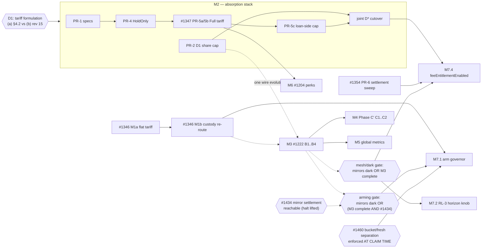

# VPFI Recycling — Completion Plan (programme of record)

| Field | Value |
| --- | --- |
| **Title** | VPFI Recycling — Completion Plan |
| **Author** | Vaipakam Developer Team |
| **Date** | 2026-07-18 |
| **Status** | **Draft — programme plan + Phase B′ implementation design** for owner review. Single document of record for *everything still required* to complete VPFI recycling, re-verified against `main` (through the RL-4 landing) and reconciled with the 2026-07-18 completeness-scout state (#1346, #1347, the #1222 parked B1–B4/C1–C2 plan + WIP branch) |
| **Cards** | Umbrella **#1349** · #1222 (Phase B′ mesh + Phase C′) · #1331 (folds into B2) · #1346 (Layer 0) · #1347 (Layer 2 — **D1 DECIDED (b)**, owner 2026-07-18; re-based to the formula doc) · #1218 (metric completion) · #1204 / #1219 (channels 3–4) · M2 card set (cut per §M2) |
| **Substrate (binding)** | [`VpfiRecyclingBalanceGovernorDesign.md`](VpfiRecyclingBalanceGovernorDesign.md) (RATIFIED governor), [`VpfiCrossChainRecyclingDesign.md`](VpfiCrossChainRecyclingDesign.md) (Option-B mesh), [`VpfiRecyclingLoopClosureDesign.md`](VpfiRecyclingLoopClosureDesign.md) (RATIFIED RL-1…6), [`VpfiAbsorptionDistributionFormulaRedesign.md`](VpfiAbsorptionDistributionFormulaRedesign.md) **pinned at rev 15 — the revision the owner's D1 decision (2026-07-18) approved** (adds ack-timed remitted accounting + reward-haircut snapshotting over the rev-8–14 freezes). A later formula-doc rev enters implementation scope ONLY after this completion plan is updated to adopt it (a conscious re-ratification step) — cards must never silently follow a mutable draft past the decided revision |

---

## 0. Purpose

Four design documents govern VPFI recycling, written at different times
against different code states, plus a completeness scout (2026-07-18) that
filed cards and parked WIP. This plan consolidates all of it into one
verified programme: what is **done** on `main`, what **remains**, in what
**order**, which older checklist items are **superseded**, and the one
genuine **design divergence** that gated the biggest remaining block —
**resolved: D1 decided (b), owner 2026-07-18** (§M2/§7.1). It also carries the Phase B′
mesh implementation design (§M3), aligned to the #1222 parked
decomposition with two corrections.

**Definition of done** is §6: every governor-§4 absorption class live or
explicitly market-era deferred; distribution absorption-coupled on every
deployed chain; recycle-at-source with shortfall-only remittance; loop
health publicly observable; and the system **armed**, not just merged dark.

## 1. State of `main` — DONE (verified 2026-07-18)

| Piece | Landed via | Notes |
| --- | --- | --- |
| Recycle-bucket ledger, `LibVpfiRecycle.credit` chokepoint, `VpfiRecycled` day-bucketed feed, backing check, forfeited-reward re-route | #1217 PR-3a (#1312) | `RecycleSource` enum reserves the currently-designed classes (notification, tariff, LIF/yield/matcher, bond slash, forfeit/expiry); only `ForfeitedReward` + `ExpiredReward` have credit sites today. **Not yet reserved: a spend-gated-perk class — the #1204 build appends `SpendGatedPerk` (enum is append-only, stable ABI) rather than misclassifying perk absorption under another source** |
| Governor: absorption-coupled day-pool stamps, commitment accounting, margin knob, `armedFromDay` arming | #1217 PR-3b (#1313) | Ships **unarmed** — schedule-only until the ceremony (§M7) |
| Dual fresh/recycled accumulators, consume-at-claim, pool-composition + arming broadcast (8-word payload) | #1217 PR-3c (#1315) | Composition crosses the mesh already; custody stays Base-side |
| RL-1 claim-to-vault delivery (Diamond-funded credit primitive, `deliverTo`, wrapper carve-outs, broadcast-safe rollup) | #1301 (#1302) | |
| RL-2 retention ledger + `VaultVpfiDebited` + indexer `rewardLoopLedger` | #1303 (#1310) | Dashboard *surface* still pending (§M5) |
| RL-3 claim-horizon sweep (per-entry, grandfathered, split signals) | #1305 (#1317) | **Dark** until the horizon knob is set; mirror routing gap = #1331 |
| RL-4 allocation register (claims-first structural, forward reserve, dormant `[keeper 0, reserve 10000]`) | #1306 (#1344) | Base-only by design |
| RL-6 legal evidence pack + copy-rules release gate | #1304 (#1308) | |
| Read views (`getRecycleBucket`, `getRecycledCreditedByDay`, `getRecycleConfig`, `getRecycleRegisterState`) + EIP-170 lens refactor | #1344 / #1333 | |

**Verified NOT done (as of 2026-07-18 — see §1a for the current state):**
notification-fee custody re-route + flat tariff — #1346; the Layer-2
tariff charger — #1347; the #1294 D1/HoldOnly/settlement-sweep stack;
all Phase B′ mesh fields; Phase C′; the arming ceremonies.

## 1a. Status refresh — verified against `main` 2026-07-27 (through #1435)

The 2026-07-18 baseline above is retained for the record; this section is
the current state. Everything below merged **dark/dormant** — the M7
ceremonies remain the only activation path — **with TWO exceptions
that are LIVE now**:

1. **The M1 notification tariff.** `LibNotificationFee.bill` has no M7
   gate: on any deployment where notification billing runs, the flat
   tariff already moves into Diamond custody and credits the bucket
   (`credit(NotificationFee, …)`) — operators account for those
   credits now, not after the ceremonies.
2. **The #1352 fee changes.** The 0.2% LIF / 2% yield-fee freeze is a
   **compiled constant** (`LOAN_INITIATION_FEE_BPS = 20`) charged at
   accept, and the borrower HoldOnly direct lending-asset fee
   reduction likewise runs at origination — neither waits for
   `feeEntitlementEnabled` or a ceremony. Current borrower charges and
   treasury fee behaviour already reflect them. "Dark" properly covers
   the Full channel, the loan-side reward cap, and their gated
   settlement behaviour.

**Now DONE (all Codex-reviewed, all `Closes` their cards):**

| Milestone | Landed via | Notes |
| --- | --- | --- |
| **M1 complete** (#1346) | #1358 | Flat native tariff + numeraire-rotation removal + Diamond-custody re-route + `credit(NotificationFee, …)` + the #973 restamp tail |
| **M2 — all landed slices** (milestone itself stays IN PROGRESS until #1369) | #1350→#1359 (specs) · #1352→#1363 (HoldOnly + 20/200 freeze + grandfather resolver) · #1347→#1366 (Full tariff, dark) · #1353→#1371 (loan-side cap, dark) · #1354→#1381 (settlement sweep, dark) · #1355→#1412 (frontend) · #1356→#1411 (deploy asserts + facet-key drift gate) · **#1351 CLOSED** via the slice series #1397/#1399/#1407–#1410 (D1 ShareOfPool claim SM: storage+knob+stamp, `processUserSideDay`, pricing core, chunked claim, preview-parity) with its remit-side prerequisite delivered by B2-d2 | Settlement-sweep long tail closed by follow-up cards #1383 (PR-B2/B3 repay/preclose/swap families), #1384 (extension repricing), #1391 (offset close-out), #1392 (sold-position discount continuity). **One deferred origination-auth slice remains — #1369** (see the remaining map): signed-offer makers cannot authorize Full, and matched fills ignore the lender offer's `creatorFull` — so the M2 milestone must NOT be checked off on the umbrella tracker until #1369 lands; only the listed slices are done |
| **M3 B1 + B2-a…d2** (#1222, in progress) | B1 #1413 · B2-a #1414 (two-pass per-chain funding) · B2-b #1417 (per-destination BROADCAST_V2 — the D1+mesh **union** landed as one 15-word kind-5 evolution, per the wire rule) · B2-c #1422 (Base-side commitment-gate plumbing) · B2-d1 #1425 (per-entry mirror→Base commitment report, kind-6) · B2-d2 #1426 (delivered-backing remit ledger `(remitter, remitId)` + kind-7 ack + Σcommitments remit gate/clamp + operator valves + zeroed-chain manual-budget path) | Keeper passes shipped with d1/d2; **operator prerequisite: D1 migrations `0043_keeper_commitment_scan.sql` + `0044_keeper_remit_ack.sql` before arming** |

**Implementation supersessions of this plan's §M3 text (recorded; the
merged PRs' design records are authoritative):**

1. **B1 consistency clamp** landed as the **AGGREGATE form** — the
   baseline advances only by accepted credit, order-independent,
   `Σattributed ≤ reported` — superseding this plan's
   per-chain-monotonic-cursor / lower-day-snapshot options (Codex r2 on
   #1413 showed the per-report-delta clamp corrupts quiet-day late
   closes).
2. **Gate retiming (§2b of the B2-d design record) — RATIFIED (owner,
   2026-07-27):** finalize-readiness does NOT wait for commitment
   reports (causally circular — the report prices from finalize's own
   outputs); the "never from a partial set / delays never zeroes" rule
   binds at the **remit gate** instead — tokens never leave Base for a
   mirror until that mirror's report is complete — and
   `remitIneligible` marks a silent chain ZEROED out of that day's
   shipment until operator reconciliation. Load-bearing in #1425 +
   #1426. This supersedes this plan's earlier "chunk completeness wired
   into day-finalization readiness" rule (the §M3 text carries the
   in-place supersession note).

**Still REMAINING for complete VPFI recycling:**

| Item | Where |
| --- | --- |
| ~~**M3 B2-d3**~~ **— DONE, merged `bf2b97cc` (#1430).** Mirror commitment-on-arrival (**not** the "consume-on-arrival" this row said while parked — arrival RESERVES the instructed amount into the mirror's `outstandingCommitRecycled`; the bucket is debited later, pro-rata, at claim/remit, per this plan's own "broadcast *commits*" rule. Debiting at arrival would charge the same tokens twice, because claims already debit as they pay — see `LibVpfiRecycle.reserveMirrorCommit`) + two-sided netting + per-chain books (`chainConsumedRecycled` / `chainOutstandingRecycledCommit` become real; `_stampOne` local-vs-top-up split; remittance netting) — makes the per-chain §7 invariants bind | #1222 |
| **M3 B2-d4** — lift the mirror `_dayPoolHalves` pricing halt (mirror claims are HALTED on armed days until this lands — per the B2-d design record `Vpfi1222B2dDeliveredBackingDesign.md`; `LibInteractionRewards` gates on it). **ATTEMPTED 2026-07-27 (PR #1433) and WITHDRAWN — the halt STAYS.** d5 discharged the precondition this row assumed, but review found the halt ALSO guards (a) the FRESH side, which has no delivered-funding bound on a mirror and truncates-terminally rather than deferring, and (b) deliberately-zeroed (`remitIneligible`) days, which would advance the cursor and retire their entries for zero — and which the manual-compensation path cannot reprice, since nothing writes the mirror's funding stamp. **Both prerequisites, and the retry of this slice, are tracked on #1434** (design record §2g) | #1222 → **#1434** |
| ~~**M3 B2-d5**~~ **— DONE, merged `64964e91` (#1432).** The `Ā`-excluded remitted-recycled custody-credit class (`RecycleSource.RemittedCustodyRelocation`) + the #1331 reclassification. The exclusion covers the REPORTED CUMULATIVE as well as the `Ā` day-bucket (the derived floor `bucket + paidOut` would otherwise re-admit it), and the remit payload carries a leading keccak version sentinel (`RemitWire.REMIT_WIRE_TAG_D5`) so an un-upgraded receiver REJECTS rather than silently truncates | #1222 |
| **M2 #1369** — deferred Full-auth origination paths: signed-offer maker Full authorization (`OfferCreateFacet`) + matched fills honoring the lender offer's `creatorFull` (`FeeEntitlementFacet`) + the frontend maker surface — without it, those parties cannot enter the Full absorption channel even after enablement | #1369 |
| ~~**M3 B3**~~ **— DONE, merged `4961e9db` (#1435).** Source-scoped netted remittance completion. d3 had shipped the SEND half (shortfall-only remittance); B3 closed the BOOK half — mirrors now report two commitment-retirement cumulatives (total retired, and the release-only subset) on the day-close, so `chainOutstandingRecycledCommit[c]` finally RETIRES (`== instructed − retired`, exact with broadcasts in flight) and a commitment released un-spent restores that chain's availability instead of being lost forever. Both figures are clamped on ingest against Base's own instruction ledger — a mirror is trusted for timing, never magnitude — which forces `avail ≤ reported` and keeps d5's exclusion intact. Report payload 6→8 words (length is a sound discriminator here: flat `uint256` tuple, no dynamic member, so no version sentinel is needed unlike d5's remit payload). Design record `Vpfi1222B3SourceScopedNettingDesign.md` | #1222 |
| **M3 B4** — 3-chain mesh e2e + invariants + watcher per-chain bucket checks + TokenomicsTechSpec §4a. **B4-a DONE, merged `393852d9` (#1437)** (per-chain §7 commitment invariants). **B4-b DONE, merged `48ab772e` (#1439)** (three real diamonds over a queueing `MeshBusMessenger`; surfaced the **#1434-before-`D*` second arming gate** now recorded in §M7 and in the §4 graph's `ARMGATE` node). **B4-c DONE, merged `e77fe3de` (#1443).** `ops/mesh-watcher`, a standalone Cloudflare Worker reading every reward chain's recycled ledger. B4-c SHIPPED with eight CRITICAL checks as real alerts (commit identity, the clamp chain, the §7 #6 consumed cap, attribution ceiling, availability formula, Base self-inertness, Base-never-ahead-of-chain, bucket coverage — the last then CRITICAL on mirrors only, since `releaseRemitReservation` makes a canonical shortfall the intended recovery state; #1448 below supersedes that scoping and takes the total to ELEVEN CRITICAL checks — adding `bucket-composition` (both directions), `reported-derivation` and `role-consistency`); stuck-settlement, report-lag and coverage gaps ship **ADVISORY** and are delivered silently. Nine Codex rounds / ~54 findings drove a source-level restructure: error text is classified rather than forwarded, storage returns failures rather than throwing, and the windowed-signal rules, alert identity, health definition and snapshot freshness each live in one enforced place. 146 tests, 65 mutations at B4-c; 180 tests and a further nine mutation checks after the #1448 follow-up. Code-complete and **undeployed** — D1 creation, secrets and the first deploy are documented operator steps in its README. **B4-c follow-ups #1444 + #1446 DONE, merged via #1448** — the contracts now publish the raw stored counters behind the recycled books (`getRecycleCompositionPosition`) plus the released-remit stranded cumulative, which closed both gaps without the event-stream scanning #1446 had assumed it needed. Bucket coverage became a single strict rule on every chain (the canonical advisory exception is gone, not documented — governor §7 #2 amended to its universal form), and two new CRITICAL checks landed: `bucket-composition` (a counter cannot claim more credit than the bucket received — catches a custody relocation also advancing absorption) and `reported-derivation` (the published cumulative is re-derived off-chain and disagreed with). Neither subsumes the other and the tests assert that. **#1445** (endpoint chain-identity) is CLOSED — every tick verifies `eth_chainId` per target against the id its secret is named for, so a mis-set endpoint can no longer be adopted silently and report a clean tick against the wrong chain. The watcher's remaining untested seam is the `mesh.ts` wiring around that check, recorded as a coverage boundary in its README rather than as a limitation. **B4-d DONE.** TokenomicsTechSpec §4a swept — the funding bullets described the pre-mesh shape (canonical chain funds every slice on demand) long after two-pass self-funding, the commitment-report gate and the zeroed-chain manual path shipped, and §4a's testing requirements now record what a mesh test must establish that a single-deployment test cannot. §7 #2's fresh half driven to its boundary: the invariant is an upper bound the campaign cannot approach (fresh reservations size from the fixed schedule, ~20,164 VPFI on an early day, over **52** finalizable slots — days 0-39 from the general actions plus the 12 even days 40-62 that `instructThenRetire` reserves — so 51 with a non-zero schedule and ~1.03M reachable against 69M: a factor of ~67, **under two orders of magnitude**. Counted twice: the first version of this row said "seven orders", the second "fewer than 40 slots, under ~1M"; both were wrong and the conclusion was unchanged by either), so FIVE deterministic tests place the ledger AT the cap: fresh clamps to exactly the remaining headroom rather than to the day's schedule; at the cap exactly fresh goes to zero while recycled keeps funding (§7 #1's "bounds fresh drawdown only"); value already REMITTED reserves identically — the one term no fixture could otherwise reach, since it needs a mirror sent almost the whole allocation; and TWO combination fixtures, because every single-term fixture is satisfied by a formula that takes the LARGEST reservation instead of summing them (remitted+outstanding together, then all three terms with paid-out non-zero as well). Mutation evidence is recorded as a table in `MeshLedger.invariant.t.sol` beside the fixtures themselves, NOT restated here — three successive reviews caught a stale "and only that fixture" claim in this row and in the release note, each time because a fixture had been added and nothing tied the prose to the fixture set. Exclusivity was the wrong property, and so was the order criterion that briefly replaced it — the measured sets are NOT nested, so "fails while the others pass" establishes nothing either. What earns a fixture its place is pinning a distinct behaviour at the boundary. Both sides also assert the RESERVATION, not just the day's published stamp — publishing the clamped figure while reserving the unclamped one breaks the cap with every stamp assertion green, and the same publish-versus-reserve gap exists on the recycled side (a stamped recycled budget with no reservation behind it lets a later day re-offer the same availability). **Open out of B4, and NOT closed by it: #1460** — a fresh-only claim can spend recycle-bucket backing (mechanism in §M7 step 0). It is a claim-path defect rather than a mesh one, so no B4 slice closes it. **It is BOTH already reachable on an unarmed deployment AND still a hard arming gate** — not alternatives, though r17 wrongly replaced the second with the first before r19/r20 restored both. THREE conditions are needed, not two: `recycleBucket` non-zero (notification-fee absorption, ungated), a scheduled-only claim (the only kind an unarmed deployment serves), **and** the scheduled side short — `balanceOf − recycleBucket < scheduledPayout`. With ample unearmarked funding the first two hold and nothing is corrupted, so they are not sufficient alone; nothing measured the third until #1487 (M5) published the unearmarked backing figure, which makes it readable but does NOT close the defect. Arming does not make it reachable, it makes it VISIBLE, because recycled claims then fail over a shortfall an earlier scheduled claim caused — which is also why `BACKING --> ARM` stays an unconditional hard edge (§4). The edge governs SEQUENCING; reachability governs URGENCY. Full statement in §M7 step 0. An operator reading this row as "B4 done" must not conclude either that the arming path is clear or that this one can wait for the ceremony. Also open: #1452 (the one exclusion variant no bound catches), #1461 (the coverage allowance is GROSS — a released-then-late-delivered remittance still counts as stranded backing, so both post-conditions can pass over a genuinely short bucket; detection-only). **#1331's B4 coverage recorded as discharged** except the mirror half, which is unreachable until #1434 — the CONSUMPTION side only (claim / forfeit / expiry pricing → retirement / release); a mirror's bucket is credited today via `onRewardBudgetReceived` | #1222 |
| **M4 C1/C2** — surplus knob + batched repatriation | #1222 tail |
| **M5 — DONE.** Dashboard views (`selfFundingRatio`, `platformRetained`, runway, `netEmission = freshDrawdown`) + public surface. Shipped across six PRs: #1487 + #1496 (contract slices — `GovernorDayPoolStamped` widened by TWO fields, pre-launch absorption split to its own counter and event, both appended at the struct TAIL so an in-place upgrade cannot shift a slot), #1507 (indexer consumer), #1508 (day-0 provenance, #1504), #1513 (schema + read surface; the operator capture PASS split out to **#1523**), and **#1524** (the public `/analytics` surface, merged `c2ff56a16`). #1218 CLOSED. **What the surface is FOR is carrying the platform's refusals through rather than resolving them** — the read layer spends real effort declining figures it cannot stand behind, and all of it is undone by a page that renders a refusal as a zero or a dash. Ratified into TokenomicsTechSpec as four surface rules, each earned by getting it wrong first: a figure the wire format publishes unconditionally is NOT thereby safe to DISPLAY unconditionally (mirror absorption is a running partial before finalization — a machine consumer reads `stamped` beside it, a reader looking at a table cannot); a caveat is shown only where its condition holds, judged AT THE PRECISION THE SURFACE DISPLAYS; a positive amount is never presented as zero, and a published share rounds in the direction that cannot overstate; and a surface that cannot trust its input refuses ITS OWN figures without substituting a zero for the value it rejected. **M5 also publishes the unearmarked backing figure that makes #1460's third condition readable — readable is not closed; see §M7 step 0.** Open M5-adjacent follow-ups, none blocking: #1523 (versioned captures + promote; carries the unfixed post-apply-backup gap), #1525 (retained reserve beside its actual backing), #1515 (runway across a backfill boundary), #1510 (day-0 provenance is a deployment fact the event stream cannot carry) | #1218 |
| **M6** — perks (#1204, `SpendGatedPerk` enum entry, legal glance first) + bonds (#1219, schedule the glance) | #1204 / #1219 |
| **M7** — ceremonies, now including the NEW operator steps the mesh added. **Chain-side ORDER is load-bearing (r4):** **(1) enable `feeEntitlementEnabled` FIRST** — while it is off, `_fullTariffShouldRun` skips plain canonical originations, so any loan accepted after an unstamped-scan but before enablement re-joins the unstamped class and the readback goes stale; enabling first means every subsequent origination stamps itself and the scan result cannot be invalidated by new loans (this reorders the §M7.4 joint gate — arming becomes the LAST step, see the in-place note there; the alternative is atomically batching enablement + scan + arming with canonical originations paused across the batch). **(2) Zero unstamped reward-eligible canonical loans.** On armed days the legacy #1008 cap retires and the loan-side cap deliberately skips an UNSTAMPED loan (`feeEntitlementByLoanId[loanId].openDays == 0` — the rev-15 unstamped-earns-normally rule), so any reward-eligible canonical loan still open and unstamped at `D*` would earn **uncapped**. Enumerate open reward-eligible canonical loans with `openDays == 0` and resolve each, reading back **zero unresolved** before arming. **There is NO backfill surface**: `_stampEntitlement` runs only at origination and no admin/migration path can stamp an existing loan — the supported resolutions are the enable-first ordering (prevents new members of the class) and **wait-for-close** (or voluntary close/re-open) for existing ones; a true backfill needs a not-yet-filed migration card with snapshot inputs + verification. (Pre-live: enabling + arming at mainnet genesis makes the set empty by construction — but the readback is still the gate, and any testnet-rehearsal or post-launch `D*` DOES have such loans.) **(3) Arm with a propagation buffer:** `setGovernorCommitArmedFromDay(D*)` **IS the D\* cutover** — one canonical-only, one-shot, future-day-only Base call; NO per-chain `D*` administration (a mirror-chain or duplicate call reverts). The setter only writes Base storage + emits `GovernorCommitArmed` — it does NOT itself send anything: a mirror learns `D*` only when the **first application of a not-yet-applied finalized day's kind-5 broadcast** lands after arming (a replay of an already-applied day exits through the idempotency branch WITHOUT installing `armedFromDay`). Because the call is **irreversible the moment it lands** while `D*` may legally be `today+1`, choose `D*` with a **multi-day buffer** (several broadcast cycles), require the per-mirror **readback of `governorCommitArmedFromDay`** to succeed on every mirror **well before `D*`**, and have the contingency written down for a mirror that misses the deadline (its claims stay halted until CCIP delivery recovery / manual re-execution — governance cannot postpone `D*`). **Keeper side:** apply D1 migrations 0043/0044; grant the keeper EOA `KEEPER_ROLE` **on EVERY mirror Diamond** (`submitCommitmentBatch` is mirror-only AND role-gated — granting on Base alone, or missing one mirror, leaves that mirror's commitment pass reverting forever, its report never completes, and the remit gate stalls that chain's funding); **fund the keeper EOA on every mirror AND on Base (canonical)** — mirrors need transaction gas for `submitCommitmentBatch` plus the quoted native CCIP fee for `sendCommitmentReport`/`sendRemitAck`, and **Base needs gas + the CCIP `msg.value` fee for every Base→mirror `remitRewardBudget` send** (`runRewardBudgetRemit` submits from the canonical chain — an unfunded Base EOA lets commitment reports complete while every reward-budget send fails and mirror claims stay unfunded); per-chain balance readback **including the canonical chain** is part of the checklist; **verify per-destination lane capacity before enabling the flags** — the keeper excludes any day whose eligible slice exceeds `REWARD_REMIT_LANE_CAP` or the CCIP token-bucket capacity (retries cannot fund it until limits are raised, and the 50,000-VPFI default capacity can be below an early high-concentration daily slice), so the **#918 largest-slice preflight is an M7 activation dependency**: read back that each destination's token-bucket capacity AND the keeper lane cap clear the maximum supported single-day slice; authorize the remit signing EOA; and arm the **master flags together** — `KEEPER_ENABLED` + `REWARD_COMMIT_ENABLED` (commitment reports) + `REWARD_REMIT_ENABLED` (delivery-ack pass) — arming the chain without all of these leaves reports/acks inert and stalls multi-chain funding | runbook |
| **M8** — fragment assembly (`1346-*`–`1356-*`, `1383a/b-*`+, and the `1222-b*` mesh family — see §M8 for the exact filename families), #882 | docs |
| ~~Owner ratification — the §2b gate retiming~~ | **DONE — RATIFIED 2026-07-27** (supersession 2 above) |

## 2. Is the cross-chain mesh (#1222) still required? — YES

Re-checked after #1299 and the A′ landings. The mesh substrate was kept
verbatim by every later design; the code state has made the need concrete:

1. **Mirror buckets accumulate with nothing consuming them.**
   `LibVpfiRecycle.credit` is chain-agnostic and the facets are identical
   everywhere, so a mirror's forfeited rewards (LIVE class) credit that
   mirror's local `recycleBucket` — but sizing, commitment reserve, and
   consume paths are all `onlyCanonical`. Mirror-absorbed VPFI is parked,
   invisible to `Ā`, funding nothing.
   ~~*(items 1-3 as written)*~~ **SUPERSEDED by B1 and B2-a — NOT by B2-d5
   (#1457 r21).** Verified in git: `recordChainRecycled` and the mirror-report
   ledger attribution landed in **B1** (`09492a4`, #1413); folding
   `dayMirrorRecycledCredit` into `Ā` and using mirror availability for two-pass
   funding landed in **B2-a** (`a82426d`, #1414). B2-d5 (`64964e9`, #1432) added
   the relocated-custody credit class and resolves item 4 only — r19 attributed
   all four to it because item 4's strike-through was the nearest label to hand. `LibVpfiRecycle.recordChainRecycled` maintains the `Ā`
   attribution headroom and is reached from BOTH report directions, so
   mirror-absorbed VPFI is no longer invisible to `Ā`: the mirror-report
   ingress is `RewardAggregatorFacet._ingestChainReport`
   (`RewardAggregatorFacet.sol:362-386`), and Base's own local report goes
   through `RewardReporterFacet._recordChainReportLocal`
   (`RewardReporterFacet.sol:324-344`). r19 named these the other way round —
   the conclusion held but the citation was reversed, and the function names
   settle the direction (#1457 r20). Only item 4 was struck
   when B2-d5 landed; items 1-3 assert the same pre-mesh state and should have
   been struck with it. What remains gated on #1434 is the CONSUMPTION side, as
   item 4 already says.
2. ~~**Base over-remits while mirror buckets sit full** — #776 remittances
   don't know a mirror holds protocol-owned recycled VPFI locally;
   exactly the round-trip waste Option B exists to remove.~~ See above.
3. ~~**Global `Ā` under-counts**: the coupled term sizes from Base-local
   credits only.~~ See above.
4. ~~**A live, filed drift exists (#1331)**: mirror remitted-recycled
   shares hit a no-op `releaseCommitment` instead of crediting the local
   bucket — benign only *because* B′ is missing.~~ **RESOLVED by B2-d5**
   (merged `64964e91`, #1432), which moved the recycled credit to remit
   ARRIVAL: `onRewardBudgetReceived` now calls `creditCustodyRelocated`,
   so a mirror's local bucket IS credited today. Retained struck-through
   because later text still reasons from it — what remains gated on
   #1434 is the CONSUMPTION side (claim / forfeit / expiry pricing, and
   therefore retirement or release), not the credit.
5. **RL-3's ratified mirror rules presuppose B′.**

Scope nuance (matches the owner's 2026-07-18 parking directive): B′ is
not needed while the reward program ships **dark / Base-only** — it is a
hard prerequisite of the **multi-chain reward rollout** being
economically correct. Parking is sequencing, not obsolescence.

## 3. The remaining programme — eight milestones

### M1 — Layer 0: notification tariff into the loop — card **#1346**

As filed (matches this plan): **M1a** flat-VPFI re-denomination (drop the
`VPFI_PER_ETH_FIXED_PHASE1` conversion — the class §14.2 forbids at
launch; default preserves today's ≈0.5 VPFI typical bill) + **M1b**
custody re-route into Diamond custody with
`credit(NotificationFee, …)`. No deps — the PR-3a chokepoint is live.
Reconcile with **#973 (L26)** in the same PR: the bill path moves vault
VPFI without the mandatory discount/tier restamp; the re-route must run
the standard tracked-balance/rollup tail. First live non-forfeit
absorption class.
> **SUPERSEDED by implementation (see §1a):** this milestone did NOT
> ship dark. `LibNotificationFee.bill` carries no M7 gate — the flat
> tariff is LIVE wherever notification billing runs, moving VPFI into
> Diamond custody and crediting the bucket now. Operators account for
> `NotificationFee` credits from deploy, not after the ceremonies.
**Numeraire-rotation
surface (in scope):** the current code treats the notification fee as a
numeraire-denominated knob — `NumeraireConfigFacet.setNumeraire` writes
`newNotificationFeeInNewNumeraire` into the same storage slot. Once the
slot is reinterpreted as a flat VPFI amount, that rotation path would
clobber it with a fiat-denominated value on the next numeraire change.
M1 therefore also removes the notification fee from the numeraire
rotation (config/event rename included) — the flat VPFI tariff has no
numeraire linkage at all.

### M2 — The absorption formula stack — card **#1347** + the M2 card set

> **D1 DECIDED: (b)** — owner, 2026-07-18. The
> `VpfiAbsorptionDistributionFormulaRedesign.md` LIF·year dual-fee
> package at rev 15 (the D1-approved revision) governs M2; option (a) is retired
> (the governor §4.2 formula gets its supersession note; the unwired
> `recycleTariffKPer1e18EthDay` knob is deleted once no caller remains).
> The divergence table is retained below for the record.

The launch-era absorption path is the tariff-priced discount entitlement
— on this everything agrees. What the tariff IS diverged between two
documents; the owner resolved it as recorded above (historical table):

| | **(a) Governor §4.2** (RATIFIED 2026-07-15; how #1347 is currently written) | **(b) #1294 rev 8–15** (merged doc, Draft status, but carrying later owner product decisions C1–C6 dated 2026-07-16) |
| --- | --- | --- |
| Formula | `k × loanVolumeETH × durationDays` (ETH·day) | `C* = baseLif_list × tYears × K` (LIF·year; K default 5e18) |
| Knob | `recycleTariffKPer1e18EthDay` (exists, unwired) | **New** `tariffKPerLifYear`; rev 14+ explicitly **forbids** wiring the ETH·day knob and retires it |
| Effect of paying | Buys that loan's LIF + yield-fee **discount entitlement** (applied at settlement) | **Dual-fee Full**: asset fees always charged; +10% own-side discount (CAP 50%); tariff absorbed at init, never a waiver/offset |
| Who pays | Party opting in | **Per-party double absorption** (each Full party pays own `C*`; both ⇒ 2×C*) |
| Coupling | Standalone charger | Drags the **loan-side reward cap** (`½×C*×(1−m_reward)` replaces #1008) + **D1 share cap** + joint `D*` cutover — `feeEntitlementEnabled=true` is forbidden until PR-5c is live |
| List fees | Unchanged (0.1% / 1%) | Frozen **0.2% LIF / 2% yield** with open-loan grandfathering |

**Recommendation: (b)** — it is the later owner decision set, it went
through five Codex design rounds, and its supersession map explicitly
retires (a)'s formula ("do not wire `setRecycleTariffKPer1e18EthDay` for
Phase-1 absorption"). But (b) is materially bigger (it re-prices list
fees and replaces the reward-cap regime), so the choice is the owner's,
made consciously — not defaulted. On (b), #1347's body is re-based to
rev 15 (the D1-approved revision) and the card set below is cut; on (a), the
formula doc's fee/tariff sections get a supersession note instead. **The
formula doc's D1 + messenger content survives either way — with one
non-negotiable coupling under (a) too:** ShareOfPool must never cut over
without a per-loan fee-linked reward cap in force. Under (b) that is
PR-5c; under (a) the equivalent cap must be defined from (a)'s own
tariff (e.g. `½ × kEthDay-tariff × (1−m_reward)` per side) **or** the
D1 ShareOfPool cutover stays blocked (keep #1008) until one exists —
choosing (a) never licenses the documented D1-only thin-book
over-reward path.

Cards to cut on (b) (titles per the #1294 PR plan; PR-3a–3c landed —
**PR-3d, the metrics slice, is NOT landed and lives on as M5/#1218** —
PR-7 = #1346):

| Card | Scope | Hard deps |
| --- | --- | --- |
| PR-1 | Spec supersession (docs; fee defaults 20/200 + grandfather resolver) | D1 decided |
| PR-2 | D1 `(user,side,day)` share cap + joint day SM + broadcast evolution — **scope includes the report/remit side even standalone**: mirror→Base per-loan headroom commitments + ack-timed `loanSideRewardRemitted` attribution (rev-15 freezes) are prerequisites for safe ShareOfPool remittance (`chainRewardBudgetForDay = min(uncappedSlice, Σ commitments)`), with or without the mesh — never broadcast-only. **Broadcast shape rule: the D1 evolution EXTENDS the live PR-3c tuple** — `scheduleFloorHalf`, `recycledHalf`, and `armedFromDay` are load-bearing live fields and must survive (cap field replaced/extended by `capMode`+`capPayload`); the formula doc's older "cap-only v2 minimum" wording is superseded — a cap-only shape would lose the pool composition + arming stamp and stall or misprice armed days on mirrors (coordinate with §M3 wire rule when same-window) | Receiver-first in BOTH directions: mirrors dual-decode the widened broadcast before Base sends it, AND **Base dual-decodes the widened report before any mirror report sender switches** (else day-close reports revert/zero) |
| PR-4 | HoldOnly hybrid borrower LIF + fee-default migration | PR-1 |
| PR-5a/5b | Per-party Full tariff (LIF·year `C*`, `maxCStar` auth, no silent downgrade) + `credit(FullTariff, …)` at init | PR-4; #1347 re-based |
| PR-5c | Loan-side reward cap + `cStar` backfill gate | PR-5b |
| — | **Joint cutover `D*`** (arm ShareOfPool only when 5c live); **Full enablement additionally requires PR-6** (settlement sites must honor the lender Full stamp before anyone pays `C*` for it) | PR-2 + PR-5c (+ PR-6 for `feeEntitlementEnabled`) |
| PR-6 | Settlement sweep honors lender hold + Full stamps | PR-4 + PR-5b |
| PR-8 | Frontend (tariff quote, incidence copy, no purchase-price language) | PR-5b ABIs |
| PR-9 | Deploy asserts (peg unset, fee 20/200, knob states) | before mainnet |

### M3 — Phase B′ mesh — card **#1222** (adopting its parked B1–B4 plan, with two corrections)

The #1222 parked decomposition (B1 ledger+report, B2 broadcast
consume/keeper + commitment-on-arrival absorbing #1331, B3 source-scoped
netted remittance, B4 e2e/invariants/watcher/specs) matches this plan and
is adopted as the implementation cut. Two corrections before B1 resumes:

1. **B1 must carry TWO report fields, not one.** The parked B1 adds only
   the cumulative `chainRecycledVpfi18` (payload 4→5). The ratified
   governor (§6, Codex r2) requires the mirror to report **both** the
   cumulative (availability accounting, self-healing) **and the
   day-bucketed credit total for the closing day** (`Ā`'s per-day
   attribution) — a cumulative delta spanning a missed day cannot be
   split between D and D+1, letting report *timing* rather than receipt
   timing shift budgets. Report payload goes 4→6 in one bump; the WIP
   branch's test updates cover both. **Rollout gate — receiver first:**
   the report flows mirror→Base and Base's messenger pins one strict
   `REPORT_PAYLOAD_SIZE`, so Base MUST ship dual-length decode (4 and 6
   words accepted, nothing else) **before** any mirror sends the 6-word
   shape — otherwise `closeDay` reports revert and the day finalizes
   with that chain zeroed. Mirror senders upgrade only after Base
   dual-decode is live (or behind a sender flag). **Consistency clamp
   (Base-side):** Base rejects or clamps any report whose for-day
   credit exceeds the increase in that chain's cumulative counter since
   the last accepted report — otherwise a mirror sender bug or stale
   replay could feed excess into `Ā` that the cumulative availability
   ledger does not back, making Base fund "absorption" that never
   happened. **Ordering precondition:** the clamp's baseline is only
   sound if reports are accepted in day order per chain — today's flow
   is merely per-day idempotent, so a delayed earlier day accepted
   after a later one would be clamped against the later (higher)
   cumulative and permanently under-credit that chain. B1 therefore
   adds a **per-chain monotonic report cursor** for the recycled
   fields (out-of-order earlier days are held/retried until in order —
   consistent with the existing cumulative self-heal), or clamps
   against the nearest lower-day accepted cumulative snapshot; the
   implementing PR picks one and tests the delayed-day case. **If the
   cursor option is chosen, it MUST advance over grace-finalized-zero
   days**: the aggregator can finalize a missing chain as zero after
   the grace window and then reject that day's late report forever — a
   cursor that simply waits would wedge behind an unacceptable day and
   hold every later report. Rule: a day finalized-zero for the chain
   advances the cursor with zero day credit, keeping the last accepted
   cumulative as baseline (the cumulative self-heal then recovers
   availability on the next accepted report); otherwise use the
   lower-day snapshot approach.
2. **Per-chain two-pass funding resolution** (governor §3.1, Codex
   r5/r6) belongs in B2/B3: global `Ā` sizes the *target*;
   `localFunded_c = min(target_c, availRecycled_c)` — **with a
   deterministic per-side allocation of the shared availability**: a
   chain's `availRecycled_c` is one bucket serving both side halves, so
   the split is computed at ONE allocation point, pro-rata to the two
   side targets (`fundedSide_c = availRecycled_c × targetSide_c /
   (targetLender_c + targetBorrower_c)` when short, rounded down),
   preserving `fundedLenderBudget_c + fundedBorrowerBudget_c ≤ local +
   top-up availability` by construction — computing the sides
   independently against the same availability would spend it twice,
   and split rules chosen per-component would drift between claim caps
   and remittance; Base tops up
   pro-rata (claims-first, keeper residual) **from its REMAINING
   availability only** — Base is itself a chain in the set, so its own
   `localFunded_Base` slice reserves first and the top-up pool is
   `BaseAvail − localFunded_Base` (funding top-ups from total Base
   availability would double-commit the same bucket whenever Base has
   local demand and mirrors have shortfalls); each chain's broadcast
   carries its own funded recycled figures — **and Base is an explicit
   "destination" for stamping purposes**: Base receives no broadcast (it
   stamps its local day record directly at finalization), so that stamp
   MUST be Base's own per-side funded equivalents, never the aggregate
   `Σ recycledBudget_c` (a Base claim against the aggregate would
   compute ≈ `p_Base × Σ funded` instead of Base's reserved slice; the
   aggregate is a metric, not a claimable figure). A chain whose slice
   is unfunded gets a smaller add-on — never a claim against tokens
   parked on another mirror. **Accumulator semantics (load-bearing, PER
   SIDE):** today's `recycledHalf` slot is consumed by the accumulator
   as a numerator over the **global** side denominators — and the
   lender and borrower sides have **separate** global denominators, so
   a chain whose lender and borrower demand weights differ cannot be
   made correct on both sides by one scaled value. The broadcast
   therefore carries **side-specific global-equivalent halves**:
   `recycledLenderHalfEquiv_c = fundedLenderBudget_c / p_c,lender` and
   `recycledBorrowerHalfEquiv_c = fundedBorrowerBudget_c /
   p_c,borrower` (each rounded down), so the existing per-side
   numerator/global-denominator math yields exactly that side's funded
   budget — with the funded budgets remaining the binding caps at
   claim/remit (scaling dust can never over-pay). Alternatives
   rejected: mirrors switching to local denominators (changes claim
   math on every chain); a single scaled value under an
   equal-side-weights invariant (the invariant does not hold in
   general). **Zero-demand guard, per side:** when a side's
   `p_c,side == 0` (no finalized demand on that side/chain for the day
   — quiet or force-finalized days, still-broadcast-configured
   destinations), never divide: send that side's equiv half as 0 /
   skip — the same zero-denominator convention the live remittance
   math already uses. The implementing PR pins the rounding.

Kept from the parked plan verbatim: commitment semantics (broadcast
*commits*; bucket debited pro-rata at claim/remit), whole-day idempotency
stamp covering every bucket-touching field, `consumed ≤ reported` per
chain, source-scoped netting with commitment-netted `availRecycled`,
per-destination values with a **replay-stable binding**: alignment to
the mutable `broadcastDestinationChainIds` list alone is NOT stable —
a message built before a list reorder/add/remove would decode against
a different ordering on delayed CCIP delivery or governance replay,
applying another chain's funded halves/consume amounts. Either one
payload per destination, or array fields that embed the destination
chain-ids (with the mirror selecting its element by `block.chainid`),
never positional alignment to the live list,
mirrors-decode-first messenger redeploy. **Backward decodability
(both message kinds, both directions):** the messenger dispatches by
`msgType` then enforces strict payload sizes — every widening therefore
ships **dual-length decode on the receiver first** (old + new sizes
accepted for that kind, nothing else), because delayed CCIP deliveries
and governance replays of pre-upgrade messages MUST keep decoding after
the upgrade: mirrors keep accepting the 8-word kind-2 broadcast
alongside the widened shape, Base keeps accepting the 4-word report
alongside the 6-word one. Only after every receiver dual-decodes do
senders switch. **Wire-format rule, stated as a
field union — never an assumed word count, applied to WHICHEVER
broadcast kind is ACTIVE when M3 lands:** if M2's D1 evolution has
already cut over, Base no longer sends legacy kind-2 for ShareOfPool
days — widening kind-2 then would bolt the recycle fields onto an
inactive shape while post-cutover mirrors receive the D1 kind without
them. M3 therefore widens the **active** kind (kind-2 only if D1 has
not landed; otherwise the D1 successor kind, or a new union kind),
keeping every superseded kind backward-decodable as legacy. **The same
active-shape rule applies to the REPORT direction:** M3 widens
whichever report shape is active when it lands, preserving all
existing fields — if PR-2 landed first, the active report already
carries per-loan headroom commitments + ack-timed remitted accounting,
and M3's recycled fields ADD to that shape (never a regression to the
old 4-word report + recycled fields that would drop the commitment
data ShareOfPool remittance depends on). Standalone
M3 adds the two new fields (`recycleConsume`, `keeperAllocate`) and
the report 4→6 — **and the broadcast build becomes
per-destination**: today's messenger builds ONE payload and loops over
`broadcastDestinationChainIds`, but under the §M3 two-pass funding
correction each chain must receive its OWN funded values —
the per-side `recycledLenderHalfEquiv_c` / `recycledBorrowerHalfEquiv_c`
pair (replacing the today-global `recycledHalf` slot),
`recycleConsume_c`, `keeperAllocate_c` — **and the FRESH component
varies per destination too**: near 69M exhaustion the governor's
ceil-dust trims bind the `scheduleFloor` slice as well, and the
governor's "trim propagates" rule requires the trimmed chain's
broadcast to carry the trimmed figures — so the fresh component is
per-destination **and PER SIDE** whenever a fresh trim binds
(`scheduleFloorLenderHalfEquiv_c` / `scheduleFloorBorrowerHalfEquiv_c`;
global value otherwise): the trims arise from per-side ceil-div sums,
so lender and borrower slices can trim against different demand
weights — one `scheduleFloorHalf_c` would reproduce for the fresh
component exactly the per-side denominator mismatch fixed above for
the recycled halves. Without this, a fresh-trimmed mirror would
accrue/remit against the untrimmed floor and overrun remaining fresh
availability. A single shared
payload would have every mirror accruing against the same halves even
when a chain's slice was trimmed. So the B2 change is per-destination
payload assembly (or explicit per-destination array fields), not merely
"+2 words". If M2's PR-2 D1 evolution lands in the same window, the
combined shape is the **union of both field sets, in BOTH directions** —
Base→mirror: D1's `capMode` + `capPayload` (replacing `capThreshold18`)
*and* the two recycle fields; **mirror→Base: the union likewise covers
the REPORT side** — the recycled cumulative + for-day fields (B1) *and*
rev-15 D1's per-loan headroom commitments, plus the ack-timed remitted
accounting on the remit path (Base must not compute
`chainRewardBudgetForDay = min(uncappedSlice, Σ commitments)` without
the commitment data, nor consume loan headroom on failed bridge
deliveries without the ack timing). **Two hardening rules on those
report/remit fields:** (1) *bounded commitments* — per-loan headroom is
dynamic data, and a busy chain's day-close CCIP report must never
become undeliverable: the report carries a **bounded** scheme
(aggregate per-side headroom + a commitment root with chunked detail,
or paginated commitment chunks), and ShareOfPool remittance for a day
is gated on **all chunks present and verified** — never computed from a
partial set (a missing chunk delays, never zeroes, that chain).
> **SUPERSEDED in part — §2b gate retiming, RATIFIED by the owner
> 2026-07-27 (see §1a supersession 2):** the original rule here wired
> chunk completeness into *day-finalization readiness*; implementation
> (#1425/#1426) proved that causally circular — the commitment report
> prices from finalize's own outputs — so the completeness gate binds
> at the **remit gate** instead: armed days remit to a destination only
> once its report is `.complete`, bounded by the reported liability,
> with `remitIneligible` zeroing a silent chain out of that day's
> shipment until the evidenced operator reconciliation (which the
> B2-d2 zeroed-chain manual-budget path serves). The
> delays-never-zeroes / never-partial-set property is preserved at the
> point where tokens actually move. (2)
*pending-remittance reservation* — ack-timed accounting alone allows
duplicate in-flight allocations (two remits before the first ack both
see the same headroom), while incrementing at send reintroduces the
failed-bridge bug: sends therefore reserve into a separate
`pendingRemitted` ledger at dispatch, finalized into
`loanSideRewardRemitted` on an **authenticated delivery ack** and
released on failure — headroom visible to later remits =
`capEff − paid − remitted − pending`. **Ack-loss recovery (must be
specified before this is implementable):** reservations are bound to
the CCIP message ID; the ack is idempotent and retryable (a
re-delivered ack finalizes the same reservation exactly once); and an
ambiguous outcome (ack delayed/lost while delivery status is unknown)
resolves through a bounded reconciliation path — after a timeout, the
operator finalizes or releases the reservation against the observed
CCIP delivery status (manual, evidenced, Base-ledgered) — so one lost
ack can never permanently suppress remits for a loan/side, and a blind
release can never double-allocate. **Storage width note (every
equivalent-half field):** the global-equivalent numerators scale funded
budgets by `1 / p_c,side`, so a thin chain with a tiny nonzero side
weight legitimately produces values orders of magnitude above the
actual daily pool — the live mirror day-pool stamp's `uint128` casts
are NOT a safe container. Implementing PRs use widened storage/wire
fields (uint256) or an explicitly bounded numerator scheme; a
skewed-demand broadcast must never revert or truncate. One evolution
per direction, one
receiver-dual-decode gate each, with the implementing PR pinning the
exact layouts. Naming a fixed word count
across both upgrades is exactly how a decoder silently drops `capMode`
or a recycle field; the layout is derived from the union at
implementation time. #1331 is absorbed by B2
(remit-ingress labeling + remitted-recycled = local credit vs
locally-committed = pure release, across claim/forfeit/expiry paths).
**`Ā`-feed exclusion for remitted-recycled (consciously supersedes the
governor §4 Codex-r7 "reported like any other receipt" wording):** the
remitted-recycled share of a mirror forfeit/expiry credits the mirror
bucket for **availability/custody labeling only** (bucket balance +
reported cumulative, so netting works and no balance goes unlabelled) —
it is **excluded from the day-bucketed `credited[d]` feed**, because
those tokens were already `Ā`-counted once when first absorbed on Base:
re-crediting them would let one protocol receipt cycle
bucket → budget → expiry → bucket and manufacture repeat reward budget
(geometrically decaying via the margin, but with no new user activity
behind it). A distinct custody-relocation credit class carries this
(e.g. a non-`Ā` flag on `VpfiRecycled` or a sibling event). Fresh-funded
forfeit/expiry shares still credit `Ā` — those tokens enter the
recycled economy for the first time. Phase C′ (C1 surplus knob, C2 batched repatriation,
Base-ledgered before the send) stays sequenced last, unchanged.

Invariants/tests: the B4 list, plus the governor §7 commitment
invariants per chain and the no-double-count rule across
fresh / remitted-recycled / locally-committed shares.

### M4 — Phase C′ surplus tooling — #1222 tail (C1 + C2, unchanged)

### M5 — #1218 transparency dashboard completion

RL-2 landed the ledger + events + indexer ingestion; remaining: the
derived views — `selfFundingRatio`, commitment-netted `platformRetained`,
`runwayExtensionDays` (`∞ / self-funded` terminal form), and the
net-emission series, which under the governor is **`freshDrawdown[D]`**
(the scheduleFloor actually drawn fresh), not the superseded
`freshMint − recycled` formula — plus the public dashboard surface under
RL-6's copy gate (supply/flow transparency only). Meaningful once
#1346/#1347 give absorption a live feed; global figures sum per-chain
day-bucketed credits after M3.

**Both gates are MET** — #1346 and #1347 are closed, so absorption has a
live feed, and M3 B4 is done, so the global figures can sum per-chain
credits. M5 is unblocked.

**The contract slice is TWO VIEWS, not a storage change (scouted 2026-07-30,
verified against source).** All seven §9 figures are derivable from state
the protocol already persists; nothing new is stored and no NEW event is
emitted (#1218 M5 step 3a widens `GovernorDayPoolStamped` by TWO fields,
`freshDrawdown` **and** `armed` — see the decision record below). The count
matters literally: a consumer deriving the topic from a six-parameter
signature computes the wrong hash and silently matches NOTHING, so an
understated field list does not degrade the series, it empties it
(Codex #1496 r5 P2). Five were already reachable — `scheduleFloor[D]`/`recycledBudget[D]`
from `getDayPoolStamp`, `selfFundingRatio[D]` and `runwayExtensionDays`
derived from that series. `platformRetained` was reachable from
`getRecycleBucket` + `getGovernorCommitState` ONLY while the keeper register
is dark: once `recycleRegisterKeeperBps` is non-zero, `_applyRecycleRegister`
earmarks part of each day's margin into `recycleKeeperBudget` from INSIDE the
bucket (so `recycleBucket` does not move) and `_recycleFundable` nets it
beside the outstanding commitments. The two-term derivation therefore
overstates retained reserve for as long as the register runs, which is why
`getRecycleBackingSnapshot` returns the keeper term as a sixth raw value —
`platformRetained = bucket − outstandingRecycled − keeperBudget`, floored at
zero (Codex #1487 r2/r3). Two figures had no DIRECT read — one lacked an
aggregate and one lacked any getter at all; neither was strictly
unreachable, and the per-bullet detail below says which is which:

- **`absorbed[D]` was HALF-exposed, which is worse than unexposed.** The
  global figure is `recycledCreditedByDay[D] + dayMirrorRecycledCredit[D]`
  — `_stampGovernorDayPool` sums both when it sizes Ā — but only the local
  term had a getter. A dashboard built on it would have published Base-only
  absorption labelled as global, understating exactly the cross-chain
  activity the programme exists to capture, and it would have looked
  plausible. Both terms now publish separately.
- **`freshDrawdown[D]` needs no storage.** It is NOT reconstructible from
  the CLAIM side (`interactionPoolPaidOut` has no day dimension; the claim
  event spans a day RANGE with one fresh-plus-recycled total; a whole-claim
  cap truncation rescales the fresh shares after the per-day walk). The
  first scouting pass read only that side and wrongly concluded a per-day
  accumulator was required. It IS reconstructible from the FINALIZE side:
  `committableForDay` is a pure view over per-day aggregates finalization
  already persists, so day D's fresh commitment is recomputable by anyone
  at any later time — and the published call is the one finalization makes
  to size its own reservation. Earned-day attribution is forced by the
  metric's own definition, not chosen: `freshDrawdown[D]` is only meaningful
  read against `scheduleFloor[D]`, and claim-day attribution would score a
  claim spanning D-30…D against day D's floor alone.

  FIVE bounds ship ON the surface rather than being left to be found:
  EXACT for the armed-day global reservation; an APPROXIMATION pre-arming
  (unarmed claim pricing reads the UNCAPPED `halfPoolForDay` while the stamp
  records `min(schedule, freshAvailable)`); ABOVE actual near the 69M cap
  where claim truncation pays less than was committed; and **BELOW** actual
  on a zeroed-chain day, where `remitManualBudget` later sends an
  operator-sized fresh-only amount that retires no finalize-time commitment
  (none existed), so the recomputation cannot see that drawdown at all.
  And **BELOW** the POOL's view on a released-then-re-sent remittance:
  `releaseRemitReservation` restores the day's fresh commitment but leaves
  `rewardBudgetRemittedGlobal` charged, and the re-send charges it again, so
  two real fresh outflows sit against one finalize-time commitment. Both
  readings are defensible and answer different questions — the stranded first
  outflow reaches no user, so the day's EMISSION is the commitment while its
  POOL CONSUMPTION is larger — and anyone reconciling the published series
  against the allocation counter must expect that gap rather than read it as
  corruption.

  **It is therefore NOT a pure upper bound** — bound 3 pushes one way and
  bounds 4/5 the other. The first three-bound version of this row and of the
  natspec claimed an upper bound outright; Codex #1487 r1 caught that the
  zeroed-chain manual path breaks it, and r2 added the re-remittance case.
  Forfeits are
  deliberately NOT netted — a forfeited fresh share was emitted and then
  absorbed, so it belongs in `freshDrawdown[D]` and reappears in
  `absorbed[D]`; the two are complementary legs of one movement.

**Step 3a decision — the day-pool event carries `freshDrawdown` (#1218 M5,
2026-07-31).** Recorded because it is an architectural choice with a real
trade, not an implementation detail.

The indexer's ingest path (`chainIngestDO`) makes **zero contract reads**. It
is a pure function of the event stream, and that is what makes it replayable
and race-free under the single-writer alarm. Preserving that property was the
constraint the design had to satisfy.

Scouting found the DAILY series derivable from events, and this is the
careful statement of it — an earlier revision said "six of the seven §9
figures", which double-counted absorption's two halves as two figures and
quietly dropped `platformRetained` (Codex #1496 r5 P2). `platformRetained =
bucket − outstandingCommitRecycled − keeperBudget` is one of the seven and is
NOT carried by the three-event recipe; it is a cumulative position read from
`getRecycleBackingSnapshot`, not a per-day flow, and adding `freshDrawdown`
does not change that. What the events do give, completely, is the per-day
series — which is what an indexer accumulates and what the dashboard plots:
`VpfiRecycled` carries `dayId`, so local absorption buckets per day;
`ChainRecycledReported` carries `dayCreditAccepted` per `(chain, day)`, so the
mirror term does too — **but ONLY for chains other than the canonical one**.
`recordChainRecycled` also runs for Base's OWN local close and emits the same
event for that self-report, while the on-chain accumulator deliberately adds
to `dayMirrorRecycledCredit` only when `sourceChainId != block.chainid`. Base's
credit is already counted once via `VpfiRecycled`, so an ingest that consumed
every chain-report event would count canonical absorption TWICE and inflate the
published global figure (Codex #1496 r1 P2). **The ingest recipe must filter
`sourceChainId != <the canonical chain id>` and must have a test that fails if
that filter is removed** — an inflated absorption number is exactly the
plausible-looking wrong figure this milestone exists to prevent, and it would
make the programme look more self-funding than it is; and `GovernorDayPoolStamped` already carried the floor
and the recycled budget, from which `selfFundingRatio[D]` and the runway
series follow. Exactly ONE figure was missing — `freshDrawdown[D]` — and it is
the headline one, `netEmission[D]`.

Three ways to close that, and why the third wins:

- **Read the contract during ingest.** Ends the purity property for one
  figure. Rejected — that property is worth more than the field.
- **Read at query time.** Either fans out one call per displayed day, or needs
  a cache; and a read-through cache would have to write from the read path,
  which breaks the DO's single-writer discipline. It also leaves the HEADLINE
  metric as the one that goes null when RPC is flaky while every other figure
  serves from D1 — an inconsistency users would see first.
- **Carry it in the event.** `commitFresh` is already computed inside
  `_finalizeAndWrite`; it only sat inside the `if (armed)` guard and so was
  out of scope at the emit. Hoisting it is behaviour-neutral (a pure view; the
  guard still gates the only state writes) and costs one view call on an
  unarmed day's once-daily finalize.

The event had **no consumers outside the contract** — declaration and emit
only — so widening it broke nothing.

**Cutover, because the natural claim overreaches.** Widening the event changes
its topic, so days finalized BEFORE the upgrade were announced under the old
five-argument signature and cannot supply the field; the indexer's derived
decoder will not match them and its cursor does not rescan. The event stream
therefore carries the series **from the cutover forward**, not for all history.
Pre-cutover days are served by `getRecycleDayMetrics`, which recomputes them on
demand, so the two surfaces are largely complementary — the event pins history
as it happens, the getter reconstructs what predates it. A deployment wanting
the older days in its stored series backfills once from that getter.

**That backfill MUST carry arming status alongside each value** (Codex #1496
r7 P2). `getRecycleDayMetrics` returns the recomputed figure and NO armed
bit. Days before `governorCommitArmedFromDay` are every day of the documented
initial unarmed deployment — most of what a first backfill would cover — so
they come back as non-zero figures that nothing reserved. Storing them as the
record republishes unreserved ESTIMATES as net emission: precisely what the
event's `armed` field was added to prevent, in the flattering direction.

So the backfill reads `armedFromDay` from
`RewardAggregatorFacet.getGovernorCommitState` (or the `GovernorCommitArmed`
event) and, per day, either marks the row an estimate or excludes it — never
stores a bare figure. Post-cutover days need none of this: the event carries
`armed` itself, which is why it exists.

**There IS a residual gap, and an earlier revision wrongly said there was none
(Codex #1496 r2 P2).** The getter is the ONLY pre-cutover source, and it
recomputes from `dayCapThreshold18`, which `setBroadcastDayCapThreshold` can
overwrite for an already-finalized day on a Diamond demoted from the canonical
role. If that overwrite lands BEFORE the backfill runs, the getter reconstructs
a different figure from what the day committed — and because pre-cutover days
carry no widened event, the original is then unrecoverable from anything.

So the backfill is not a convenience that can be deferred; it is **an operator
ordering requirement**: back-fill pre-cutover days BEFORE any demotion or
role migration, and treat the backfilled values as the record from that point.
Post-cutover days do not have this exposure, because the event is immutable and
survives the overwrite. Recorded here rather than only in the runbook, since
the constraint comes from the data model rather than from the ceremony.

**Where the two can disagree, prefer the event.** The getter recomputes from
`dayCapThreshold18`, and `setBroadcastDayCapThreshold` is a second writer of
that slot: a Diamond demoted from the canonical role which later receives its
first V2 broadcast for a day it had already finalized will have that threshold
overwritten while `dailyGlobalFinalized` stays true. The recomputation can then
move; the emitted value cannot. The event is the immutable record of what the
day actually committed. A test binds the emitted value to what
`getRecycleDayMetrics` returns for the same day, so the two copies of that
figure cannot drift; and a second test pins that the hoist did not drag the
reservation with it, since an unarmed day silently consuming commitment
headroom would be a far worse bug than the one being fixed.

**The indexer consumer LANDED (#1349 M5, `apps/indexer`).** Migration 0045
plus a `GovernorDayPoolStamped` / `VpfiRecycled` / `ChainRecycledReported`
ingest and a `GET /metrics/recycling` read surface. Three decisions in it
are load-bearing and should not be re-litigated:

- **The series is keyed on the EVENT's reward day**, never on a
  block-derived one. RL-2's `reward_loop_*` tables key on the UTC epoch
  day — a deliberate, documented choice for that ratio, NOT an oversight
  to be "fixed" — so the database now holds two day axes with different
  origins AND different boundaries (`interactionLaunchTimestamp mod
  86400` vs midnight). Joining or UNIONing them pairs unrelated buckets
  and produces a plausible chart. The 0045 header states this; the read
  surface publishes no calendar date at all, so it cannot become a second
  authority on where a day begins.
- **The canonical chain's own `ChainRecycledReported` is excluded from
  the mirror term.** The event fires for every reporting chain including
  the canonical chain reporting itself, while the contract folds it into
  `dayMirrorRecycledCredit` only when `sourceChainId != block.chainid`.
  Summing all accepted reports and adding the local series double-counts
  the canonical chain in the FLATTERING direction. The two terms are
  stored separately rather than pre-summed so the exclusion is visible at
  rest, and a mutation that removes the filter is killed by a named test.
- **Unarmed days are served as estimates with no `netEmission`, and are
  excluded from the lifetime cumulative.** The per-day `armed` flag has
  nowhere to live inside a running total, so an estimate folded into one
  becomes indistinguishable from a commitment.

**#1504 CLOSED — day 0 now means the first scheduled day.** Pre-launch
credits accumulate in `recycledCreditedPreLaunch` (read via
`getRecycledCreditedPreLaunch`) instead of `recycledCreditedByDay[0]`, so
the published series carries no day-0 caveat and `Ā`'s trailing fold is no
longer inflated by a stock at programme start. Bucket, cumulative and every
backing/availability figure are unchanged — only attribution moved.

The event decision is the part not to re-open: pre-launch credits announce
themselves through a SEPARATE `VpfiRecycledPreLaunch`, not a widened
`VpfiRecycled` and not a sentinel `dayId`. Chosen on FAILURE MODE — an
unrecognised event is omitted, whereas an unread flag is absent and absent
reads as day 0, which is the defect itself. Omission understates;
mis-bucketing inflates. A test asserts the old event is NOT emitted for a
pre-launch credit.

Two siblings (`creditCustodyRelocated`, `consume`) keep the day-0 label
deliberately — neither writes a day-keyed accumulator, so the day is an
informational label rather than an attribution; both now say so in-line.
The mirror side needed no change: a mirror's pre-launch value reports into
the availability cumulative but never into a day figure, which only widens
the already-intended `chainAttributedRecycled ≤ chainReportedRecycled` gap
(`LibVaipakam.sol` — the clamp baseline advances ONLY by accepted credit).

Scope limit, stated because the natural claim overreaches: this cannot
rewrite credits already taken. An in-place-upgraded chain keeps whatever
its day-0 slot holds; on a fresh deploy day 0 is clean by construction.

**The pre-cutover SCHEMA + read surface landed (#1349 M5); the PASS is
SPLIT OUT to #1523.** Migration 0047, the restore-converter registration and
the read-side union ship together and are inert with zero rows — an empty
table serves an empty pre-cutover history, which is truthful until a capture
exists. The operator pass was written and reviewed across three rounds, then
split: `ON CONFLICT DO NOTHING` (chosen to protect the intact-inputs
capture) makes every capture immutable, so a reorged, stale or
wrong-Diamond capture is permanent. `latest` → reorg hazard; `finalized` →
a delayed mirror report records a LOWER total that cannot be repaired; an
unverified `DIAMOND` succeeds emptily against a promoted replacement and
blocks the right capture on the same keys. One root cause, three faces.
#1523 designs versioned captures + an explicit promote instead. **Its
unfixed carry-over: `ARCHIVE_READY` proves a backup ran BEFORE the pass, when
the table was empty — a POST-APPLY backup must be required before demotion.**

Decisions from the shipped half, not to re-litigate:

- The table is **BORN-OFF-CHAIN** — archived and re-imported on restore,
  and deliberately absent from §6's clear-before-replay command. Every
  other `recycle_*` table is a chain-log fold that the replay rebuilds;
  these rows are recomputed from `getRecycleDayMetrics`, whose
  `dayCapThreshold18` input `setBroadcastDayCapThreshold` can overwrite for
  an already-finalized day on a demoted Diamond. After that a re-run yields
  DIFFERENT figures and the original is unrecoverable.
- **Event precedence is READ-TIME**, not a write rule: separate tables mean
  the preference is a property of the lookup, which nothing can violate.
  A shared table with a `source` column would have made it a rule about
  write order.
- **Every row carries `armed`**, resolved once from
  `getGovernorCommitState` and stamped on all of them. The pass FAILS
  CLOSED if it cannot read that — bare figures are the one outcome it
  exists to prevent. It honours the zero sentinel: `armedFromDay == 0`
  means NEVER ARMED, and a bare `day >= armedFromDay` is forbidden.
- `aBar` / `marginBps` are **NULL, not 0** — the getter does not return
  them, and a zero margin is a real, different thing.
- Operator-run rather than a Worker route: it needs chain reads and hand
  sequencing against a demotion, and `apps/indexer` is deliberately
  read-only and operator-key-free. It emits SQL and writes NOTHING on
  failure — but that is NOT enough on its own, and an earlier revision of
  this row said it was (Codex #1513 r7). A shell `>` TRUNCATES the target
  before node starts, so a re-run that then fails destroys the previous
  pre-demotion capture: the one artifact here that cannot be recreated.
  **Use `OUT=<path>`**, which writes a sibling temp file and renames only
  after a complete run. Stdout is for inspection and carries no such
  guarantee. `ON CONFLICT DO
  NOTHING` — the first capture, taken while the inputs were intact, is the
  record.

**TWO operator ordering requirements, and the second was missed until
Codex #1513 r8:**

1. Back-fill BEFORE any demotion or role migration (the getter's inputs).
2. **Deploy `ops/offchain-data-archive` BEFORE running the pass**, and
   confirm a nightly run has included `recycle_day_backfill`. No deploy
   script deploys that Worker — `deploy-{mainnet,testnet,chain}.sh` deploy
   the indexer and apply 0047 and stop — so following the canonical rollout
   creates IRREPLACEABLE rows while the live nightly is still running a
   table list that omits them. After a demotion makes regeneration
   impossible, a D1 loss in that window loses the capture permanently.
   The split-out pass (#1523) carries an `ARCHIVE_READY=1` acknowledgement
   for this, because it cannot observe the answer and a silent default is
   either an obstacle or a trap. **That acknowledgement is NOT sufficient
   on its own** and #1523 must close the gap: it proves a backup ran BEFORE
   the pass, when the table was still empty. Nothing yet requires a
   POST-APPLY backup, and the archive Worker runs only on its nightly
   03:17 UTC schedule — so a demotion inside that window leaves the rows
   unregenerable with their only copy in D1.

**(Historical note — why it was a separate slice, and the restore
classification is why.)** `check-table-classification.mjs` requires every
written table to declare its restore treatment, and the two classes get
OPPOSITE handling: replay-derived tables are CLEARED before the block-zero
replay, born-off-chain tables are IMPORTED from the archive. The event-fed
tables are purely replayable. Backfilled rows are not — they come from
`getRecycleDayMetrics`, whose `dayCapThreshold18` input a demotion can
overwrite, so they must be preserved and never regenerated. A table cannot
be half-cleared and the classification is per-table, so mixing the two
would guarantee one class the wrong treatment during exactly the incident
the classification exists for. The backfill therefore lands as its own
born-off-chain table in its own slice — and "prefer the event where the
two disagree" becomes read-time precedence rather than a write-order rule.
**The operator ordering requirement above is unchanged by this**: backfill
before any demotion or role migration.

**One addition beyond §9, decided rather than asked (delegated call,
recorded here).** M5 also publishes the unearmarked backing figure
(`balanceOf − recycleBucket`). Every other figure on this surface is
computed from stored COUNTERS, and counters cannot notice the tokens behind
them have left — which is exactly **#1460**. Its third condition (the
scheduled side short) is the one that decides whether a deployment
satisfying the other two is corrupted or merely eligible, and nothing
measured it. Publishing `platformRetained` without it would have let M5
absorb #1460's corruption invisibly; a dashboard is the worst place to be
silently wrong. **This MEASURES #1460 and does not close it** — the defect
stays a hard arming prerequisite (§M7 step 0) on its own slice, which is
also where proof that a real claim can REACH the bad state belongs (M5's
test drives the bucket above the balance directly, so it establishes the
view stays readable in the breached state, not reachability).

### M6 — Absorption channels 3–4 (RL-5's four-channel posture)

**E-2 spend-gated perks (#1204)** — the two spend-gated perks charge
VPFI → `credit(…)`; ratified (RL-5) to ride M2's release train. **Gate:
the #1204 design's own status is `legal glance → per-perk build` — the
glance precedes the build here exactly as for bonds**, and §6 counts
perks complete only in a decided state (glance passed + built, or an
explicit owner deferral recorded on #1204).
**#1219 service bonds** — schedule the legal glance now (the bounded
review slot the excision doc recommends); slash path →
`credit(ServiceBondSlash, …)` on build.

### M7 — Activation ceremonies (runbook, not code — nothing is real until this)

GovernanceRunbook gains a recycling section, executed in order:

0. ✅ **RESOLVED — the separation is now enforced at claim time.**
   `RewardClaimFacet` requires a claim's FRESH components to fit in
   `balanceOf − recycleBucket` before anything transfers, reverting
   `InteractionRewardBackingShort(requiredFresh, backingRoom)` when they do
   not. It REVERTS rather than truncating, and that distinction is
   load-bearing: the 69M cap may truncate because `remaining` is monotone
   non-increasing, so its trimmed remainder is unfundable forever, but
   `backingRoom` RISES when a remit lands while the claim legs have already
   consumed the entitlement — so truncating would delete value that was
   about to become payable, trading a books-corruption defect for a
   value-loss one. Verified rather than reasoned: a probe that truncates,
   restores funding and retries finds nothing left to claim. Reverting is
   also what §4a already promised for an unfunded chain — "recoverable
   back-pressure, never lost value". The recycled component is never capped — it cancels
   out of the invariant algebra, so at fresh exhaustion the recycled term
   still pays, which is the promised steady state.
   `RewardAggregatorFacet`'s enforcement comment is corrected in the same
   change, and `RewardClaimBackingSeparationTest` asserts the post-state
   `balanceOf >= recycleBucket` across a **paying** claim — the assertion
   whose absence let this survive. One imprecision is stated rather than
   hidden: per-loan borrower-LIF custody shares the balance and has no
   running total, so the headroom is an upper bound on free tokens, shared
   with the two pre-existing enforcement points.
   **The `BACKING --> ARM` edge in §4 stays** — it is discharged, not
   deleted; arming still requires this closed.
   *The forensic account below is retained as the historical record of the
   defect and of how its framing was corrected twice (r17 → r19/r20). It
   describes the PRE-FIX code.*

   ⛔ **#1460 was BOTH already reachable on an unarmed deployment AND a hard
   arming gate. Those are not alternatives, and r17 wrongly replaced the
   second with the first (#1457 r19).** THREE conditions, all satisfiable
   before arming:
   - `recycleBucket` is non-zero — `LibNotificationFee` credits it with no
     arming and no fee-entitlement gate (its own comment: "the first live
     non-forfeit absorption class");
   - the claim is scheduled-only — the only kind an unarmed deployment serves,
     since `_dayPoolHalves` returns a zero recycled half while unarmed;
   - **and the scheduled side is short**: unearmarked balance
     (`balanceOf − recycleBucket`) is less than the scheduled payout. This
     third term is necessary and r17 omitted it — with ample unearmarked
     funding the claim pays and `balanceOf >= recycleBucket` still holds, so
     the books stay covered. A non-zero bucket plus a scheduled-only claim is
     NOT sufficient on its own.
   So it is live on any deployment that has absorbed notification fees AND is
   thin on unearmarked scheduled funding — a condition nothing currently
   measures, which is its own reason not to wait. What arming adds is not
   reachability but VISIBILITY: recycled claims begin, and one fails over a
   shortfall an earlier scheduled claim caused. It remains a hard arming gate
   (`BACKING --> ARM`, §4) because arming over an existing corruption converts
   quiet book damage into user-visible claim failures — but do not read that
   gate as permission to wait for the ceremony.
   The mechanism: `RewardClaimFacet` debits `recycleBucket` by a claim's
   **recycled** component only, then transfers the **aggregate** out of the
   same fungible balance without checking that the non-recycled part fits
   in `balanceOf − recycleBucket`. So a scheduled-only claim on a chain
   holding recycled custody spends the custody backing the recycled pool.
   Nothing is paid to the wrong party and nothing is lost — the books stop
   being true: the bucket then claims more than it holds, and a LATER
   recycled claim fails instead of the scheduled one having failed for want
   of scheduled funding. The un-earmarked-balance shape already exists at
   `InteractionRewardsFacet` (the expiry sweep) and is simply absent from
   the claim path; `RewardAggregatorFacet` currently states the separation
   as enforced, which it is not; no test asserts it across a **paying**
   claim; and `ops/mesh-watcher` reads no `balanceOf`, so it cannot see the
   shortfall either. **Arming does not make the corruption
   reachable — it is reachable now (see the opening of this step). What
   arming adds is a party that NOTICES: recycled claims begin, and one of
   them fails over a shortfall an earlier scheduled claim caused.** This
   sentence claimed reachability until #1457 r18, ten lines below the
   correction, which is the same deferral licence in the same step. It sits
   above the arming step because arming over an existing corruption converts
   quiet book damage into user-visible claim failures, not because arming is
   what creates it. Closing it means the separation
   enforced at claim time AND asserted across a paying claim — not only at
   the credit chokepoint.

1. **Arm the governor** (`armedFromDay`) once M1b gives absorption a
   live feed — **AND only while reward claims are Base-only / dark on
   mirrors, or M3 (Phase B′) is complete AND #1434 has made mirror
   settlement reachable** (the second gate below; the §4 dependency
   graph carries it as the dedicated `ARMGATE` node, so planning derived
   from the graph cannot schedule `D*` straight off M3). Note the
   dark-mirror branch is unchanged and does **not** require #1434 —
   arming with reward claims dark on every mirror was always permitted,
   and `ARMGATE` keeps that disjunct. Only the M3 branch gains the
   settlement-reachability condition.

   **#1460 is a SEPARATE graph node (`BACKING`), not a disjunct of
   `ARMGATE`** — deliberately, because it constrains BOTH branches. A
   dark-mirror arming is not exempt: Base itself pays scheduled and
   recycled claims from one fungible balance, so the corruption is
   reachable there too. Folding it into `ARMGATE` would let the
   dark-mirror disjunct satisfy the gate while the defect stood, which is
   exactly the reading this graph is meant to prevent. `BACKING --> ARM`
   is an unconditional hard edge, and since this plan treats the graph as
   a scheduling source, that is the form that stops a planner arming with
   every graphed predecessor satisfied. **That edge stands, and step 0 now agrees with it
   (#1457 r19/r20):** #1460 is a hard PREREQUISITE for arming *and* already
   reachable without it. (This paragraph referred to "step 0's 'not an arming
   gate' framing" until r20 — but r19 had already rewritten step 0 to state
   both, so the reference described text that no longer existed. The framing
   it was reconciling was r17's, not step 0's.) The edge governs sequencing; reachability
   governs urgency. The error r17 introduced was treating them as mutually
   exclusive — dropping the gate in order to assert the urgency. `RL3KNOB` and `FEE` continue to
   hang off the weaker `GATE`, which #1434 does not affect. Arming with active mirror
   claims and no mesh produces exactly the §2 failure set (mirror
   buckets invisible to global `Ā`, Base over-remitting, the #1331-class
   drift becoming economically real). The runbook entry carries this
   gate as a precondition checklist item, not prose.

   > **SECOND ARMING GATE — #1434 must land first (added by M3 B4-b).**
   > "M3 complete" is necessary but NOT sufficient. Arming is the single
   > switch that starts creating per-chain commitment reservations on
   > mirrors, and while the mirror armed-day pricing halt stands
   > (#1434), a mirror can RESERVE what Base instructs but has no
   > user-reachable way to RETIRE it — claims, forfeits and expiry all
   > price through the halted path, so its settlement totals stay at
   > zero. Base's spare-capacity figure for that chain
   > (`reported − (consumed − released)`) is then **permanently lower, by
   > the accumulating stock of commitments that would have been RELEASED
   > un-spent but cannot be** — while the chain's bucket is untouched, and
   > the mesh degrades
   > toward "Base funds everything" — precisely the waste B3 removed
   > from Base's own books, re-entering through the mirror end. It is
   > recoverable (the totals are cumulative, so settlements after the
   > halt lifts close the backlog) rather than a permanent wedge, but
   > it silently negates B3 for the whole window, and `D*` is
   > irreversible once set. **So: #1434 lands before `D*` is chosen.**
   >
   > **State the defect as a SHORTFALL, and scope it to RELEASES** (Codex
   > #1439 r2, r5, r6). Three qualifications, all load-bearing for anyone
   > building monitoring against this paragraph:
   >
   > (a) An armed day only moves the figure if it creates a **nonzero
   > mirror-local instruction** — `resolveAndStampDayFunding` books
   > nothing when the coupled target or both global denominators are
   > zero, and `_stampOne` leaves `chainConsumedRecycled` unchanged for a
   > mirror with no local commitment.
   >
   > (b) The absolute figure **need not fall at all**: a mirror that keeps
   > absorbing ratchets `reported` upward and can offset or exceed the
   > instruction. **An alert keyed on "availability fell" is wrong.**
   >
   > (c) **Only RELEASES restore capacity — not retirement generally.**
   > `LibVpfiRecycle.mirrorAvailRecycled` is
   > `reported − (consumed − released)` and never reads
   > `chainRetiredRecycledCommit`. A claim that CONSUMES its commitment
   > advances retirement while availability stays exactly as low, because
   > those tokens really left the bucket — pinned by
   > `test_E2E_ConsumedCommitmentRetiresWithoutRestoringAvailability`. So
   > what #1434 unblocks, in capacity terms, is the forfeit/expiry
   > **release** path specifically, and a flat-RETIREMENT signal would
   > fire during perfectly healthy paid settlement.
   >
   > **Two DIFFERENT questions, two different signals — do not conflate
   > them** (Codex #1439 r6 + r7; an earlier draft of this paragraph did,
   > and would have produced a permanently-firing alert):
   >
   > - *How much capacity came back?* — the **release** subset, per (c)
   >   above. Only releases restore availability.
   > - *Is settlement STUCK?* — the **outstanding reservation**,
   >   `chainOutstandingRecycledCommit[c]` (B3's `consumed − retired`),
   >   staying positive while `retired` stays flat over a window.
   >
   > `consumed − released` is NOT a backlog measure: a perfectly healthy
   > mirror that pays claims and simply has no forfeits or expiries keeps
   > it positive with `released` flat forever, so an alert keyed on it
   > fires continuously on normal paid settlement. Retirement is what
   > distinguishes settling from stuck; releases quantify how much
   > capacity that settlement gave back.
   >
   > **B4-c's condition**: `outstanding > 0` AND `retired` unchanged
   > across the window — deliberately NOT "outstanding is growing".
   > Growth stops on its own once Base exhausts that mirror's reported
   > capacity and `_stampOne` has nothing left to instruct; the stuck
   > state persists after the backlog plateaus, so a growth-keyed alert
   > would clear precisely when the condition became permanent.
   >
   > **That condition is NECESSARY, not SUFFICIENT** (Codex #1439 r8). A
   > perfectly healthy mirror that simply had no claims, forfeits or
   > expiries fall due in the window satisfies both halves: commitments
   > legitimately stay reserved until a user or horizon event retires
   > them. Alerting on it alone produces persistent false alarms on a
   > quiet chain. **B4-c must add a settlement-EXPECTED qualifier** —
   > either evidence that settlement was eligible or attempted (claimable
   > entries present, or an RL-3 horizon reached) or a deadline tied to
   > when retirement was due. Choosing that qualifier is B4-c design
   > work, not a wording fix, and is tracked on #1442; this paragraph
   > deliberately stops at the necessary condition rather than
   > pre-committing the alarm.
   >
   > *Evidence, stated precisely.* The DECAY is proved end-to-end by
   > `test_E2E_ArmingWithoutMirrorSettlementDecaysBaseAvailability` in
   > `MeshThreeChainE2ETest`: two armed days, strictly growing
   > outstanding, strictly falling availability, zero retirement on both
   > sides of the wire, mirror bucket untouched. The MECHANISM — that
   > every mirror settlement path (claim, forfeit, RL-3 expiry) prices
   > through `_dayPoolHalves`, which returns `halt` on a mirror, and
   > that `_entryWindowSplit` derives its recycled share from the
   > cumulative accumulator that breaks on the same halt — is
   > established by reading those paths, and `RewardRemittanceFacet`'s
   > consume/release are `onlyCanonical` so they do not provide an
   > alternative route. The stronger counterfactual "lift the halt and
   > retirement happens" is NOT currently constructible: the armed-day
   > mirror claim path has never been reachable, and #1434's own two
   > prerequisites are what would make it pay. Do not cite this test for
   > that claim (Codex #1439 r1).
2. **RL-3 horizon knob** — only after BOTH ratified RL-3 UX safeguards
   are verified live: the free-channel pre-expiry notice (in-app
   notification center) **and the claim-center countdown surface**
   (users must see when claimable rewards become terminally sweepable —
   notice alone does not satisfy the ratified safeguard), **AND under
   the same mesh gate as arming: rewards Base-only/dark on mirrors OR
   M3 complete** (mirror expiry credits land in local buckets that Base
   can neither count in `Ā` nor consume until B′ — activating the
   horizon on live mirror reward chains without the mesh reproduces
   the arming failure mode). The ≥90-day grandfather window starts at
   activation.
   ⛔ **AND #1499 closed** — the expiry-horizon predicate
   (`_userClaimFundingNeedView`, shared by the sweep gate and the
   countdown mirror) does NOT apply the #1460 claim-time backing
   condition. Inert while `rewardClaimHorizonDays == 0`, which is why it
   is a knob precondition rather than a merge blocker; setting the knob
   is exactly what makes it live. Armed over the divergence, the horizon
   accrues against claimants whose claims REVERT for want of backing,
   and restored funding lets the next sweep expire them on that stale
   elapsed time — consuming the very notice window the two safeguards
   above exist to guarantee. Deferred out of #1497 after three in-flight
   alignment attempts were each subtly wrong (all with green suites);
   the fix is one shared derivation across the three sites plus a
   property-test matrix, and should land with #1498.
3. **RL-4 weights** — stay `[keeper 0, reserve 10000]` absent a keeper
   funding need.
4. **`feeEntitlementEnabled`** — only at the M2 joint-cutover gate,
   **which includes PR-6 (#1354) as a hard dependency**: with Full
   enabled before the settlement sweep lands, a lender could pay `C*`
   at origination while every yield-fee site still ignores the lender
   Full stamp — collecting the tariff without delivering the purchased
   +10% discount. Gate = PR-2 + PR-5c live + PR-6 live + `D*` armed
   (asserted by PR-9/#1356).
   > **ORDERING SUPERSEDED (r4, see the §1a M7 row):** with PR-6
   > (#1354/#1381) landed, the protective intent of "`D*` armed" as an
   > enablement precondition is met differently — the ceremony now runs
   > **enable `feeEntitlementEnabled` → unstamped-scan/readback → arm
   > `D*` LAST** (with a multi-day propagation buffer). Enabling before
   > arming is safe (pre-`D*` days keep the legacy #1008 cap) and
   > closes the scan-staleness window: while enablement is off, plain
   > canonical originations skip stamping, so a loan accepted between
   > the scan and enablement would reach `D*` unstamped and uncapped.
   > **SUPERSEDED by implementation (see §1a):** the original
   > "configure the same `shareOfPoolCutoverDay` on every reward chain
   > before Base arms" step no longer exists as per-chain
   > administration — `RewardAggregatorFacet.setGovernorCommitArmedFromDay(D*)`
   > IS the cutover: one canonical-only, one-shot, future-day-only Base
   > call (a mirror-chain or duplicate call reverts). The setter itself
   > only writes Base storage and emits `GovernorCommitArmed` — it does
   > NOT invoke the messenger. `D*` reaches a mirror in-band with the
   > **first application of a not-yet-applied finalized day's kind-5
   > broadcast** after arming; a replay of an already-applied day exits
   > through the idempotency branch without installing `armedFromDay`.
   > The all-chains-consistent property this paragraph wanted is
   > delivered by that propagation, gated by a per-mirror **readback of
   > `governorCommitArmedFromDay`** once the next new-day broadcast has
   > applied — the checklist item is that readback, not "configure each
   > chain" and not the setter call alone. **Mesh/dark precondition
   (same as governor arming and RL-3):** Full enablement on
   reward-active mirrors before M3 would strand `FullTariff` credits
   in mirror-local buckets Base can neither count in `Ā` nor fund
   from — so `feeEntitlementEnabled` additionally requires rewards
   Base-only/dark on mirrors OR M3 complete (or Full is explicitly
   limited to Base until B′ lands).
5. Deploy asserts (M2 PR-9) wired into `predeploy-check.sh`.

### M8 — Docs housekeeping

Assemble the pending release-note fragments — the `1217-*`/`130x-*`
families AND the post-plan implementation wave (`1346-*`–`1356-*`,
`1383a-*`/`1383b-*`, `1384-*`, `1391-*`, `1392-*`, and the Phase B′
mesh family `1222-b1-*` through `1222-b2d2-*` — fragments are named by
their **card**, #1222, not by the implementing PR numbers — as present
under `docs/ReleaseNotes/unreleased/`);
TokenomicsTechSpec edits ride each implementing PR; whitepaper
reconciliation (#882) when that copy is next touched.

## 4. Dependency graph

```mermaid
flowchart LR
  D1{{"D1: tariff formulation<br/>(a) §4.2 vs (b) rev 15"}} --> M2
  M1a[#1346 M1a flat tariff] --> M1b[#1346 M1b custody re-route]
  M1b --> ARM[M7.1 arm governor]
  GATE{{"mesh/dark gate:<br/>mirrors dark OR M3 complete"}}
  M3 -.-> GATE
  ARMGATE{{"arming gate:<br/>mirrors dark OR<br/>(M3 complete AND #1434)"}} --> ARM
  M3 -.-> ARMGATE
  SETTLE{{"#1434 mirror settlement<br/>reachable (halt lifted)"}} -.-> ARMGATE
  BACKING{{"#1460 bucket/fresh separation<br/>enforced AT CLAIM TIME"}} --> ARM
  GATE --> RL3KNOB[M7.2 RL-3 horizon knob]
  subgraph M2 [M2 — absorption stack]
    PR1[PR-1 specs] --> PR4[PR-4 HoldOnly]
    PR4 --> PR5[#1347 PR-5a/5b Full tariff]
    PR5 --> PR5c[PR-5c loan-side cap]
    PR2[PR-2 D1 share cap] --> DSTAR[joint D* cutover]
    PR5c --> DSTAR
  end
  DSTAR --> FEE[M7.4 feeEntitlementEnabled]
  PR6[#1354 PR-6 settlement sweep] --> FEE
  GATE --> FEE
  PR2 -. one wire evolution .-> M3[M3 #1222 B1..B4]
  M1b -.-> M3
  M3 --> M4[M4 Phase C' C1..C2]
  M3 --> M5g[M5 global metrics]
  PR5 --> E2[M6 #1204 perks]
```

## 5. Card actions

**Umbrella: #1349** mirrors this plan's M1–M8 as a single programme
tracker (checklist per milestone, D1 gate, DoD) — the one card to read;
constituent cards below remain the working tickets.

| Card | Action |
| --- | --- |
| #1349 | Umbrella — keep in lockstep with this plan; tick milestones as constituent cards close |
| #1346 | Keep as filed = M1; add the #973 restamp note (comment posted) |
| #1347 | **D1 decided (b)** — body re-based to the formula doc at rev 15 (LIF·year, dual-fee, per-party double absorption, PR-5a/5b scope) |
| #1222 | Adopt the parked B1–B4/C1–C2 cut with §M3's two corrections (B1 two report fields; two-pass funding in B2/B3); #1331 stays absorbed by B2 |
| #1331 | **CLOSED 2026-07-18 as duplicate of #1222** — its full scope (remit-ingress labeling; remitted-recycled = local credit vs locally-committed = pure release, across claim/forfeit/expiry) is §M3's B2; the B4 tests must cover it. **B4 coverage DISCHARGED as of B4-d, except the mirror half.** Recording the evidence precisely, because the first version of this row credited it to the wrong tests: B4-a's `availRecycled ≤ reported` ceiling does NOT establish the exclusion (it still holds if relocated custody wrongly increments `reported` — the ceiling rises with it), and `MeshThreeChainE2ETest` never delivers a reward remittance through the receive path, so B4-b does not drive remit-ingress labelling either. The exclusion is exercised by the single-diamond `RewardRemitLedgerTest`, which drives the ingress directly, and made externally observable by #1448's composition relation — with the omission case (an arrival never labelled at all) still open as #1452. B4-a and B4-b remain load-bearing for what they DO prove: the per-chain clamp chain and the three-diamond mesh behaviour respectively. The MIRROR half is **unreachable until #1434** — but state it precisely, because "no mirror-side bucket" is FALSE: B2-d5 moved the recycled credit to remit ARRIVAL, so `onRewardBudgetReceived` already calls `creditCustodyRelocated` and a mirror's bucket is live and credited today (exercised by `RewardRemitLedgerTest`). What #1434 gates is claim / forfeit / expiry PRICING on a mirror, and therefore the retirement or release of locally-committed reservations — the consumption side, not the credit side. Recording it as "no bucket exists" would send the follow-up to build something that already ships |
| #1218 | Re-point at §M5 (net-emission = `freshDrawdown` under the governor; dashboard surface) |
| #1204 / #1219 | Keep; note the RL-5 release-train commitment; schedule the #1219 legal glance |
| New | Cut the M2 card set (per §M2 table) once D1 is decided; one M7 runbook card |
| #1217 | **CLOSED 2026-07-18 as completed** — tasks 1/4 shipped (governor stack), task 2's conversion-routing superseded (successors: #1346 Layer 0, #1347 Layer 2), task 3 continues as #1218 (§M5); fragment assembly stays tracked by M8, not by the card. #1301–#1306 closed via their PRs |

## 6. Definition of done — "VPFI recycling complete"

1. **Absorption**: notification tariff (M1) + Full tariff (M2) live and
   crediting the bucket — **including the #1369 origination-auth slice**
   (signed-offer maker Full authorization + matched fills honoring the
   lender offer's `creatorFull`): the Full channel is not complete while
   whole origination paths cannot enter it; forfeit/expiry classes live
   (already);
   **spend-gated perks (#1204) in a DECIDED state** — legal glance passed
   + built and crediting, or an explicit owner deferral recorded on
   #1204; **service bonds (#1219) in a DECIDED state** — either the
   legal glance passed and the slash path (`credit(ServiceBondSlash, …)`)
   built and live, **or** an explicit owner deferral recorded on #1219
   (the same completed-deferral treatment as the conversion classes) —
   "pending" is not a done state; conversion classes (borrower
   LIF-in-VPFI, yield-fee-in-VPFI, matcher remainders) explicitly
   **market-era deferred** behind the single §14 legal item — deferral
   is a completed state, not an omission.
2. **Distribution**: governor armed — which requires **#1460 closed**, the
   bucket/fresh separation enforced at CLAIM time and asserted across a
   PAYING claim rather than only at the credit chokepoint (§M7 step 0);
   `dailyPool = scheduleFloor + (1−m)×Ā` live with commitment discipline;
   D1 + loan-side cap cut over jointly; rewards delivered claim-to-vault
   by default.
3. **Cross-chain**: recycle-at-source + netted remittance live on every
   deployed chain (M3), which requires **#1434** so mirror settlement is
   reachable; surplus tooling available (M4); watcher **DEPLOYED** and
   invariants green — `ops/mesh-watcher` is code-complete but undeployed,
   so "green" is not yet a statement anything can make; #1445 closed so a
   mis-set endpoint cannot report a clean tick against the wrong chain.
4. **Observability**: #1218 dashboard live (loop-closure,
   self-funding, net-emission), global across chains.
5. **Governance/ops**: all M7 ceremonies executed and recorded; deploy
   asserts green; the retired ETH·day knob removed or documented dormant
   (per D1's outcome).
6. **Docs**: specs current per-PR; release notes assembled; #1217,
   #1222, #1331, #1346, #1347, #1218 closed.

## 7. Decisions asked of the owner

1. **D1 — tariff formulation** (§M2): **DECIDED (b)** — owner,
   2026-07-18: the `VpfiAbsorptionDistributionFormulaRedesign.md`
   LIF·year dual-fee package at its CURRENT revision (rev 15 at time of
   writing, whose later freezes — reward-haircut snapshotting, ack-timed
   remitted accounting — are part of the package). M2 cards scope
   against rev 15 as pinned — a later formula-doc rev enters scope only via a plan update (re-ratification); #1347 re-based;
   option (a) retired with a supersession note.
2. **CONFIRMED (owner, 2026-07-27):** this plan is the **programme of
   record** (supersedes the Phase-B checklist in #1222's body; adopts the
   parked B1–B4/C1–C2 cut with §M3's two corrections). It had been
   executed against as such since the plan merged — every M1/M2/M3 slice
   in §1a was scoped from it — so this marker records the standing
   practice rather than changing it.
3. **CONFIRMED (owner, 2026-07-27):** the **wire-evolution coordination
   rule** — one messenger widening shared between M2's D1 broadcast and
   M3's mesh fields when they land in the same window. Already applied in
   practice: B2-b (#1417) landed the D1 + mesh field sets as ONE 15-word
   kind-5 evolution rather than two, exactly per this rule.

> Every decision in this section is now settled: D1 (2026-07-18), the two
> confirmations above (2026-07-27), and the §2b gate retiming ratified
> 2026-07-27 (recorded as §1a supersession 2). No owner decision is
> outstanding against this plan.
