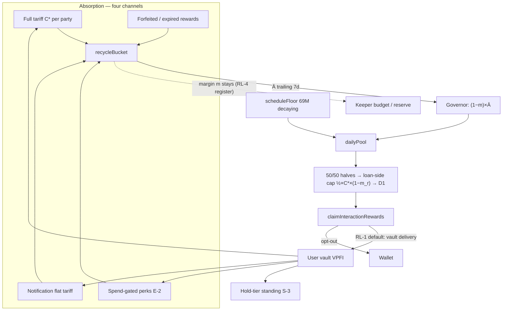

# VPFI Recycling — Loop-Closure Design (independent assessment + v2 deltas)

| Field | Value |
| --- | --- |
| **Title** | VPFI Recycling — Loop-Closure Design |
| **Author** | Vaipakam Developer Team |
| **Date** | 2026-07-16 |
| **Status** | **Draft — proposal for owner decision** (assessment + additive deltas; changes nothing already RATIFIED without an explicit decision below) |
| **Owner directive** | *"Near-zero legal expenditure; better for the platform; no burning — recycle absorbed VPFI into the reward stream."* |
| **Related** | [`VpfiRecyclingBalanceGovernorDesign.md`](VpfiRecyclingBalanceGovernorDesign.md) (RATIFIED 2026-07-15), [`VpfiCrossChainRecyclingDesign.md`](VpfiCrossChainRecyclingDesign.md), [`VpfiAbsorptionDistributionFormulaRedesign.md`](VpfiAbsorptionDistributionFormulaRedesign.md) (#1294 rev 13, Draft), [`UserValueEnhancementOpportunities.md`](UserValueEnhancementOpportunities.md) §5, [`VPFITokenomicsRedesignResearch.md`](VPFITokenomicsRedesignResearch.md), [`VPFISecuritiesFeatureExcision.md`](VPFISecuritiesFeatureExcision.md) |

> ⚠️ **Not legal advice.** Same posture as every doc in this family: near-zero
> legal *expenditure* is a design constraint, not a clearance claim.

---

## 1. Mandate and method

The owner asked for a fresh plan and design for VPFI recycling under three
constraints — (a) near-zero legal expenditure, (b) better for the platform,
(c) recycle absorbed VPFI into the reward stream, never burn — treating every
existing design as a suggestion, and benchmarking against how comparable
DeFi / DEX / lending protocols handle the same problem.

Method: the existing three-doc stack (governor + cross-chain substrate +
#1294 absorption/distribution formulas) was re-derived from first principles
against (i) the code ground truth (every VPFI inflow/outflow site was
re-verified), (ii) production tokenomics of GMX, dYdX, Aave, Curve/Convex,
Camelot, Jupiter, Osmosis, Hyperliquid, Raydium, Synthetix, and (iii) the
2023→2026 US regulatory arc, including two datapoints **not yet recorded in
this repo** (§4).

**Verdict up front (honest, not deferential): the ratified backbone survives
the adversarial re-derivation and should be KEPT.** The governor's
absorption-coupled budget (`dailyPool = scheduleFloor + (1−m)×Ā`), the
recycle-at-source/net-remit mesh, and #1294's fee-native tariff +
fee-linked loan-side reward cap independently reconstruct the three safest
patterns in production DeFi (§3). Discarding them would reproduce months of
Codex-hardened correctness work to arrive at the same shape. What the
re-derivation *did* find is that the loop is designed **open at the
distribution end** and thin at the cold-start absorption end — five concrete
gaps (§5) with five additive deltas (§6) that close the loop, none of which
reopens a ratified decision.

## 2. The one-paragraph model of the loop

VPFI the protocol absorbs (tariffs, notification fees, forfeited rewards,
future slashes — the governor §4 classes) credits a protocol-owned
**recycle bucket**. At day finalization the governor sizes the reward budget
as the decaying pre-funded floor **plus** `(1−m)` of trailing-7-day
absorption (`m` = 5% retained platform margin). Users earn from that budget
only through their **own completed lending activity**, per-user- and
per-loan-capped so a participant can never extract more than a fixed
fraction of what their own loan absorbed. Nothing is burned: the 230M hard
cap already provides permanent scarcity (owner decision 2026-07-13), and
every recycled token extends the reward program's life instead —
after the 69M pre-fund exhausts, the program continues indefinitely at
`(1−m)×Ā`.

## 3. External benchmark — where the Vaipakam stack sits

Production designs for "protocol-absorbed native token → what now?", and
what each teaches:

| Protocol | Mechanism | What Vaipakam's stack already mirrors | What it deliberately avoids |
| --- | --- | --- | --- |
| **dYdX v4** | Trading rewards hard-capped at ≤90% of the *user's own net fees* per fill; block budget ≤ that block's fees. Killed the v3 wash-farming economy | #1294's `loanSideRewardCap = ½×C*×(1−m_reward)` is exactly this fee-linked cap, per loan per side; the governor's `(1−m)×Ā` is the epoch-budget analog | — |
| **Aave (2025 Aavenomics)** | "Buy and Distribute": revenue buys AAVE **into the ecosystem reserve** (not burned) to fund future incentives; 320k AAVE from a closed migration contract redirected into the reserve | Recycle bucket = the reserve pattern, minus any market operation (receipts arrive as fees, no buyback needed) | Buyback stays dormant (#687-C) — Vaipakam gets the "reserve refills rewards" property with zero market touch |
| **GMX** | esGMX escrowed rewards; unvested forfeits return to the pool; Multiplier Points burn on unstake | Forfeited interaction rewards → bucket (the same "forfeiture extends the runway" loop, §4 of the governor) | The separate non-transferable escrow token (§7 — rejected) |
| **Jupiter ASR** | Quarterly rewards conditioned on activity, computed on time-weighted stake, **auto-staked at claim** | Time-weighted tier accumulator already exists; **delta RL-1 adopts the auto-stake-at-claim analog (claim-to-vault)** | — |
| **dYdX retroactive rewards** | Unclaimed rewards **swept back to the community pool** at epoch end | Not adopted yet — **delta RL-3 proposes a (long) claim horizon** as an owner decision | — |
| **Curve/Convex (veCRV)** | 50% of fees pro-rata to passive lockers in cash-equivalents; gauge voting | — | This is the dividend-shaped end Vaipakam excised (#687-B); gauges also created the Curve-Wars capture surface (Mochi attack) — the fixed formulaic allocation here has no vote-directable emissions |
| **Trader Joe sJOE** | USDC revenue share to stakers | — | Same dividend shape — avoided |
| **Hyperliquid** | ~97% of fees auto-buy HYPE; fully automated, no discretion | The loop's full determinism (report→net→consume, no per-epoch committee) matches the "administrative/ministerial" property | Buyback + burn framing |
| **Uniswap (UNIfication, 2025)** | Chose **burn over distribute** explicitly to reduce regulatory exposure after years of fee-switch paralysis | — | Instructive contrast: burn was *their* legal-comfort tool because their alternative was a dividend to passive holders. Vaipakam's alternative is a **usage rebate**, which has its own (stronger) legal shape — so the owner's no-burn call costs nothing legally *as long as rewards stay usage-shaped* (§4) |
| **Synthetix** | Ended inflation; fee-funded rewards only | The governor's end-state (`floor→0`, budget `= (1−m)×Ā`) is this exact "emissions sunset into fee-funded rewards," built in from day one instead of retrofitted | — |

Sources: GMX docs (tokenomics/rewards), dYdX docs + Chaos Labs wash-trading
detection, Aave governance (Aavenomics update; Umbrella), Curve resources
(veCRV fee distribution), Jupiter ASR, Hyperliquid docs, Raydium docs
(buyback-to-treasury), Synthetix SIP-2043, Uniswap UNIfication coverage.

## 4. Legal frame — two datapoints to add to the repo's evidence base

The repo's legal spine (#694 research) anchors on the **SEC/CFTC
interpretation of 2026-03-17 (release 33-11412)**. Two earlier datapoints
strengthen the exact shapes this design family uses and are recorded here so
they are citable from specs and any future bounded counsel review:

1. **Fuse no-action letter (SEC Corp Fin, 2025-11-24)** — first no-action
   relief for a rewards token: a token earned through user activity and
   redeemable **only for discounts/rebates on platform costs**, with staff
   reasoning that *"cost reduction or redemption capability are not
   'profits' to the consumer but rather a type of rebate to encourage
   certain consumptive behaviors."* This is, almost verbatim, the
   Vaipakam shape: interaction rewards earned by own activity, whose
   in-platform utility is fee-discount standing. It is the single closest
   precedent for the entire recycling loop and should be cited alongside
   33-11412 in any legal-posture section.
2. **SEC Corp Fin statement on protocol staking (2025-05-29)** — protocol
   staking is non-securities where the activity is "administrative or
   ministerial," not entrepreneurial. Not directly applicable (VPFI is not
   PoS stake), but the *property it rewards* — full determinism, no operator
   discretion in the flow — is one the recycling loop already has and must
   keep (no per-epoch allocation committee; see RL-4's bounded register).

The resulting design rules, restated once (they bind every delta in §6):

- Rewards are **usage rebates**, sized by the user's own activity,
  fee-linked-capped. Never pro-rata to passive holding, never
  cash-equivalent revenue share, never a promised rate.
- **Issuer representations dominate** under 33-11412: all copy says
  *rebate / fee discount / program longevity* — never yield, APY, income,
  deflation, scarcity, or price.
- **No market touch, no published price, no purchase surface** (#687-A
  stands; governor §14 stands).
- **Full determinism**: the loop is bookkeeping over fees already received.

## 5. Gap analysis — where the ratified stack leaves value on the table

The re-derivation found the loop **closed on the absorption side and open on
the distribution side**, plus three smaller structural gaps:

| # | Gap | Evidence |
| --- | --- | --- |
| **G1** | **Distribution-end leak.** Claimed rewards pay `safeTransfer(msg.sender, …)` straight to the claimant's wallet (`InteractionRewardsFacet.claimInteractionRewards`). Every distributed VPFI exits the sink system entirely unless the user manually re-deposits to their vault. The whole hold-demand engine (tier TWA, min-history, min-tier clamp) only sees VPFI that users move back in by hand — the loop's biggest single leak, at the exact point the protocol controls | Code: `InteractionRewardsFacet.sol` claim transfer; tier system reads only vault balances via the tracked-balance chokepoint |
| **G2** | **Cold-start absorption is a single thin channel.** #1294 itself flags Full attach as "rare at cold start" (users hold no VPFI yet); until then absorption ≈ notification fees + reward forfeits. The Layer-1 spend-gated perks (E-2) and service bonds (#1219) that would widen absorption are sequenced behind the tariff work with no committed slot | #1294 "Product honesty"; governor §4 launch-status table |
| **G3** | **The retained margin is purposeless capital.** `m×Ā` accumulates in the bucket forever; Phase C tooling can move it between protocol pockets but no priority order exists for what it is *for* | Governor §3.3 ("Nowhere — and that is the point") |
| **G4** | **Unclaimed commitments never expire.** A committed reward day is released only by forfeit, "never by time," so availability accounting carries an unbounded tail of dormant `(user, day)` commitments from users who never return; each one permanently reduces `fundable[D]` | Governor §3.1 commitment accounting |
| **G5** | **The legal argument is asserted, not evidenced.** The stack's docs argue safety from first principles; no doc records the external precedent set (§3/§4) that makes the argument checkable by a future counsel in one sitting | grep: Fuse NAL cited nowhere in `docs/` |

## 6. The v2 deltas (RL-1 … RL-6)

All additive. RL-1 is the substantive design change; the rest are hardening,
sequencing, and evidence.

### RL-1 — Claim-to-vault delivery (the loop closer) — RECOMMENDED, ADOPT

**Change:** `claimInteractionRewards()` delivers the claimed VPFI into the
claimant's **per-user vault** by default, through the standard
`VaultFactoryFacet.vaultDepositERC20` chokepoint (the same path
`VPFIDiscountFacet` deposits use), instead of `safeTransfer` to the wallet.
An explicit `claimToWallet` flag (or a one-time user preference) preserves
wallet delivery for anyone who wants it.

**Why this is the highest-leverage delta:**

- Every rewarded VPFI lands **inside the sink system** on arrival: it
  increments the protocol-tracked vault balance, stamps the post-mutation
  tier rollup (`rollupUserDiscount` fires at the deposit chokepoint), and
  immediately counts toward fee-discount standing and future Full-tariff
  spending power. The distribution end of the loop stops leaking by
  default and starts feeding both demand sinks (S-1/S-3) mechanically.
- It directly attacks G2 as well: Full-tariff attach requires users to
  *have* vault VPFI. Claim-to-vault is the bootstrap that fills vaults
  without any purchase surface.
- Production precedent: Jupiter ASR auto-stakes rewards at claim —
  the reward re-enters the system instead of hitting the market.

**Legal shape — unchanged.** This changes the *delivery venue* of a rebate,
not its character. Critically, it is **not a lockup**: the vault is the
user's own custody surface and withdrawal stays available at any time, so no
"holding requirement" or vesting condition is introduced (avoiding any
hold-to-earn optics — the token is simply delivered where it is useful).
Copy rule: describe as "rewards land in your vault, ready to use" — never as
auto-staking or compounding.

**Mechanics and edge rules:**

- Route through the deposit chokepoint, never a bare transfer to the vault
  address — a direct transfer would be clamped out by the anti-dust
  tracked-balance rule and earn no tier standing.
- Claimants necessarily have vaults (rewards require loans, loans require
  vaults); if a vault is somehow absent, fall back to wallet delivery
  rather than creating one inside the claim path.
- Sanctions posture unchanged: the claim entry point keeps its existing
  tier gating; delivery venue does not alter it.
- Forfeit routing (`toTreasury`) is untouched.
- Mirror chains: identical change; the vault system is per-chain already.

**Tests:** claim credits tracked vault balance + tier rollup stamped at
post-mutation balance; wallet opt-out honored; dust-clamp not triggered;
forfeit split unchanged; invariant `diamondVpfiBalance ≥ userLifCustody +
unclaimedRewardBudget + recycleBucket` unaffected (payout leaves the diamond
either way).

### RL-2 — Loop-closure metric (extends #1218) — ADOPT

Add to the transparency dashboard, per day and cumulative:

```
loopClosureRatio[D] = (vaultRetainedRewards[D] + absorbed[D]) / distributed[D]
```

where `vaultRetainedRewards` = rewards delivered to vaults and still vaulted
at day close. Together with `selfFundingRatio` (#1218) this makes the loop's
health two observable numbers — how much of distribution stays in the
system, and how much of distribution the system's own absorption funds. Pure
indexer/metrics work; no contract change beyond events already specified.

### RL-3 — Reward claim horizon (bounded liability tail) — OWNER DECISION

**Proposal:** rewards become sweepable to the recycle bucket `H` days after
the underlying loan's terminal event (proposed `H = 365`; bounded knob,
min 180). The sweep is permissionless (keeper class), emits a dedicated
`VpfiRecycled(EXPIRED_REWARD, …)` source, and releases the day-commitment
per the governor's existing source-split rules (fresh-funded share = real
bucket credit; recycled-funded share = commitment release).

- **For:** closes G4 — without a horizon, `fundable[D]` degrades forever
  under dormant commitments, and the accounting tail grows unboundedly.
  Production precedent: dYdX swept unclaimed epoch rewards back to the
  community pool. Legally inert (rebate programs with redemption windows
  are the norm; a 12-month window on a fee rebate is conservative).
- **Against:** it takes value from dormant users; the ratified governor
  deliberately chose "released only by forfeit — never by time."
- **If adopted:** prominent UX (claim-center countdown, notification
  pre-expiry via the existing paid-push channel), spec edit to the
  governor's commitment rules, and the horizon starts only at loan
  terminal + full claimability (never while a claim is blocked by
  missing finalization/broadcast).

This is presented as a decision, not folded in, precisely because it
amends a ratified sentence.

### RL-4 — Recycled-stream allocation register — ADOPT AT PHASE C′ (dormant before)

Generalize the Phase-C "optional keeper-budget credit" into one bounded,
timelocked register over the recycled term only (never the schedule floor):

```
recycledBudget[D] split by weights: [interactionRewards, keeperBudget, retainedReserve]
defaults: [10000, 0, 0] bps   // exactly today's ratified behaviour
bounds: interactionRewards ≥ 5000; weights sum to 10000
```

- Encodes "what is the margin/surplus *for*" (G3) as an explicit priority
  stack: claims first, keeper gas second, reserve last — the same order the
  cross-chain design already enforces per-day (§3.5 claims-first rule),
  now as a declared config surface instead of an emergent property.
- Stays deterministic (weights read once at finalization, stamped like the
  margin) — no per-epoch discretion, preserving the
  administrative/ministerial property (§4).
- Deliberately **not** a gauge: users never vote reward direction
  (Curve-Wars capture surface avoided by construction).

### RL-5 — Absorption bootstrap hardening (sequencing, not new design) — ADOPT

Commit the second and third absorption channels to the same release train as
the tariff, so launch absorption is never single-channel:

1. **Notification flat VPFI tariff** (#1294 PR-7 / governor §13) — also
   removes the last conversion residual. Pull forward; it has no deps.
2. **Spend-gated perks (E-2 / #1204)** — priority solver routing and
   listing-visibility boost are pure fee-for-service VPFI sinks that credit
   the bucket; build the two spend-gated perks (skip hold-gated ones if
   time-constrained) alongside PR-5b so a second permanent sink exists at
   Full launch.
3. **Service bonds (#1219)** — keep behind its legal glance, but schedule
   the glance now (it shares the bounded-review slot the excision doc
   already recommends) so the slash-absorption class isn't blocked on an
   unscheduled prerequisite.

With RL-1 filling vaults at the distribution end, these three plus the Full
tariff give four independent absorption channels within one release cycle of
each other — the flywheel stops depending on any single attach rate.

### RL-6 — Legal evidence pack + copy rules — ADOPT (docs only)

- Record §3's benchmark table and §4's two datapoints in
  `VPFITokenomicsRedesignResearch.md` (or as an appendix referenced from
  it), so the "hand any future counsel two documents" package is: SEC
  release 33-11412 + the Fuse NAL, with the production-protocol comparison
  as context.
- Reaffirm the copy rules (§4) as a checklist item in the release-gate for
  every user-facing recycling/rewards surface — the cheapest legal
  insurance in the whole program, and under 33-11412 the dominant factor.

## 7. Considered and rejected

| Idea | Why rejected |
| --- | --- |
| **Escrowed non-transferable reward token** (esGMX/xGRAIL pattern) | A second token contract = new audit surface, new mesh accounting (escrow state can't ride the CCT lanes), and non-transferable-with-vesting invites "investment-like maturation" analysis. RL-1 captures ~80% of the benefit (rewards re-enter the sink by default) with ~5% of the surface |
| **Vesting bonus** ("claim locked for 90d, get +10%") | Pays extra for time-holding — the hold-to-earn shape §5 of `UserValueEnhancementOpportunities.md` explicitly forbids reintroducing |
| **Demand-balancing split steering** (tilt the 50/50 lender/borrower split of the *recycled* term toward the underserved side) | Genuinely interesting as a market-balancing instrument, but it changes the distribution's character (rewards become operator-steered), adds an economic knob with a gaming surface, and violates the governor's "changes only the pool's size, never its distribution rules" boundary. Revisit only with live-market evidence of persistent one-sided books, as its own design |
| **Burn (any slice)** | Owner decision 2026-07-13 stands and the benchmark reinforces it: burn is the legal-comfort tool for protocols whose alternative is a dividend (Uniswap). Vaipakam's alternative is a rebate — the safer shape already. The governance escape-hatch note in §5.1 remains the only residual |
| **Buyback-style balancing** | Re-rejected on the standing #687-A posture (market operations) — unchanged from governor §10 |
| **EMA / tunable smoothing window** | Ratified as fixed `W = 7`; nothing in the re-derivation justifies reopening (one auditable economic knob beats two interacting ones) |

## 8. The closed loop, composite view



Every arrow is either a fee receipt, internal bookkeeping, or a usage
rebate; no arrow touches a market, quotes a price, or pays for passivity.

## 9. Plan — how the deltas land

Mapped onto #1294's PR plan (which this design does not renumber):

| Card | Scope | Depends on | Notes |
| --- | --- | --- | --- |
| **RL-1 PR** | Claim-to-vault delivery + opt-out + tests | None (independent of D1/governor; touches `InteractionRewardsFacet` claim tail only) | Can ship **first** — immediate loop value even before the governor exists, since it feeds the live tier system |
| **RL-2** | Indexer/dashboard metric | #1218 metrics card | Rides the same events |
| **RL-3** | Claim-horizon sweep (if ratified) | Governor PR-3 stack (commitment model) | Owner decision first; spec edit to governor §3.1 |
| **RL-4** | Allocation register (dormant defaults) | Governor PR-3b | Config plumbing in the #1217 knob pattern |
| **RL-5** | Sequencing: pull PR-7 forward; E-2 spend-gated perks alongside PR-5b; schedule #1219 legal glance | — | Project-board sequencing, not new code design |
| **RL-6** | Evidence pack + copy checklist | None | Docs-only, immediate |

Spec edits (per house discipline, in the implementing PRs):
TokenomicsTechSpec §4 (claim delivery default + opt-out; claim horizon if
ratified), §9 (allocation register; loop-closure metric), plus
`_CodeVsDocsAudit` rows and release-note fragments per PR.

## 10. Decisions asked of the owner

1. **RL-1 claim-to-vault delivery** — adopt as the default reward delivery
   (wallet opt-out preserved)? *(Recommended: yes — highest-leverage,
   zero-legal-delta loop closure.)*
2. **RL-3 claim horizon** — amend the ratified "commitments never expire by
   time" to a 365-day post-terminal horizon with sweep-to-bucket?
   *(Recommended: yes, with the UX safeguards listed; but this is the one
   delta that touches a ratified sentence, so it is strictly the owner's
   call.)*
3. **RL-4 allocation register** — adopt at Phase C′ with dormant
   `[10000,0,0]` defaults? *(Recommended: yes.)*
4. **RL-5 sequencing** — commit notification flat tariff + two spend-gated
   perks to the same release train as the Full tariff? *(Recommended: yes.)*
5. Confirm the standing backbone is unchanged by this review: governor
   (RATIFIED), cross-chain substrate, #1294 formulas proceed as planned —
   this design adds to them and reopens nothing else.
